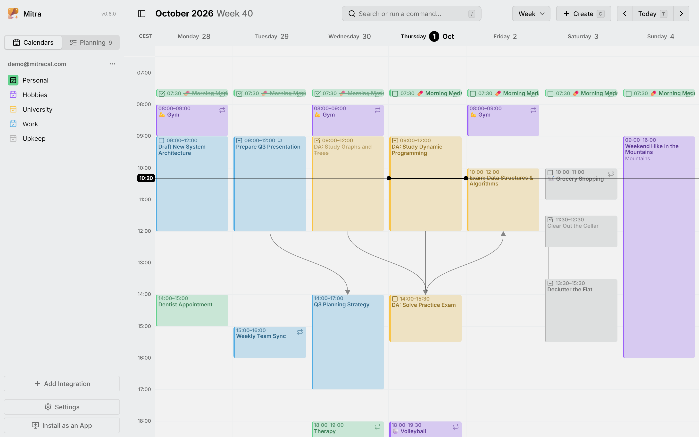

<div align="center">


# Mitra

**One calendar to plan your events and tasks**

[](https://github.com/a11delavar/mitra/actions/workflows/qa.yml)
[](LICENSE)
[](https://github.com/a11delavar/mitra/pkgs/container/mitra)
[](https://mitracal.com/docs/)
[](https://demo.mitracal.com)

<br />
<br />

<picture>
  <source media="(prefers-color-scheme: dark)" srcset="assets/screenshots/week-dark.webp">
  
</picture>

</div>

> [!WARNING]
>
> Mitra is early and moving fast. Expect rough edges and breaking changes before `1.0`.

## Why Mitra

Most tools make you choose between a calendar for your time and a to-do app for your tasks. Mitra puts both on one timeline, so you can see when there's actually room to get things done. It runs on your own server, keeps calendars itself if you like, and connects to the ones you already have.

Want to look around first? **[Try the demo](https://demo.mitracal.com)**: you get a calendar of your own with sample entries, and nothing to install.

## Features

- Events and tasks on one timeline, in week, month, year, timeline and table views. Drag to create, move and resize anything.
- Calendars stored in Mitra itself, with no account behind them, or synced both ways with CalDAV, Google Calendar, Apple Calendar, Notion and Tempo. Published calendar feeds come in as read-only subscriptions.
- Planning: tasks without a date wait in the Planning tab with a due date and an estimate, until you drag them into your week.
- Availability, subtasks and dependencies, reminders as push notifications, guest lists with replies, and a command palette for the keyboard.
- Seven languages, right to left included, light and dark themes, and a color for every calendar.
- One small container with a database you own, no telemetry, and sign-in for several people when you need it.

## Get started

```yaml
# compose.yaml
services:
  mitra:
    image: ghcr.io/a11delavar/mitra:latest
    restart: unless-stopped
    ports:
      - '3000:3000'
    volumes:
      - ~/mitra:/app/data
    # environment:
    #   MITRA_URL: 'https://mitra.example.com' # once Mitra has a public address
```

```sh
docker compose up -d   # → http://localhost:3000
```

Out of the box, Mitra is for one person and has no sign-in. Everything it stores is in the `~/mitra` folder, so backing that up backs up everything.

From here, the **[documentation](https://mitracal.com/docs/)** covers your first calendar, connecting accounts, sign-in for several people and everything else. You can also read it as Markdown in [`docs/`](docs).

## Contributing

Issues and pull requests are welcome.
