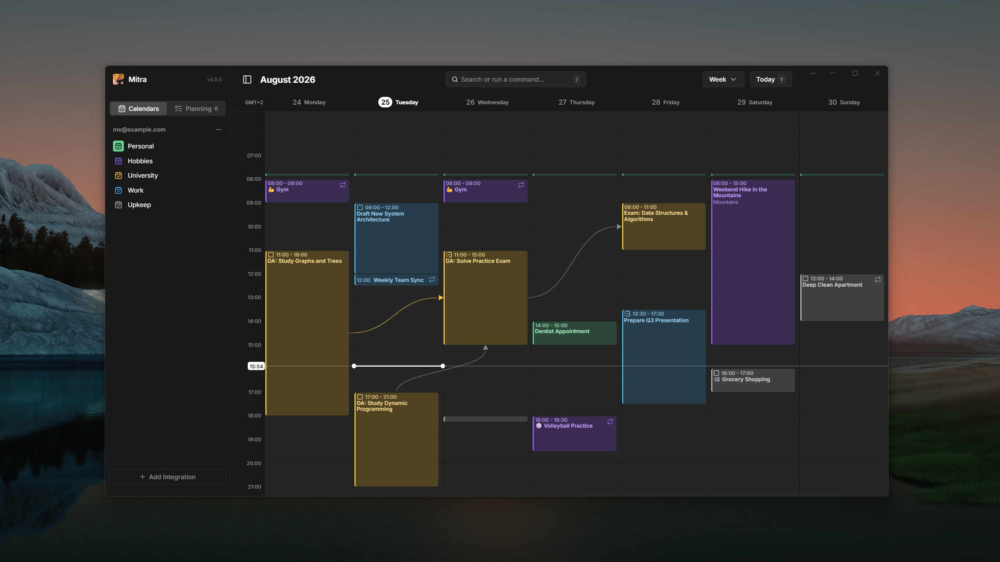

**One calendar to plan your events and tasks.** Mitra is a self-hosted, private planner where your tasks sit on the same timeline as your events — and it plugs into the accounts you already have (CalDAV, Google Calendar, Apple Calendar, Notion) instead of replacing them.

> [!NOTE]
> Mitra is early and moving fast. Expect rough edges and breaking changes before `1.0`.

## Start here

- **[Installation](getting-started/installation.md)** — get a container running in a couple of minutes with Docker Compose.
- **[Configuration](getting-started/configuration.md)** — name your instance, set its public URL, and learn how Mitra is configured.
- **[Environment variables](reference/environment-variables.md)** — the complete reference for every setting.

## Connect calendars & tasks

Mitra brings in the calendars and task databases you already use and syncs them in the background.

- **[Overview](integrations/README.md)** — how syncing, background daemon, and read-only support work across all providers.
- **[CalDAV](integrations/caldav.md)** — connect any CalDAV server (Nextcloud, Radicale, Fastmail, mailbox.org, …). Connects straight from the app, no deployment setup.
- **[Google Calendar](integrations/google-calendar.md)** — needs a one-time OAuth setup of your deployment.
- **[Apple Calendar (iCloud)](integrations/apple-calendar.md)** — connect with an app-specific password.
- **[Calendar Subscriptions](integrations/calendar-subscriptions.md)** — subscribe to published `webcal://` or `.ics` feeds, read-only.
- **[Notion](integrations/notion.md)** — turn Notion database views into two-way task sources.
- **[Tempo](integrations/tempo.md)** — sync Jira worklogs two-way and track time alongside your events.

## Use Mitra

Day-to-day behaviour, whichever accounts you connected.

- **[Calendars & task lists](guides/calendars.md)** — choose what gets imported, then rename, recolor, reorder and hide it; and pick where new entries land.
- **[Unscheduled tasks](guides/unscheduled-tasks.md)** — where tasks with no date live, and how to drag them onto the calendar (and back off it).
- **[Routines](guides/routines.md)** — how daily habits and routines display as compact day marks in month and year views.
- **[Relationships](guides/relationships/README.md)** — link tasks and events across calendars, organize subtasks, and track dependencies.
- **[Participants & invitations](guides/participants.md)** — invite people to an entry and follow their replies.
- **[Reminders & notifications](guides/notifications.md)** — how push reminders work and what they need.
- **[Location autocomplete](guides/location-autocomplete.md)** — the geocoder behind the location field.
- **[Keyboard shortcuts](guides/keyboard-shortcuts.md)** — drive the views, navigation and entries from the keyboard.

## Administer your instance

- **[Multi-user & sign-in (OIDC)](guides/multi-user.md)** — share one deployment with family or a team.
- **[Backups](guides/backups.md)** — everything lives in one directory; back that up.
- **[Updates](guides/updates.md)** — the update indicator and how to disable it.
- **[Health checks](guides/health-checks.md)** — the endpoint for orchestrators and uptime monitors.
- **[Logging](guides/logging.md)** — verbosity levels for diagnosing problems.
