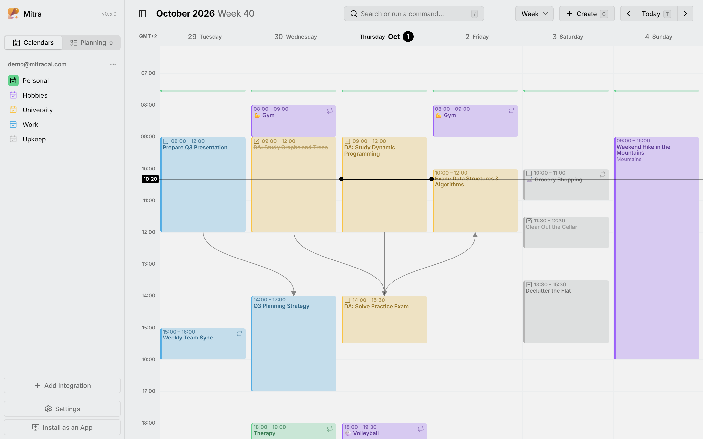

**One calendar to plan your events and tasks.** Mitra is a self-hosted, private planner that puts your tasks on the same timeline as your events. It connects to the accounts you already have (CalDAV, Google Calendar, Apple Calendar, Notion) instead of replacing them.

<picture>
  <source media="(prefers-color-scheme: dark)" srcset="../assets/screenshots/week-dark.png">
  
</picture>

> [!NOTE]
> Mitra is early and moving fast. Expect rough edges and breaking changes before `1.0`.

## Start here

- **[Installation](getting-started/installation.md)**: get a container running with Docker Compose in a couple of minutes.
- **[Configuration](getting-started/configuration.md)**: name your instance, set its public URL, and see how Mitra is configured.
- **[Environment variables](reference/environment-variables.md)**: the full reference for every setting.

## Connect calendars & tasks

Mitra brings in the calendars and task databases you already use and syncs them in the background.

- **[Overview](integrations/README.md)**: how syncing, the background daemon and read-only calendars work across all providers.
- **[CalDAV](integrations/caldav.md)**: connect any CalDAV server, such as Nextcloud, Radicale, Fastmail or mailbox.org. You connect it from the app, with no setup on the server.
- **[Google Calendar](integrations/google-calendar.md)**: needs a one-time OAuth setup on your deployment.
- **[Apple Calendar (iCloud)](integrations/apple-calendar.md)**: connect with an app-specific password.
- **[Calendar Subscriptions](integrations/calendar-subscriptions.md)**: subscribe to published `webcal://` or `.ics` feeds, read-only.
- **[Notion](integrations/notion.md)**: use Notion database views as task lists that sync both ways.
- **[Tempo](integrations/tempo.md)**: sync Jira worklogs both ways and track time next to your events.

## Use Mitra

Day-to-day behaviour, whichever accounts you connected.

- **[Views](guides/views.md)**: [week](guides/views.md#week), [month](guides/views.md#month), [year](guides/views.md#year), [timeline](guides/views.md#timeline) and [table](guides/table-view.md).
- **[Calendars & task lists](guides/calendars.md)**: choose what gets imported, rename, recolor, reorder and hide it, and pick where new entries go.
- **[Planning tasks](guides/unscheduled-tasks.md)**: give tasks a due date and an estimate, keep unscheduled tasks in the Planning tab, and schedule them when you're ready.
- **[Routines](guides/routines.md)**: how daily habits show up as small day marks in the month and year views.
- **[Availability](guides/availability.md)**: shade the time each calendar is for, like working hours or study time, and show it as busy where others look.
- **[Relationships](guides/relationships/README.md)**: link tasks and events across calendars, organize subtasks and track dependencies.
- **[Participants & invitations](guides/participants.md)**: invite people to an entry and follow their replies.
- **[Links](guides/links.md)**: the links in an entry, shown by what they open, from meetings to join to notes in other apps.
- **[Reminders & notifications](guides/notifications.md)**: how push reminders work and what they need.
- **[Location autocomplete](guides/location-autocomplete.md)**: the geocoder behind the location field.
- **[Keyboard shortcuts](guides/keyboard-shortcuts.md)**: control the views, navigation and entries from the keyboard.
- **[Settings](guides/settings.md)**: theme, language, the view Mitra opens on, and the defaults for new entries. You can search them, and most are also in the command palette.
- **[Default calendar app](guides/default-calendar-app.md)**: open `.ics` files and `webcal://` links in Mitra.

## Administer your instance

- **[Multi-user & sign-in (OIDC)](guides/multi-user.md)**: share one deployment with family or a team.
- **[Backups](guides/backups.md)**: everything is stored in one folder, so back that up.
- **[Updates](guides/updates.md)**: the update indicator and how to turn it off.
- **[Health checks](guides/health-checks.md)**: the endpoint for orchestrators and uptime monitors.
- **[Logging](guides/logging.md)**: log levels for tracking down problems.
