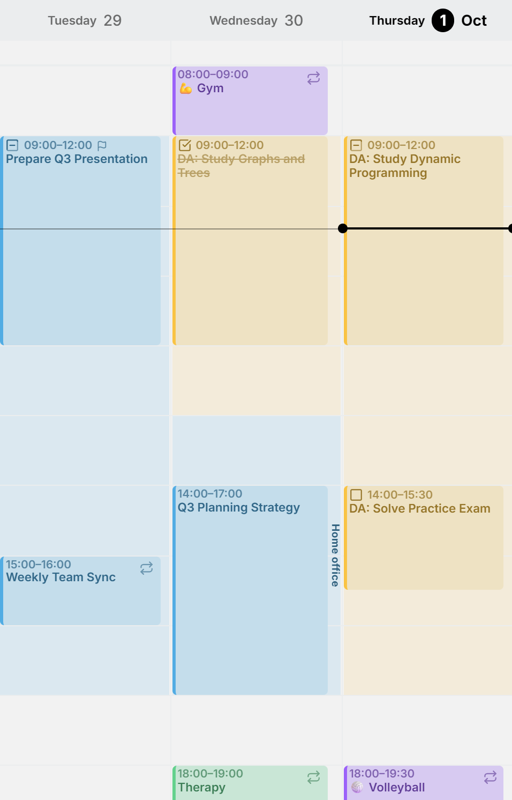
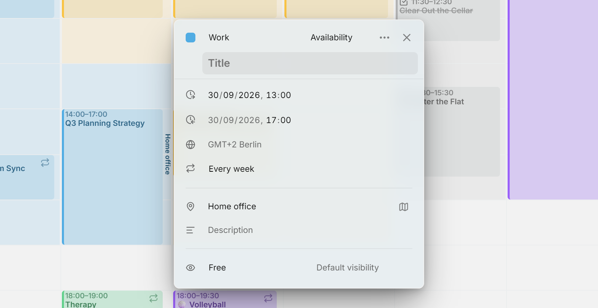

**Verfügbarkeit** ist Zeit, die du regelmäßig beiseitelegst, etwa Arbeit von Montag bis Mittwoch, Lernzeit am Donnerstag und Freitag oder der Haushalt am Samstag. Mitra schattiert sie in der **Wochenansicht** in der Farbe ihres Kalenders.

Verfügbarkeit gehört zu einem Kalender, neben dessen Terminen und Aufgaben. Deine Arbeitszeiten kommen in deinen Arbeitskalender, deine Lernzeit in deinen Uni-Kalender. Sie ist kein Termin, deshalb verwaltet Mitra sie selbst, statt sie in deinem Konto anzulegen. [Beschäftigte Verfügbarkeit](#busy-or-free) ist die einzige Ausnahme.

Sie ist die übliche Form deiner Woche, kein Zaun. Ein Zahnarzttermin mitten in deinen Arbeitszeiten ist in Ordnung.

<picture>
  <source media="(prefers-color-scheme: dark)" srcset="../assets/screenshots/availability-detail-dark.webp">
  
</picture>

## Mit Namen oder ohne

Ohne Namen ist ein Zeitfenster nur seine Schattierung. Das passt zu den meisten Verfügbarkeiten, denn die Farbe des Kalenders sagt schon, wofür die Zeit gedacht ist. Gib ihr einen Namen oder einen Ort, und dieser Text läuft am Rand des Tages entlang, etwa Fokuszeit innerhalb deiner Arbeitszeiten oder Büro und Home Office an verschiedenen Tagen.

Wo sich Zeitfenster überlappen, mischen sich ihre Schattierungen dunkler, und ihre Beschriftungen rücken auseinander: die erste an ihren Beginn, die letzte an ihr Ende.

## Verfügbarkeit hinzufügen

Öffne die Befehlspalette mit <kbd>/</kbd> oder <kbd>Ctrl</kbd> + <kbd>K</kbd> und führe **Verfügbarkeit hinzufügen** aus. Sie kommt in deinen Standardkalender:

- Hat dieser Kalender noch keine Verfügbarkeit, bekommst du Arbeitszeiten von Montag bis Freitag, 9:00 bis 17:00 Uhr.
- Andernfalls bekommst du ein Zeitfenster am heutigen Wochentag.

Der Editor öffnet sich, sodass du Uhrzeiten, Tage, Namen, Ort oder Kalender ändern kannst. Ein Eintrag, der sich nicht wiederholt, kann auch über seinen **Typ** zur Verfügbarkeit werden.

<picture>
  <source media="(prefers-color-scheme: dark)" srcset="../assets/screenshots/availability-editor-detail-dark.webp">
  
</picture>

## Bearbeiten und verschieben

- Klick in ein Zeitfenster, um es zu öffnen. Wenn du darüber ziehst, entsteht weiterhin ein normaler Eintrag, genau wie auf einem leeren Teil des Rasters.
- Verfügbarkeit wiederholt sich wie jeder andere Eintrag. Sie hat eine Zeitzone und eine Wiederholungsregel, und wenn du einen Tag davon änderst oder löschst, fragt Mitra, ob du diesen Tag oder alle meinst.
- Das Feld **Kalender** des Editors verschiebt sie in einen anderen Kalender. Wenn du die Einträge eines Kalenders mit **Einträge verschieben nach…** verschiebst, wandert seine Verfügbarkeit mit.
- Verfügbarkeit zeigt sich nur in der Wochenansicht. In Monats-, Jahresansicht, Zeitleiste und Tabelle, in Suchergebnissen oder in Beziehungen erscheint sie nicht.

## Ein- und ausblenden

Das Auge eines Kalenders in der Seitenleiste blendet seine Verfügbarkeit zusammen mit seinen Terminen und Aufgaben aus. Um nur die gesamte Verfügbarkeit auszublenden, schalte **Verfügbarkeit ausblenden** unter **Einstellungen → Kalender** ein oder finde es in der Befehlspalette.

## Wo Verfügbarkeit liegen kann

Jeder Kalender, dem du Einträge hinzufügen kannst, kann Verfügbarkeit enthalten, auch [Mitra](integrations/mitra.md)-Kalender. Diese nicht:

- [Notion](integrations/notion.md)- und [Tempo](integrations/tempo.md)-Kalender, da sich ihre Einträge nicht wiederholen können.
- Schreibgeschützte Kalender, etwa [Kalenderabonnements](integrations/subscriptions.md).

Verfügbarkeit bleibt bei ihrem Kalender. Wenn du den Kalender löschst oder das Konto trennst, zu dem er gehört, wird auch seine Verfügbarkeit gelöscht.

## Beschäftigt oder verfügbar

Verfügbarkeit hat dieselbe Auswahl **Als beschäftigt oder verfügbar anzeigen** wie ein Termin. Sie beginnt als **Verfügbar**, was zu Arbeitszeiten passt: Du lässt dich in dieser Zeit gern einplanen. Wähle **Beschäftigt** für Zeit, die andere dir nicht nehmen sollen, etwa Fokuszeit.

Innerhalb von Mitra sehen beide gleich aus. Der Unterschied ist, was andere sehen. Als verfügbar markierte Zeitfenster werden nie in eines deiner Konten geschrieben. Beschäftigte Zeitfenster in einem [CalDAV-, Google- oder Apple-Kalender](integrations/caldav.md#busy-availability) werden diesem Kalender als beschäftigte Termine mit Namen und Ort hinzugefügt, sodass sie auf deinem Handy erscheinen und Leute, die dich einladen, die Zeit als belegt sehen.
