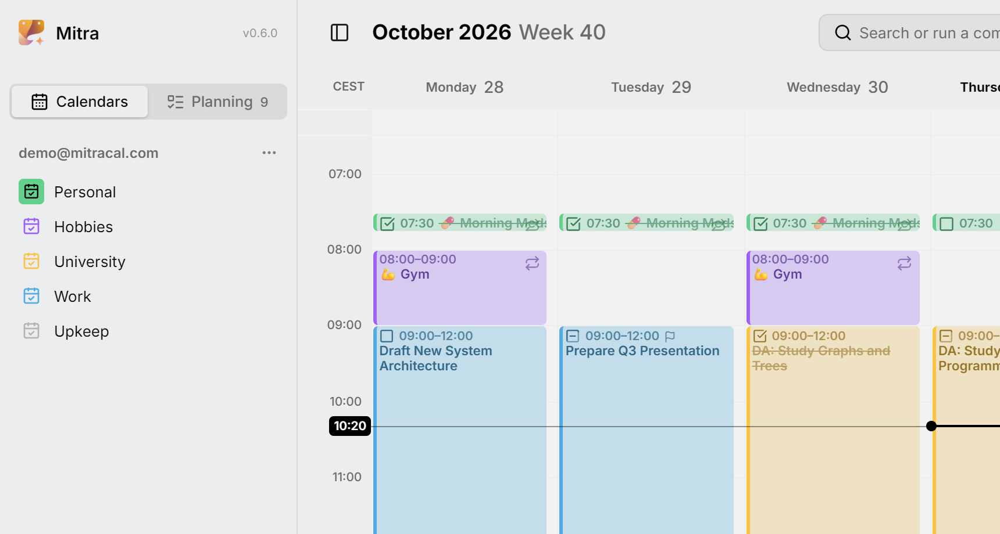

Chaque ligne de l'onglet **Agendas** de la barre latérale est un agenda. Certains sont [stockés dans Mitra](integrations/mitra.md), et d'autres viennent d'un compte que vous avez connecté. Ils se trouvent sous le titre de l'intégration à laquelle ils appartiennent, et tout ce qui figure sur cette page fonctionne de la même façon pour tous, sauf mention contraire.

<picture>
  <source media="(prefers-color-scheme: dark)" srcset="../assets/screenshots/calendars-detail-dark.webp">
  
</picture>

Un agenda occupe une seule ligne, même quand il contient à la fois des événements et des tâches, comme la plupart des agendas CalDAV. Qu'une entrée donnée soit un événement ou une tâche dépend de l'entrée.

## Choisir ce qui est importé

Quand vous connectez un compte, Mitra trouve ses agendas et les liste, tous cochés, chacun indiquant ce qu'il contient, par exemple « Événements · Tâches ». Décochez ceux dont vous ne voulez pas avant d'enregistrer. Vous pouvez changer d'avis plus tard sous **⋯ → Modifier** du compte, où les agendas ajoutés au compte depuis attendent décochés. Mitra ne synchronise et ne stocke que les agendas activés, donc les autres ne coûtent rien.

## Ajouter ou supprimer un agenda

Un agenda d'un compte connecté est créé et supprimé chez le fournisseur, et Mitra le remarque à sa prochaine synchronisation. Les calendriers Mitra font exception : ajoutez-en un avec **Nouveau calendrier** dans le menu **⋯** du titre Mitra, et supprimez-en un avec **Supprimer le calendrier** dans son propre menu **⋯**. S'il contient encore des entrées, Mitra propose **Déplacer d'abord les entrées…**, pour que rien ne soit perdu par accident.

## Masquer un agenda

L'œil au bout d'une ligne masque les entrées de cet agenda. Masquer ne concerne que ce que vous voyez : l'agenda continue de se synchroniser, et ses entrées reviennent aussitôt quand vous l'affichez à nouveau.

Masquer ne rend pas un agenda muet, donc ses [rappels](reminders.md) se déclenchent toujours. Pour arrêter complètement un agenda, désactivez-le sous **⋯ → Modifier** de son compte.

### Afficher un seul agenda

Pour écarter tout le reste, choisissez **Afficher uniquement ce calendrier** dans le menu **⋯** d'un agenda, ou faites un <kbd>Alt</kbd>-clic sur son œil. Tous les autres agendas se masquent, et Mitra se souvient de ceux que vous affichiez. Le même élément de menu devient alors **Afficher les calendriers précédemment visibles** et les ramène.

Les agendas déjà masqués auparavant restent masqués. Un agenda que vous avez connecté entre-temps s'affiche, puisqu'il ne faisait pas partie de ce que vous avez mis de côté. Afficher un agenda à la main ne vous fait pas non plus perdre le chemin de retour vers les autres. Vous pouvez aussi faire les deux depuis la [palette de commandes](shortcuts.md) en cherchant le nom d'un agenda.

## Renommer

Double-cliquez sur le nom d'un agenda, ou choisissez **Renommer** dans son menu **⋯**. Le nom est le vôtre : la synchronisation ne l'écrase jamais. Mitra ne reprend le nom du fournisseur que lorsque l'agenda y est réellement renommé.

## Recolorer

Choisissez une couleur dans le menu **⋯** de l'agenda. Tant que vous ne le faites pas, un agenda utilise la couleur que son fournisseur lui donne. Si le fournisseur n'en donne aucune, Mitra en choisit une à partir de l'adresse de l'agenda, de sorte qu'elle soit la même sur chaque appareil. Les entrées prennent la couleur de leur agenda, sauf si elles ont une couleur propre.

## Réorganiser

Les agendas commencent dans l'ordre où Mitra les a trouvés, et les comptes dans l'ordre où vous les avez connectés. Pour les organiser vous-même, faites glisser un agenda vers le haut ou le bas au sein de son compte, ou faites glisser un compte par son titre pour le déplacer avec tous ses agendas. Sur un écran tactile, appuyez longuement un instant avant de faire glisser, car un simple balayage fait défiler la liste. **Déplacer vers le haut** et **Déplacer vers le bas** dans le menu **⋯** font de même sans glisser.

Un agenda ne se déplace qu'au sein de son propre compte. Un agenda que vous activez plus tard rejoint la fin de son compte, donc il ne perturbe pas l'ordre que vous avez défini.

## Où arrivent les nouvelles entrées

L'agenda avec l'icône pleine est votre agenda par défaut : les nouvelles entrées y vont, sauf si vous en choisissez un autre. Cliquez sur l'icône d'un agenda pour en faire l'agenda par défaut, et cliquez à nouveau sur l'icône de celui par défaut pour l'effacer. Sans agenda par défaut, les nouvelles entrées vont au premier agenda de la liste, donc déplacer un agenda en haut en fait aussi l'agenda par défaut. Le même choix se trouve sous **Paramètres → Entrées**.

Les nouvelles entrées sont des événements, sauf si l'agenda ne peut contenir que des tâches, comme une vue Notion. Tant qu'une entrée est nouvelle, son éditeur a un sélecteur **Événement** / **Tâche**. Une fois enregistrée, changez-la avec **Type** dans l'éditeur, tant que son agenda peut contenir l'autre genre. Une entrée récurrente garde son type.

## Déplacer ou copier toutes les entrées vers un autre agenda

**Déplacer les entrées vers…** dans le menu **⋯** d'un agenda, ou **Déplacer les entrées de …** dans la palette de commandes, déplace tout ce qu'il contient vers un autre agenda en une fois. Choisissez où elles doivent aller, et avant que quoi que ce soit se passe, Mitra vous montre ce que le déplacement coûterait :

```
19 of 21 entries move to Personal
✓ 15 arrive with everything they carry
! 4 lose their reminders
⨯ 2 repeat and stay here
```

Le rapport dépend de ce que la destination peut contenir, donc il se lit différemment pour un agenda CalDAV et pour une vue Notion. Les entrées que la destination ne peut pas accueillir du tout, comme une entrée récurrente allant vers Notion, restent où elles sont et sont listées par leur nom.

**Copier plutôt** laisse les originaux où ils sont et place une copie de chacun dans la destination. C'est aussi ainsi que vous sortez des entrées d'un agenda en lecture seule, comme un abonnement : on peut y copier, mais pas en déplacer.

Les liens entre les entrées que vous déplacez suivent, même vers Notion, qui donne un nouvel identifiant à chaque page. Les liens des entrées qui restent en arrière continuent de pointer vers celles qui ont été déplacées.

Si la destination ne peut pas répéter les entrées, Mitra demande quoi faire des entrées récurrentes : les laisser ici, ou les convertir en entrées uniques, une pour chaque occurrence de l'année à venir, qui ne se répètent plus. Il ne convertit jamais sans demander.

> [!NOTE]
> Mitra copie d'abord et ne supprime les originaux qu'une fois leurs copies arrivées. Il n'y a pas d'annulation entre deux fournisseurs, donc cet ordre est le filet de sécurité : si quelque chose se passe mal, vous pouvez vous retrouver avec une entrée dans les deux agendas, mais jamais avec une entrée manquante. Si la copie échoue, tout le déplacement s'arrête et rien n'est supprimé.

### Déplacer une seule entrée

Pour déplacer une entrée, ouvrez-la et choisissez un autre agenda dans son éditeur. Pour une entrée récurrente, Mitra demande lesquelles vous visez. **Cette entrée** déplace cette seule occurrence, **Cette entrée et les suivantes** déplace le reste de la série et laisse derrière les occurrences précédentes, et **Toutes les entrées** déplace toute la série, règle de répétition comprise.

## Agendas en lecture seule

Certains agendas ne peuvent pas être modifiés depuis Mitra : les [abonnements à un calendrier](integrations/subscriptions.md), et les agendas que quelqu'un a partagés avec vous en consultation seule. Mitra le remarque de lui-même et les marque en lecture seule.

Vous pouvez ouvrir leurs entrées et tout lire, sélectionner et copier, mais vous ne pouvez pas y créer, modifier, déplacer ou supprimer d'entrées, et une entrée ne peut pas y être déplacée. Renommer, recolorer, réorganiser et masquer fonctionnent toujours, puisque c'est votre propre vue de l'agenda. Si le propriétaire vous autorise plus tard à faire des modifications, Mitra le remarque à la synchronisation suivante.

## Réimporter un agenda

**Réimporter les entrées**, dans le menu **⋯** d'un agenda ou d'un compte entier, jette la copie des entrées de Mitra et les importe à nouveau depuis le fournisseur. Rien ne change chez le fournisseur. Vous ne devriez pas en avoir besoin au quotidien, puisque la [synchronisation](integrations/README.md#how-syncing-works) s'occupe d'elle-même ; elle est là pour quand un agenda semble faux ou obsolète après une mise à jour. Les calendriers Mitra ne la proposent pas, puisqu'il n'y a pas de fournisseur depuis lequel importer.
