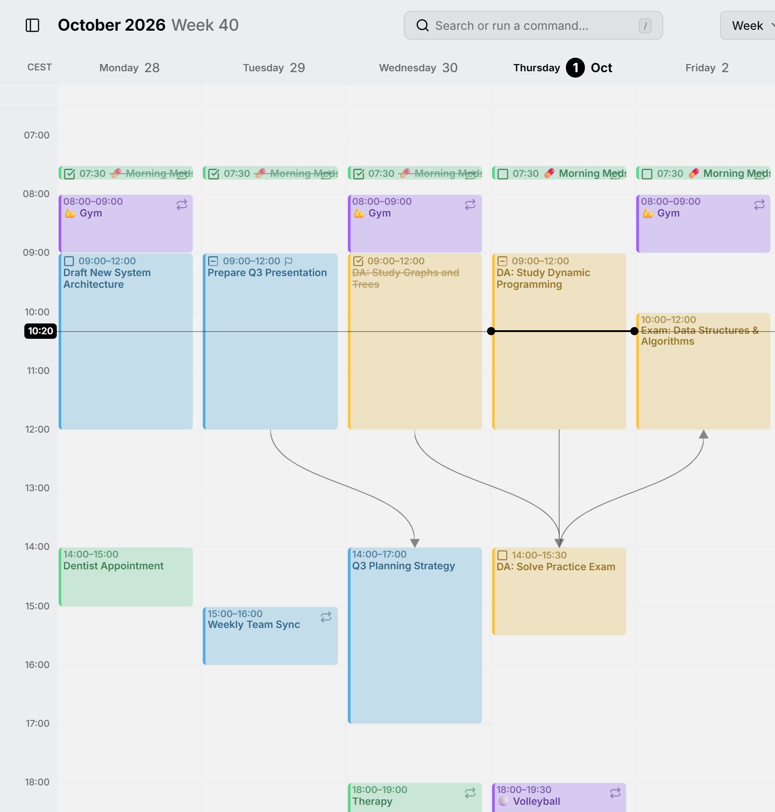

Una **dipendenza** dice che una voce non può iniziare finché un'altra non è finita: la bozza prima della revisione, la revisione prima del rilascio. La voce che attende è bloccata dall'altra.

<picture>
  <source media="(prefers-color-scheme: dark)" srcset="../assets/screenshots/week-detail-dark.webp">
  
</picture>

## Aggiungere una dipendenza

Apri la voce che attende, premi **＋** su **Bloccato da** e scrivi una parte del titolo della voce che deve finire per prima. La ricerca copre tutti i tuoi calendari, quindi una voce può attendere una voce di un altro calendario o account. L'altra voce elenca poi questa sotto **Blocca**, che elenca soltanto i collegamenti: ne aggiungi sempre uno dalla voce che attende.

Nell'editor, clicca sul titolo di una voce collegata per aprirla, oppure premi la **✕** accanto per rimuovere il collegamento, da entrambi i lati. Mitra rifiuta un collegamento che andrebbe in cerchio, come due voci che si attendono a vicenda.

Con il mouse puoi anche disegnare una dipendenza nella vista settimana o mese. Punta la voce che viene prima, afferra la breve linea alla sua fine e rilasciala sulla voce che deve attenderla. Mentre trascini, la linea diventa rossa sopra una voce che inizia già troppo presto.

## Linee sul calendario

La vista settimana, la vista mese e la cronologia disegnano una linea dalla fine di ogni voce all'inizio della voce che la attende. Punta una voce per portare in primo piano le sue linee. Le linee di ogni vista si possono disattivare in **Impostazioni → Calendario**, con **Linee di collegamento nella vista settimana**, **Linee di collegamento nella vista mese** e **Linee di collegamento nella cronologia**.

## Dipendenze interrotte

Quando una voce inizia prima che sia finita quella che attende, la dipendenza è interrotta. La sua linea sul calendario diventa rossa e, nelle righe **Bloccato da** e **Blocca** dell'editor, la voce sull'altro lato è scritta in rosso. Rimetti in ordine l'una o l'altra voce e l'avviso scompare.

## Spostare una catena

Quando trascini una voce, o uno dei suoi bordi, e altre voci dipendono da essa, Mitra chiede **Spostare anche le voci dipendenti?**. Le scelte che spostano altre voci dicono quante sono:

- **Solo questa voce** sposta questa e lascia le altre dove sono.
- **Mantieni la catena intatta** sposta le altre solo quanto basta per mantenerle in ordine. Le voci successive a questa vanno più avanti e, se hai spostato questa prima, le voci che la precedono vanno prima. Una voce con abbastanza margine resta dov'è.
- **Spostale tutte della stessa quantità** sposta l'intera catena, prima e dopo questa voce, della stessa quantità di tempo, così gli intervalli tra loro restano uguali.

Mitra chiede solo quando le scelte darebbero risultati diversi. Cambiare gli orari nell'editor non sposta mai altre voci.

Quando una voce si sposta come parte di una catena, le sue attività secondarie si spostano con lei. Le voci ricorrenti e le attività non pianificate in una catena non vengono mai spostate.

> [!TIP]
> Tieni premuto <kbd>Ctrl</kbd> (<kbd>⌘</kbd> su un Mac) mentre rilasci per saltare la domanda e spostare solo quella voce. Vedi le [scorciatoie da tastiera](shortcuts.md).

## Quali calendari lo supportano

Un collegamento viene salvato con la voce che attende, nel calendario di quella voce. I [server di calendario](integrations/caldav.md), [Apple Calendar](integrations/apple.md) e i [calendari Mitra](integrations/mitra.md) conservano qualsiasi collegamento, e su un server di calendario viene scritto nel formato standard dei calendari, così le altre app che usano lo stesso calendario possono leggerlo.

- In [Notion](integrations/notion.md), un collegamento a un'attività dello stesso database va nella proprietà di relazione corrispondente, come «Blocked by». Mitra conserva da sé i collegamenti a qualsiasi altra cosa.
- [Google Calendar](integrations/google.md) scarta i collegamenti, quindi a una voce di un calendario Google non si può assegnare qualcosa da attendere. Le voci di altri calendari possono comunque collegarsi a essa.
- Gli [abbonamenti a un calendario](integrations/subscriptions.md) sono di sola lettura, e [Tempo](integrations/tempo.md) non ha collegamenti.
