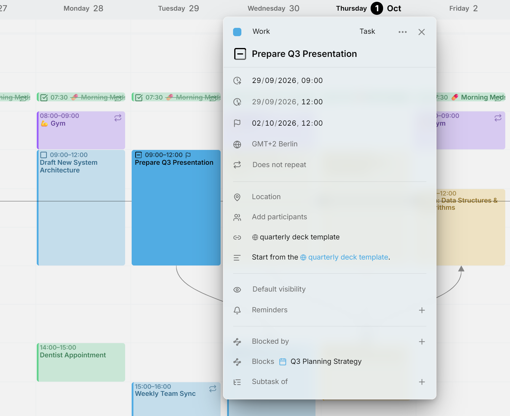

Tutto ciò che sta nel tuo calendario è una **voce**. La maggior parte delle voci sono **eventi**, che si svolgono a una certa ora, o **attività**, che porti a termine e spunti. Un terzo tipo, la [disponibilità](availability.md), ombreggia il tempo che riservi a qualcosa, dietro i tuoi eventi e le tue attività.

Questa pagina riguarda l'editor delle voci: la sua intestazione, le righe sotto di essa e la descrizione.

<picture>
  <source media="(prefers-color-scheme: dark)" srcset="../assets/screenshots/due-detail-dark.webp">
  
</picture>

## Aprire l'editor

Clicca una voce per aprire il suo editor accanto a essa. Per crearne una, premi <kbd>C</kbd> oppure **Crea** in cima alla pagina. La nuova voce inizia all'ora piena successiva, dura un'ora e va nel tuo [calendario predefinito](calendars.md#where-new-entries-land). Nella [vista settimanale](views/week.md) puoi anche trascinare su un intervallo di tempo libero.

Ogni modifica viene salvata mentre la fai. Chiudi l'editor con la sua **✕**, oppure cliccando fuori da esso. Su uno schermo stretto, come un telefono, l'editor sale dal basso come un pannello.

## L'intestazione

La riga in alto dell'editor contiene il colore della voce, il suo calendario, il suo tipo e il menu **⋯**.

### Dare a una voce un colore proprio

Una voce porta il colore del suo calendario. Per dare a una voce un colore tutto suo, clicca il punto all'inizio dell'intestazione e scegline uno. **Reimposta al colore del calendario**, nello stesso selettore, le restituisce il colore del calendario.

### Spostare una voce in un altro calendario

Accanto al punto c'è il nome del calendario della voce. Cliccalo e scegli un altro calendario per spostarvi la voce. L'elenco esclude i calendari che non potrebbero conservare qualcosa che la voce ha, come una ripetizione o lo stato **Annullato**. Vedi [Spostare una singola voce](calendars.md#move-a-single-entry).

### Cambiare il tipo di una voce

Più avanti l'intestazione mostra il tipo della voce: **Evento**, **Attività** o **Disponibilità**. Cliccalo e scegline un altro. I server di calendario tengono separati eventi e attività, quindi Mitra salva di nuovo la voce con l'altro tipo ed elimina la vecchia. L'editor resta aperto sul risultato.

Ciò che il nuovo tipo non può contenere viene scartato. Un'attività che diventa un evento perde stato, avanzamento, data di scadenza e stima. Un evento che diventa un'attività perde occupato o disponibile. La disponibilità non ha partecipanti né promemoria.

Il tipo non si può cambiare in una voce ricorrente, né in un calendario che contiene un solo tipo, come un calendario Notion. **Disponibilità** viene offerta solo dove il calendario può contenerla.

### Il menu ⋯

**Duplica** crea una copia nello stesso calendario e la apre. Tenendo premuto <kbd>Alt</kbd> mentre trascini una voce, ne crei una copia dove la rilasci.

**Elimina** rimuove la voce. Mentre l'editor è aperto lo fanno anche <kbd>Delete</kbd> o <kbd>Backspace</kbd>, purché tu non stia scrivendo in un campo. Se la voce si ripete o ha attività secondarie, Mitra chiede a quali ti riferisci.

Una voce di Notion o Tempo offre anche **Apri in Notion** o **Apri in Jira**, che la apre dove ha avuto origine.

## Titolo e orario

Il titolo è la riga grande sotto l'intestazione. Le righe sotto di esso dicono quando si svolge la voce: l'inizio, la fine, il fuso orario e se si ripete. Per passare tra giorni e orari, premi **Tutto il giorno** alla fine di una data, che compare finché sei su quella riga.

Un'attività ha anche una data di scadenza e, finché non è pianificata, una stima. Vedi [Pianificazione](planning.md). Per i fusi orari vedi [Fusi orari](time-zones.md), e per le ripetizioni [Ripetizioni](repeats.md).

## Stato delle attività

Un'attività ha una casella prima del titolo e uno di quattro stati: **Da fare**, **In corso**, **Fatto** o **Annullato**. Clicca la casella per segnare l'attività come fatta, e cliccala di nuovo per riaprirla. Per scegliere uno stato qualsiasi, fai clic destro sulla casella oppure <kbd>Alt</kbd>-clic. Funziona anche sul calendario.

Le attività fatte e annullate sono barrate. Un calendario senza stato annullato, come Notion, esclude **Annullato** dal menu. Un'attività con attività secondarie o con un elenco di controllo mostra il suo avanzamento nella casella; vedi [Attività secondarie](subtasks.md#progress).

## Occupato o disponibile e visibilità

La riga con l'occhio dice che cosa gli altri apprendono dalla voce quando guardano il tuo calendario.

Gli eventi scelgono tra **Occupato** e **Disponibile**. Occupato, il valore predefinito, segna il tempo come impegnato, quindi chi controlla quando sei libero per un incontro lo vede bloccato. Disponibile mostra la voce senza bloccare il tempo, il che va bene per un promemoria per te stesso o una festività in cui non prendi ferie. Le attività non hanno occupato o disponibile. La disponibilità sì, e parte come disponibile; vedi [Disponibilità](availability.md#busy-or-free).

Ogni voce ha una visibilità. **Visibilità predefinita** la lascia al calendario. **Pubblico** permette a chiunque possa vedere il tuo calendario di leggere la voce. **Privato** chiede alle altre app di mostrare alle persone con cui condividi il calendario solo che il tempo è occupato, non di che cosa si tratta. **Riservato** è il più rigoroso, per le voci che devono restare tra te e le persone invitate. Mitra salva la tua scelta con la voce, e il server e le app che la leggono decidono che cosa nascondere.

## Luogo, persone e altro

- [Luogo](location.md) contiene un posto, con una mappa, oppure un link a una riunione.
- [Partecipanti](participants.md) elenca le persone coinvolte e le loro risposte.
- [Promemoria](reminders.md) ti avvisano prima che la voce inizi, o prima della scadenza di un'attività.
- [Link](links.md) raccoglie i link presenti nella descrizione sopra di essa.
- **Attività secondaria di** e **Attività secondarie** costruiscono un albero di attività; vedi [Attività secondarie](subtasks.md).
- **Bloccato da** e **Blocca** dicono che cosa deve finire prima; vedi [Dipendenze](dependencies.md).

## La descrizione

Clicca la descrizione per modificarla, e clicca altrove per vederla di nuovo formattata. È scritta in Markdown, quindi titoli, elenchi puntati e numerati, testo in grassetto e corsivo, codice, tabelle e link vengono tutti resi. Una citazione che inizia con `> [!NOTE]`, `> [!TIP]` o `> [!WARNING]` diventa un riquadro colorato. Cliccare un link lo apre invece di modificare.

Le righe che iniziano con `- [ ]` diventano un elenco di controllo, che puoi spuntare senza aprire il testo. Vedi [Elenchi di controllo](subtasks.md#checklists).

## Relazioni da altre app

Altre app di calendario possono collegare le voci in modi che Mitra non crea da sé. Mitra mostra questi collegamenti in una sezione a parte: **Collegato a** per le voci che stanno insieme, e una sezione con il nome del tipo di collegamento per i tipi che non conosce. Puoi rimuovere un collegamento di questo tipo con la sua **✕**, ma non aggiungerlo.

## Quali calendari lo supportano

Ogni calendario conserva cose diverse, e Mitra nasconde le righe che un calendario non può conservare, così nulla di ciò che scrivi sparisce alla sincronizzazione successiva. Un calendario Notion contiene solo attività, per esempio, e un calendario Google non ha relazioni. Vedi [Integrazioni](integrations/README.md#what-each-one-holds) per ciò che ciascuna contiene.
