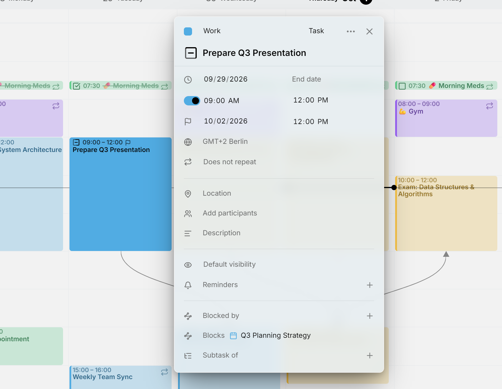
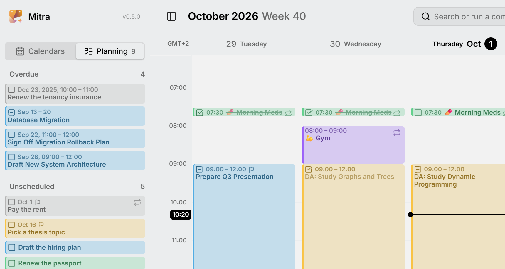

Mitra shows your tasks in the [views](views.md), next to your events. But not every task has a place in your week yet. Some are ideas you want to keep, some have a due date but no plan, and some you just haven't gotten to.

This guide shows how to keep track of those tasks, and how to plan them when you're ready.

## Schedule, constraints and planning

Mitra separates two kinds of information about a task's time.

- The **schedule** is when you'll work on the task: its start and end. It's what the views show. A task with a schedule is **scheduled**, and a task without one is **unscheduled**.
- The **constraints** are what the schedule has to respect. A task has two: its **due date**, when it has to be done, and its **estimate**, how long it will take.

**Planning** is scheduling your unscheduled tasks so that each schedule fits its constraints: it ends before the due date, and it's as long as the estimate. Mitra takes the estimate into account for you, so a task you schedule already has the right length.

Neither the schedule nor the constraints are required. A task can have a due date and no schedule, a schedule and no due date, both, or neither.

For example, a presentation is due on Friday at noon, and you schedule Tuesday morning to prepare it. The views show the task on Tuesday, and a small flag beside it shows that it has a due date.

<picture>
  <source media="(prefers-color-scheme: dark)" srcset="../../assets/screenshots/due-detail-dark.png">
  
</picture>

## The Planning tab

The sidebar's **Planning** tab is where you plan: your unscheduled tasks wait there until you schedule them. Open the sidebar and switch to **Planning**. You can also swipe sideways from **Calendars**, with two fingers on a trackpad or one finger on a touch screen.

<picture>
  <source media="(prefers-color-scheme: dark)" srcset="../../assets/screenshots/planning-detail-dark.png">
  
</picture>

The tab has two lists:

- **Unscheduled** holds every unscheduled task. Tasks with a due date come first, the soonest at the top. The rest follow in alphabetical order, and finished tasks move to the bottom.
- **Overdue** holds the tasks you've fallen behind on. See [overdue tasks](#overdue-tasks).

The number on the tab counts both lists, so you can see how much is waiting from the **Calendars** tab too. Click a task to open it, as you would in the views.

To note down a task for later, press **Add Task** at the bottom of the tab. It only asks for a title. The task goes to your [default calendar](calendars.md#where-new-entries-land), or to the first calendar that can hold tasks if your default can't.

## Set a due date

Open the task, press **Due date** and pick a day. You can add a time as well. To remove the due date, press the **✕** beside it.

A task with a due date shows a small flag, in the views and in the Planning tab. Scheduling, unscheduling or moving the task never changes its due date.

An all-day task is due on a day. If you give the task times, its due date gets a time too, 17:00 on the same day, which you can change.

## Set an estimate

An unscheduled task has an **Estimate** field, with an hourglass, where a scheduled task has its end. Click it and type the hours and minutes, or pick a length from the list.

Only unscheduled tasks have an estimate. When you schedule a task, its estimate becomes the length of its schedule. When you unschedule it, the length of its schedule becomes its estimate again, so nothing is lost either way.

## Schedule a task

Scheduling gives a task a start and an end. There are two ways to do it.

### Drag it into a view

Drag the task out of the Planning tab and drop it in a view.

- **On a time of day in the week view**, the task starts where you drop it and lasts as long as its estimate. Without an estimate, it lasts your [default duration](settings.md#entries).
- **In the all-day lane of the week view, or on a day in the month or year view**, the task becomes all-day. It covers as many days as its estimate, and at least one.

Afterwards, drag its edge to make it longer or shorter, like any other entry.

### Set a start date

Open the task, press **Start date** and pick a day.

- If its estimate is shorter than a day, the task starts at 9:00 and lasts as long as its estimate.
- Otherwise, the task becomes all-day, covering as many days as its estimate, and at least one.

The view moves to that day, and the task stays open, so you can adjust its times right away. This works everywhere, including on a phone, where the open sidebar covers the view and there's nowhere to drag to.

## Unschedule a task

Unscheduling removes a task's schedule and returns it to the Planning tab. There are two ways to do it:

- **Drag** the task out of the view and drop it on the **Unscheduled** list.
- **Open the task and press the ✕** beside its start date. The Planning tab opens, with the task still open.

The task keeps its due date, and the length of its schedule becomes its estimate. Its reminders stay if it has a due date for them to count down to, and are removed otherwise.

The **✕** beside the end date does something else. It doesn't unschedule the task, it only shortens it to the day it starts.

> [!NOTE]
> Only tasks can be unscheduled. An event always has a date. A task that repeats on a schedule, such as a weekly review, can't be unscheduled either.

## Overdue tasks

A task is **overdue** when it isn't finished and its day has passed. Its day is its due date, or, without a due date, the last day of its schedule. The **Overdue** list shows these tasks, the most overdue first.

Mitra counts whole days, so a task due this morning only becomes overdue tomorrow.

A task leaves the list when you mark it done. You can also give it a later due date, or, if it has no due date, schedule it on a later day.

## Repeating due dates

Some tasks are due again and again, such as paying the rent by the 1st of every month. Give the task a due date and set it to repeat.

The **Unscheduled** list shows only the next one, so it doesn't fill up with every month at once. When you schedule it, only that month's task is scheduled, and next month's takes its place in the list.

Repeating tasks are never overdue.

## Moments

A **moment** is a scheduled task with a start and no end, for something you do at one point in time rather than over a stretch of it, such as taking your morning medication at 7:30. In the week view it shows as a slim, one-line entry at its start time.

To turn a task into a moment, open it and press the **✕** beside its end time. To give it an end again, press **End time**.

## Which calendars support this

Every change is saved straight to the calendar the task belongs to.

- **Calendars stored in Mitra** support everything on this page.
- **[Calendar servers](../integrations/caldav.md)** support everything too. Other apps using the same calendar see the task's start and due date.
- **[Notion](../integrations/notion.md)** supports schedules, but no constraints, because a Notion database holds a single date for each task.
