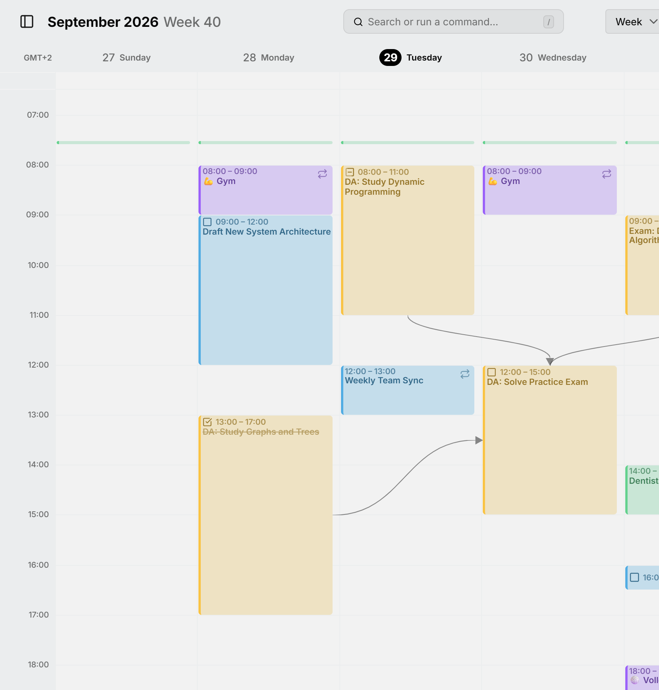
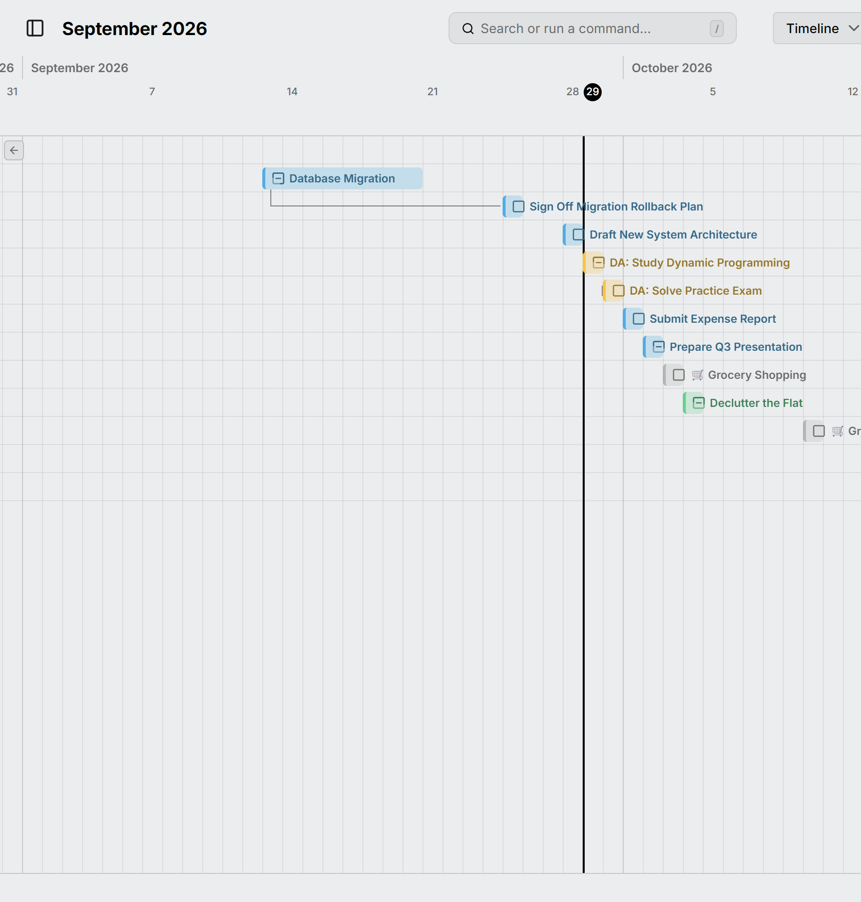
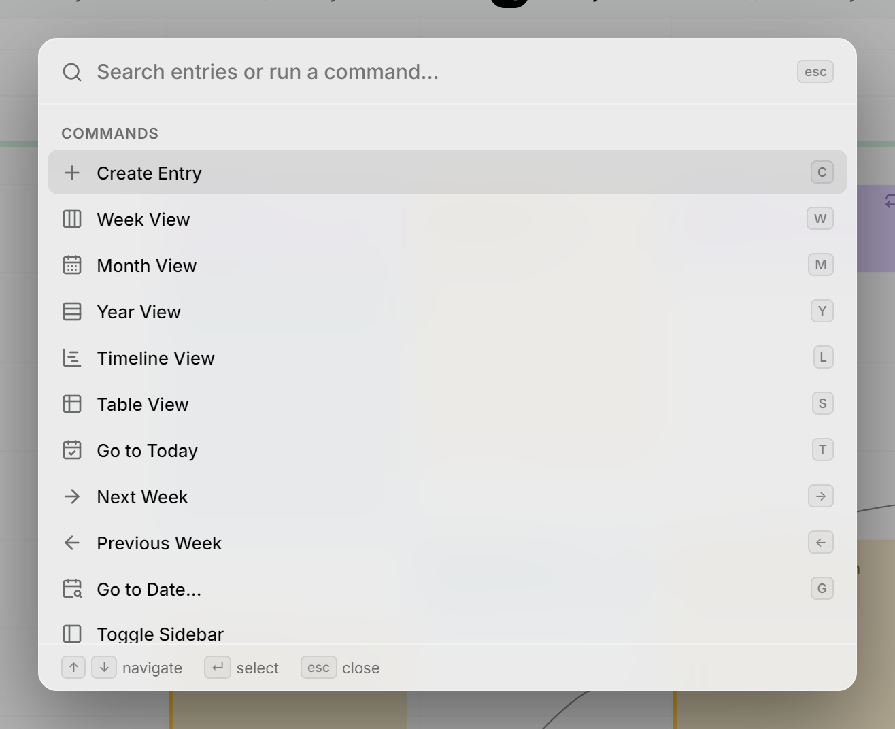

Mitra draws the same entries in five views. Pick one from the view picker in the page header, or press its key. Switching keeps the date you were looking at, and **Settings → Calendar** sets the view Mitra opens on.

In every view but the table, the arrows beside **Today** step back and forward by the view's own period (a week, a month or a year), <kbd>T</kbd> returns to today and <kbd>G</kbd> jumps to any date. Hold <kbd>Ctrl</kbd> and scroll to zoom in or out.

## Week

<kbd>W</kbd>. Hour by hour, with a column per day. Tasks sit in the same columns as events, all-day entries in the lane along the top, and [dependencies](relationships/dependencies.md) as lines between entries. Drag across empty time to create an entry, and drag an entry to move or resize it.

<picture>
  <source media="(prefers-color-scheme: dark)" srcset="../../assets/screenshots/week-detail-dark.png">
  
</picture>

## Month

<kbd>M</kbd>. Weeks as rows, with each entry as a bar across its days. Frequent repeats such as a daily workout become small marks under the day instead of a bar each; see [Routines](routines.md). Click a week number to open that week.

<picture>
  <source media="(prefers-color-scheme: dark)" srcset="../../assets/screenshots/month-detail-dark.png">
  
</picture>

## Year

<kbd>Y</kbd>. Each month is one row of days, so a whole year fits on one screen. Useful for finding a free week or seeing how a trip lines up with everything around it.

<picture>
  <source media="(prefers-color-scheme: dark)" srcset="../../assets/screenshots/year-detail-dark.png">
  
</picture>

## Timeline

<kbd>L</kbd>. Your open tasks with a date, one per row, in the order they are due. Each bar spans the task's dates. When a bar is scrolled out of sight, a button at the edge brings it back. A repeating task shows only the occurrences that are due.

<picture>
  <source media="(prefers-color-scheme: dark)" srcset="../../assets/screenshots/timeline-detail-dark.png">
  
</picture>

## Table

<kbd>S</kbd>. Your entries as rows, to sort, filter and change many at once. It lists a span of days counted from today instead of a period, so it has no arrows. See [Table view](table-view.md).

## Command palette

Press <kbd>/</kbd>, <kbd>Ctrl</kbd> + <kbd>K</kbd> or <kbd>Ctrl</kbd> + <kbd>P</kbd> to search your entries or run a command. Choosing an entry goes to its date and opens it. The commands cover the views, navigation, new entries and your settings.

<picture>
  <source media="(prefers-color-scheme: dark)" srcset="../../assets/screenshots/palette-detail-dark.png">
  
</picture>

## See also

- [Keyboard shortcuts](keyboard-shortcuts.md)
- [Settings](settings.md)
