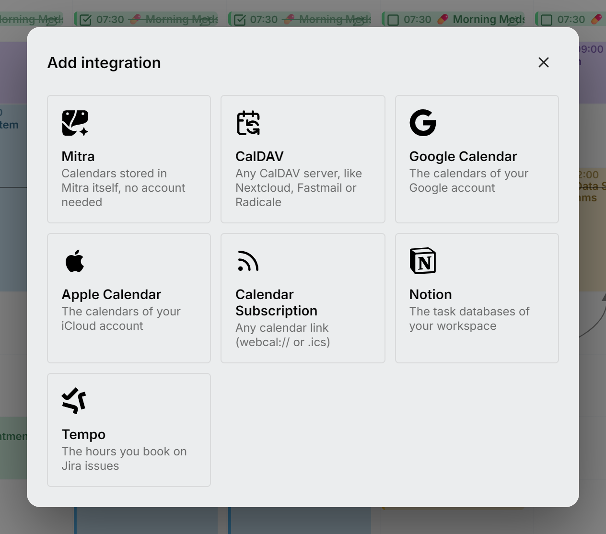

برای نگهداری یک تقویم در میترا دو راه دارید. می‌توانید آن را در خود میترا، روی سرور خودتان و بدون هیچ حسابی پشتش، ذخیره کنید. یا می‌توانید حسابی را که از قبل دارید وصل کنید و میترا تقویم‌های آن را در هر دو جهت همگام نگه می‌دارد. بیشتر افراد ترکیبی از این دو را دارند و موارد آزادانه بین این دو جابه‌جا می‌شوند.

برای افزودن هر کدام، در پایین نوار کناری **افزودن یکپارچه‌سازی** را انتخاب کنید.

<picture>
  <source media="(prefers-color-scheme: dark)" srcset="../../assets/screenshots/integrations-detail-dark.webp">
  
</picture>

## هر کدام چه چیزی نگه می‌دارد

| یکپارچه‌سازی | چه چیزی نگه می‌دارد | راه‌اندازی روی سرور |
| --- | --- | --- |
| [میترا](mitra.md) | رویدادها و کارهایی که در میترا ذخیره شده‌اند | ندارد |
| [CalDAV](caldav.md) | رویدادها و کارها از هر سرور CalDAV | ندارد |
| [تقویم گوگل](google.md) | تقویم‌های یک حساب گوگل | یک بار راه‌اندازی OAuth |
| [تقویم اپل](apple.md) | تقویم‌های یک حساب iCloud | ندارد |
| [اشتراک تقویم](subscriptions.md) | یک فید منتشرشده `webcal://` یا `.ics`، فقط‌خواندنی | ندارد |
| [Notion](notion.md) | کارهای نمای‌های پایگاه‌داده Notion | ندارد |
| [Tempo](tempo.md) | ساعت‌هایی که روی کارهای Jira ثبت می‌کنید | ندارد |

هر ارائه‌دهنده چیزهای متفاوتی ذخیره می‌کند. مثلاً کارهای Notion تکرار نمی‌شوند و ثبت زمان Tempo مکان ندارد. میترا فیلدهایی را که یک تقویم نمی‌تواند ذخیره کند پنهان می‌کند، تا چیزی که می‌نویسید در همگام‌سازی بعدی ناپدید نشود.

## همگام‌سازی چگونه کار می‌کند

وقتی حسابی را وصل می‌کنید، میترا تقویم‌های آن را پیدا می‌کند و همه را تیک‌خورده فهرست می‌کند. پیش از ذخیره، تیک آن‌هایی را که نمی‌خواهید بردارید و میترا بقیه را درون‌ریزی می‌کند. تقویم‌هایی که بعداً در حساب ظاهر شوند بدون تیک می‌آیند، تا چیز تازه‌ای بدون انتخاب شما روی تقویمتان نیاید. میترا هرگز تقویمی را که خاموش است دانلود نمی‌کند.

از آن پس سرور خودش در پس‌زمینه همگام‌سازی می‌کند. تا وقتی کسی میترا را باز دارد بیشتر سر می‌زند و وقتی کسی باز ندارد کمتر:

| | وقتی میترا باز است | وقتی کسی آن را باز ندارد |
| --- | --- | --- |
| CalDAV و تقویم اپل | هر ۱۰ ثانیه | هر ۵ دقیقه |
| تقویم گوگل، Notion و Tempo | حدود یک بار در دقیقه | هر ۵ دقیقه |
| اشتراک‌های تقویم | هر ۱۵ دقیقه | هر ۱۵ دقیقه |
| تقویم‌های میترا | چیزی برای همگام‌سازی نیست | چیزی برای همگام‌سازی نیست |

گوگل، Notion و Tempo تعداد فراخوانی برنامه‌ها را محدود می‌کنند و برای همین کندترند. وقتی میترا را باز می‌کنید، هر حسابی که نوبتش رسیده باشد بلافاصله همگام می‌شود، پس دکمه‌ای برای تازه‌سازی لازم نیست.

تغییرات در هر دو جهت می‌روند. وقتی موردی را می‌سازید، ویرایش می‌کنید، جابه‌جا می‌کنید یا حذف می‌کنید، میترا آن را در تقویمی که به آن تعلق دارد می‌نویسد. اگر یک حساب خطا بدهد بقیه معطل نمی‌مانند: میترا یک دقیقه بعد دوباره امتحان می‌کند.

بعضی تقویم‌ها را نمی‌شود از میترا تغییر داد، مثل اشتراک‌ها و تقویم‌هایی که فقط برای مشاهده با شما به اشتراک گذاشته شده‌اند. باز هم می‌توانید نام و رنگشان را عوض کنید و پنهانشان کنید؛ [تقویم‌های فقط‌خواندنی](../calendars.md#read-only-calendars) را ببینید.

> [!NOTE]
> همگام‌سازی فقط آنچه را تغییر کرده می‌گیرد. اگر تقویمی نادرست به نظر رسید، **درون‌ریزی مجدد موارد** در منوی **⋯** آن، نسخه میترا را دور می‌ریزد و دوباره از ارائه‌دهنده درون‌ریزی می‌کند؛ [درون‌ریزی مجدد یک تقویم](../calendars.md#re-import-a-calendar) را ببینید. در هر دو حالت چیزی نزد ارائه‌دهنده تغییر نمی‌کند.

## تغییر یک حساب

هر حساب را فقط یک بار می‌توان وصل کرد. برای تغییر رمز عبور آن یا تقویم‌هایی که میترا نشان می‌دهد، به جای افزودن دوباره، **ویرایش** را در منوی **⋯** آن انتخاب کنید. تقویم گوگل استثناست: وصل کردن دوباره همان حساب گوگل، دسترسی میترا به آن را تمدید می‌کند.
