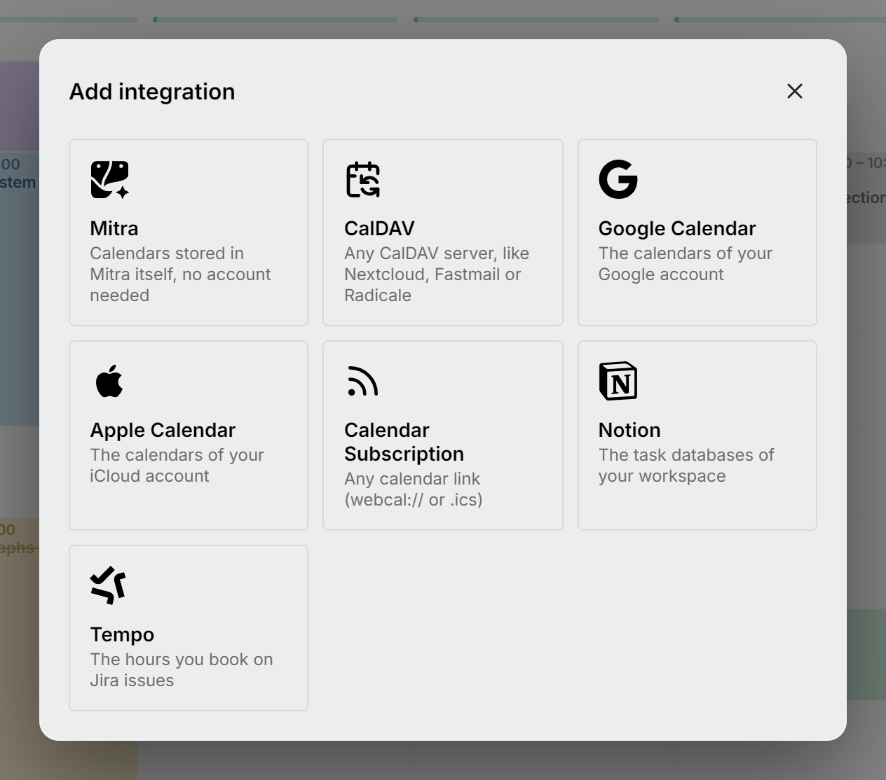

Mitra doesn't replace the accounts you already have. It **brings them in**. Connect a source and Mitra syncs it in the background: events and tasks show up on your timeline, and edits you make in Mitra go back to where they came from.

You can also [create calendars in Mitra itself](mitra.md), with no account behind them.

## Supported integrations

| Integration | What it syncs | Deployment setup |
| --- | --- | --- |
| **[Mitra](mitra.md)** | Nothing to sync: the calendars are stored in Mitra | None, no account needed |
| **[CalDAV](caldav.md)** | Events *and* tasks from any CalDAV server | None, connects from the app |
| **[Google Calendar](google-calendar.md)** | Google calendars (via CalDAV + OAuth) | One-time OAuth setup |
| **[Apple Calendar](apple-calendar.md)** | iCloud calendars (and Mitra-side tasks) | None, uses an app-specific password |
| **[Calendar Subscriptions](calendar-subscriptions.md)** | Any published calendar link (`webcal://` / `.ics`), read-only | None, paste a link |
| **[Notion](notion.md)** | Task database **views**, two-way | None, paste an integration token |
| **[Tempo](tempo.md)** | Jira worklogs (the hours you book), two-way | None, paste two API tokens |

More integrations are on the way.

To connect one, choose **Add Integration** at the foot of the sidebar.

<picture>
  <source media="(prefers-color-scheme: dark)" srcset="../../assets/screenshots/integrations-detail-dark.png">
  
</picture>

## How syncing works

- **Background daemon.** All syncing happens on the server, on a loop, so the app never waits on an external service. While you have the app open, plain CalDAV servers are polled about every 10 seconds, so changes made elsewhere show up almost live. Rate-limited providers (Google, Notion) are polled about once a minute to stay within their quotas. While nobody has the app open, polling slows to every few minutes so your home server isn't flooded all night.
- **Fresh when you look.** Opening or reloading the app syncs right away, so what you see is current without waiting for the next poll. That is also why there is no refresh button: syncing is the server's job, and reloading the page already forces it.
- **Opt-in sources.** When you connect an account, Mitra finds its calendars and lists but leaves them **disabled**. You pick which ones to sync in the source picker, and nothing is downloaded until you enable one.
- **Two-way where the provider allows it.** Creating, editing, moving, and deleting entries in Mitra writes back to the origin. Providers differ in what they can store (Notion tasks can't repeat, for example), so Mitra hides the fields a source can't store instead of letting your edits disappear.
- **Read-only support.** Subscribed calendar feeds and calendars shared with view-only permissions are automatically detected as read-only. You can view all event details without risk of accidental changes, while still being able to customize their color, name, and visibility in your sidebar.
- **Resilient by design.** One broken account doesn't stall the others; a failed source rests briefly and retries. Renames you make to a source in Mitra survive background syncs.

> [!NOTE]
> **Sync and re-import are different things.** A *sync* is the automatic background update: it fetches only what changed and runs on its own. A *re-import* is the manual fix in a source's or account's ⋯ menu: it deletes Mitra's local copy of the entries and fetches everything from the provider again. Your data at the provider is never touched either way. Only use it when a calendar looks wrong or out of date after an update; day to day, syncing takes care of itself.

## Adding an integration

In the app, open the sidebar and choose **Add Integration**, then pick the provider. Each provider's page below covers exactly what to enter:

- [Create calendars in Mitra](mitra.md)
- [Connect a CalDAV account](caldav.md)
- [Connect Google Calendar](google-calendar.md)
- [Connect Apple Calendar](apple-calendar.md)
- [Subscribe to a Calendar Feed](calendar-subscriptions.md)
- [Connect Notion](notion.md)
- [Connect Tempo](tempo.md)

> [!TIP]
> Reconnecting the same account (same server/URL and username) is an **in-place** update. Mitra recognises it and refreshes the connection instead of creating a duplicate.
