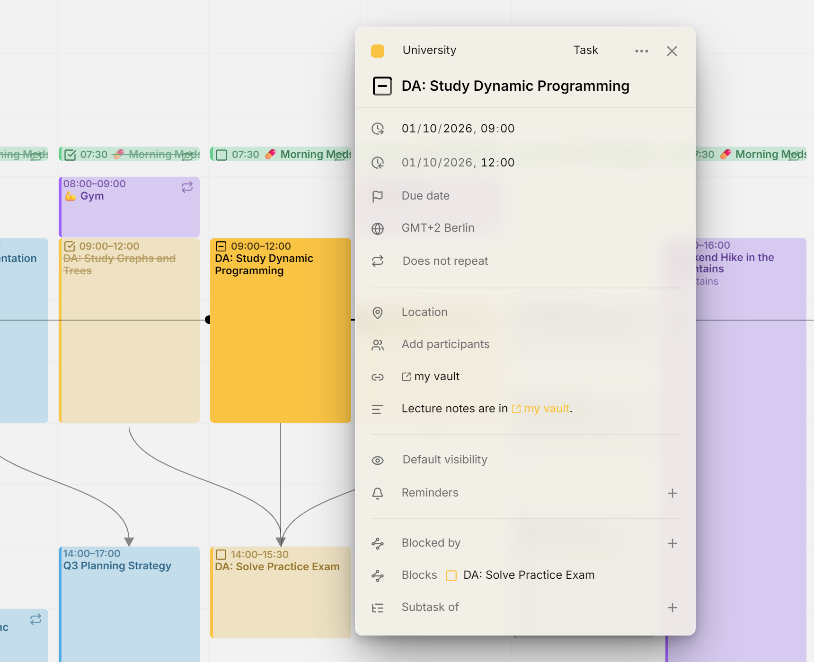

Links in an entry show what they lead to rather than their raw address. A meeting link reads **Join Google Meet**, a link to an Obsidian note shows the note's name, and a web page shows its site and path, such as `example.atlassian.net/browse/DEV-9177`.

<picture>
  <source media="(prefers-color-scheme: dark)" srcset="../assets/screenshots/links-detail-dark.webp">
  
</picture>

## In the editor

When an entry's description holds links, the editor gathers them in a **Links** row just above the description, so you can open them without reading through the text. Click one to open it: a web page opens in a new tab, any other link opens its app. Past two lines, the row scrolls.

The row has no storage of its own: it shows what the description holds. To add or remove a link, edit the description, and the row follows. Every other calendar app you use sees the same links in the description.

## In the description

Links in the description lead with a small icon for what they open. A bare address, such as one pasted from a browser, is shortened to its site and path. A link you wrote with words of your own keeps your words.

Mitra also recognizes links of apps, such as `obsidian://open?vault=…`, which most calendar apps leave as plain text. Links that would run code, like `javascript:`, are shown as plain text and never as links.

## Meeting and app links in the location

A location that is a single link is treated as that link instead of a place. A Zoom, Google Meet, Microsoft Teams, Webex, Jitsi, Whereby, FaceTime or Skype link shows as **Join** with the service's name, in the editor, on the calendar and in the table. It gets no map button. Click beside the link to edit it.

## Links to apps

Mitra names the app a link belongs to from its address. It knows Obsidian, Notion, Slack, Linear, Figma, Things, OmniFocus, Bear, Craft, Drafts, DEVONthink, Evernote, OneNote, Visual Studio Code, Cursor and Spotify. Every app link, known or not, shows the same icon for opening in another app.

> [!NOTE]
> A web page cannot tell whether an app is installed. The first time you open an app link, your browser asks whether to open the app. If the app is missing, nothing happens.
