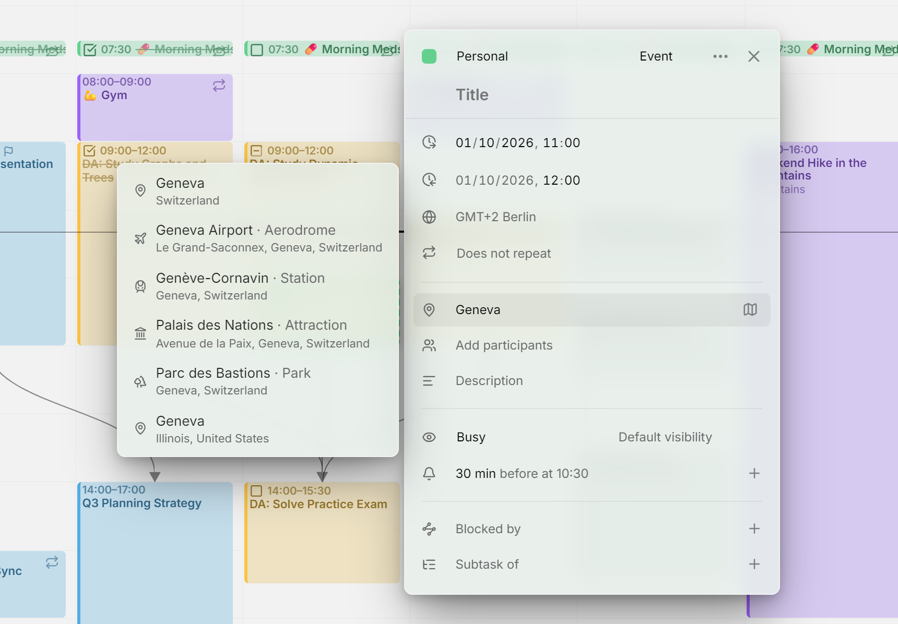

O campo de local do editor de entradas sugere lugares enquanto você digita. Ele não precisa de chave de API nem de cadastro: o Mitra usa o [Photon](https://photon.komoot.io), um geocodificador gratuito e de código aberto baseado no OpenStreetMap.

<picture>
  <source media="(prefers-color-scheme: dark)" srcset="../assets/screenshots/location-detail-dark.webp">
  
</picture>

## Sugestões

Clique no campo de local para ver os lugares usados recentemente nos seus calendários. Enquanto você digita, eles se reduzem aos que combinam e, a partir da segunda letra, lugares do Photon se juntam a eles. Escolha um para preencher o nome e o endereço, ou continue digitando: um local é texto simples, e você pode escrever o que quiser. O botão de mapa ao lado do campo abre o local no Google Maps.

As sugestões favorecem lugares perto de você. Na primeira vez que você clica no campo, o navegador pode perguntar se o Mitra pode usar sua localização. Se você permitir, sua posição vai junto com cada pesquisa, e os lugares próximos aparecem primeiro. Se não permitir, as sugestões continuam funcionando, sem essa preferência.

O Photon dá nome aos lugares em inglês, alemão ou francês quando o navegador está configurado em um desses idiomas e, nos demais casos, no idioma local.

Os calendários do [Notion](integrations/notion.md) e do [Tempo](integrations/tempo.md) não têm local, então as entradas deles não têm o campo de local.

## Privacidade

Seu navegador nunca contata o Photon. As pesquisas vão para o seu servidor do Mitra, que consulta o Photon e repassa as respostas, então o Photon só vê o endereço do seu servidor, não o seu. Ele vê o que você digita e, se você permitiu, sua posição.

Os lugares recentes vêm só dos seus próprios calendários. Em um servidor com vários usuários, ninguém vê os lugares de outro usuário.

## Usar seu próprio servidor Photon

Por padrão, o Mitra consulta o servidor Photon público da komoot, que tem limites de uso justo e nenhuma promessa de continuar no ar. Para deixar de depender dele, [hospede o Photon você mesmo](https://github.com/komoot/photon) e aponte o Mitra para ele com `MITRA_PHOTON_URL`:

```yaml
environment:
  MITRA_PHOTON_URL: 'https://photon.internal.example.com'
```

Depois de reiniciar, as pesquisas vão para o seu servidor. Nada muda no aplicativo. Veja a [Configuração](configuration.md) para as outras opções.

## Solução de problemas

Se só aparecem lugares recentes, o Photon não respondeu em cinco segundos ou recusou a pesquisa, o que acontece quando o servidor público está ocupado ou limitando requisições. O Mitra grava um aviso no seu [log](logging.md). O campo continua aceitando qualquer coisa que você digitar, e [seu próprio servidor Photon](#use-your-own-photon-server) evita o problema.

Se os lugares aparecem em um idioma inesperado, é um limite do Photon: ele só conhece inglês, alemão e francês, e usa o nome local de cada lugar para qualquer outro idioma.
