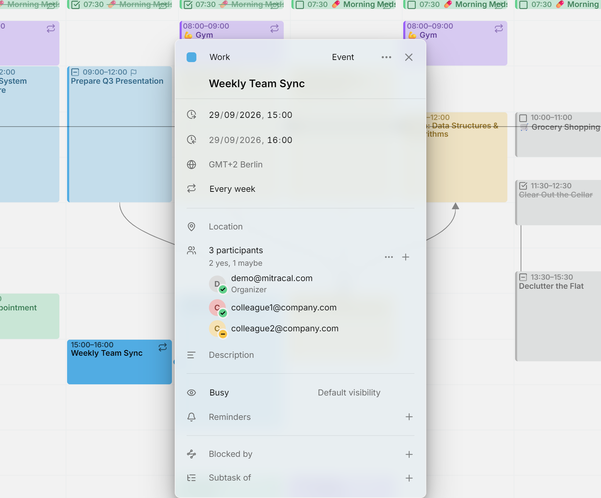

Une entrée peut avoir des **participants** : les personnes qu'elle concerne. Mitra les enregistre avec l'entrée dans le format de calendrier standard, si bien que toutes les autres applications utilisant le même calendrier voient la même liste, et que les réponses faites dans Apple Calendar, Thunderbird ou une messagerie web apparaissent aussi dans Mitra.

<picture>
  <source media="(prefers-color-scheme: dark)" srcset="../assets/screenshots/participants-detail-dark.webp">
  
</picture>

## Qui envoie les invitations

Mitra n'envoie jamais d'e-mail lui-même. Ce qui se passe quand vous ajoutez quelqu'un dépend du calendrier dans lequel se trouve l'entrée.

Quand l'entrée est dans un calendrier d'un [serveur de calendrier](integrations/caldav.md), de [Google Calendar](integrations/google.md) ou d'[Apple Calendar](integrations/apple.md), c'est ce serveur qui envoie : l'invitation, une mise à jour quand l'entrée change, et une annulation quand vous retirez quelqu'un ou supprimez l'entrée. Il recueille aussi les réponses, ce qui est la façon dont elles parviennent à Mitra. La plupart des serveurs le font, dont Google, iCloud, Nextcloud, Fastmail, mailbox.org et Zimbra. Un serveur qui ne fait que stocker des calendriers n'envoie rien : personne n'est informé de l'entrée et chaque réponse reste en attente.

Dans un [calendrier Mitra](integrations/mitra.md), il n'y a aucun serveur derrière le calendrier : la liste n'est donc qu'un relevé des personnes concernées. Personne n'est invité et aucune réponse n'arrive.

Les calendriers [Notion](integrations/notion.md) et [Tempo](integrations/tempo.md) ne peuvent pas contenir de participants, leurs entrées n'ont donc pas de ligne de participants. Dans un [abonnement à un calendrier](integrations/subscriptions.md), vous voyez les participants mais ne pouvez pas les modifier, puisque le calendrier est en lecture seule.

## Ajouter des personnes

Ouvrez l'entrée, saisissez une adresse e-mail dans **Ajouter des participants** et appuyez sur Entrée. Vous pouvez en ajouter plusieurs à la fois, séparées par des virgules, des points-virgules ou des espaces. Pour en ajouter d'autres plus tard, appuyez sur **＋** à côté du nombre de participants.

Dans un calendrier adossé à un compte, la première personne que vous ajoutez fait de vous l'**organisateur** : votre propre adresse rejoint la liste, marquée **Organisateur**, comme ayant accepté. Un calendrier Mitra n'a aucune adresse de vous à utiliser, ses listes n'ont donc pas d'organisateur.

Chaque personne s'affiche avec son initiale, son e-mail, son nom si le calendrier le connaît, et **Organisateur** ou **Facultatif** le cas échéant. Les e-mails sont sélectionnables, vous pouvez donc copier une seule adresse depuis sa ligne. Quand la liste compte plus de cinq personnes, elle affiche les quatre premières et replie les autres derrière une ligne « de plus ».

Pointez une personne pour la modifier. Un bouton la marque comme facultative, ou de nouveau obligatoire, et le **✕** la retire. Sur un écran tactile, ces boutons sont toujours visibles.

## Réponses

Une pastille sur l'initiale de chaque personne indique sa réponse : une coche verte pour accepté, une croix rouge pour refusé et un tiret jaune pour provisoire. Pas de pastille signifie pas encore de réponse. Une ligne sous le nombre les résume, par exemple « 2 oui, 1 non, 3 en attente ».

Les réponses parviennent à Mitra par le serveur de calendrier : une nouvelle réponse apparaît donc à la prochaine synchronisation, pas instantanément.

Mitra montre la réponse de chacun mais n'envoie pas la vôtre. Pour accepter ou refuser une invitation envoyée par quelqu'un d'autre, répondez dans votre application de messagerie ou une autre application de calendrier, et votre réponse se synchronise vers Mitra.

## Agir sur tout le monde

Le menu **⋯** à côté du nombre agit sur toute la liste :

- **Envoyer un e-mail aux participants** ouvre votre application de messagerie avec un e-mail adressé à tous les autres.
- **Copier les e-mails des participants** copie toutes les adresses.
- **Tout marquer comme obligatoire** et **Tout marquer comme facultatif** changent le rôle de chacun d'un coup.
- **Tout supprimer** vide la liste.

## Seul l'organisateur modifie la liste

Sur une entrée organisée par quelqu'un d'autre, vous ne pouvez ni ajouter, ni retirer, ni modifier des personnes : le **＋** est masqué, et le menu ne permet que d'envoyer un e-mail et de copier. C'est la règle du standard de planification que suivent les applications de calendrier, et le serveur de Mitra refuse lui aussi une telle modification. Vous pouvez toujours modifier le reste de l'entrée, comme son titre, son horaire et sa description.

> [!CAUTION]
> Déplacer une entrée avec des participants vers un autre calendrier la supprime du premier, et certains serveurs indiquent alors aux participants qu'elle est annulée. [Copiez-la](calendars.md#move-or-copy-every-entry-to-another-calendar) plutôt si elles ne doivent pas en être informées.

## Dépannage

- Si tout le monde reste en attente et qu'aucune invitation n'est arrivée, l'entrée est dans un calendrier Mitra, ou son serveur de calendrier n'envoie pas d'invitations. Pour vérifier le serveur, invitez les mêmes personnes depuis l'application propre au fournisseur.
- Si une réponse est arrivée mais que sa pastille n'a pas changé, attendez la prochaine synchronisation de Mitra, car les réponses arrivent par le serveur de calendrier.
- S'il n'y a aucun moyen d'ajouter des personnes, quelqu'un d'autre organise l'entrée, ou le calendrier est en lecture seule.
- Si l'entrée n'a pas de ligne de participants, son calendrier ne peut pas en contenir, comme dans Notion et Tempo.
- Si une salle de réunion manque dans la liste, c'est voulu : les salles et le matériel ne sont pas des personnes, et Mitra les laisse de côté.
