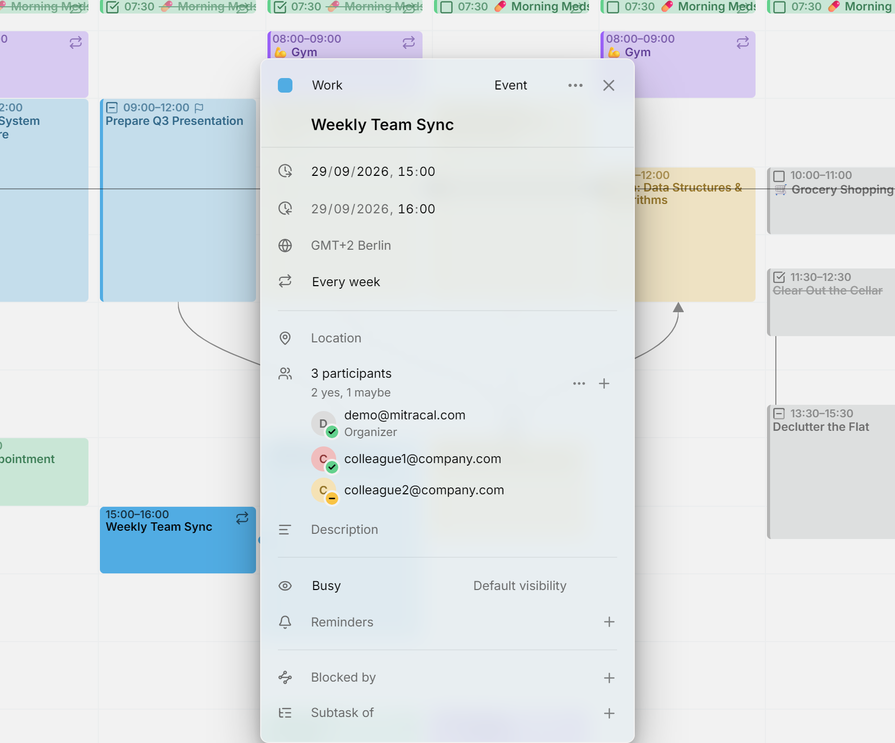

An entry can have **participants**: the people involved in it. Mitra saves them with the entry in the standard calendar format, so every other app using the same calendar sees the same list, and replies made in Apple Calendar, Thunderbird or a webmail show up in Mitra too.

<picture>
  <source media="(prefers-color-scheme: dark)" srcset="../assets/screenshots/participants-detail-dark.png">
  
</picture>

## Who sends the invitations

Mitra never sends email itself. What happens when you add someone depends on the calendar the entry is in.

When the entry is in a calendar from a [calendar server](integrations/caldav.md), [Google Calendar](integrations/google.md) or [Apple Calendar](integrations/apple.md), that server does the sending: the invitation, an update when the entry changes, and a cancellation when you remove someone or delete the entry. It also collects the replies, which is how they reach Mitra. Most servers do this, including Google, iCloud, Nextcloud, Fastmail, mailbox.org and Zimbra. A server that only stores calendars sends nothing, so nobody hears about the entry and every reply stays pending.

In a [Mitra calendar](integrations/mitra.md), there's no server behind the calendar, so the list is only a record of who is involved. Nobody is invited, and no replies come in.

[Notion](integrations/notion.md) and [Tempo](integrations/tempo.md) calendars can't hold participants, so their entries have no participants row. In a [calendar subscription](integrations/subscriptions.md), you can see the participants but not change them, since the calendar is read-only.

## Add people

Open the entry, type an email address into **Add participants** and press Enter. You can add several at once, separated by commas, semicolons or spaces. To add more later, press **＋** beside the participant count.

In a calendar with an account behind it, the first person you add makes you the **organizer**: your own address joins the list, marked **Organizer**, as accepted. A Mitra calendar has no address of yours to use, so its lists have no organizer.

Each person shows with their initial, their email, their name if the calendar knows it, and **Organizer** or **Optional** when that applies. Emails are selectable, so you can copy a single address from its row. When the list has more than five people, it shows the first four and folds the rest behind a "more" row.

Point at a person to change them. One button marks them optional, or required again, and the **✕** removes them. On a touch screen, these buttons are always visible.

## Replies

A badge on each person's initial shows their reply: a green check for accepted, a red cross for declined, and a yellow dash for tentative. No badge means no reply yet. A line under the count sums them up, such as "2 yes, 1 no, 3 awaiting".

Replies reach Mitra through the calendar server, so a new one shows up on the next sync, not instantly.

Mitra shows everyone's reply but doesn't send yours. To accept or decline an invitation someone else sent, answer in your mail app or another calendar app, and your answer syncs back to Mitra.

## Act on everyone

The **⋯** menu beside the count acts on the whole list:

- **Email participants** opens your mail app with an email to everyone else.
- **Copy participants' emails** copies every address.
- **Mark all required** and **Mark all optional** change everyone's role at once.
- **Remove all** empties the list.

## Only the organizer changes the list

On an entry someone else organized, you can't add, remove or change people: the **＋** is hidden, and the menu only emails and copies. That's the rule of the scheduling standard calendar apps follow, and Mitra's server refuses such a change too. You can still edit the rest of the entry, such as its title, time and description.

> [!CAUTION]
> Moving an entry with participants to another calendar deletes it from the first one, and some servers then tell the participants it was cancelled. [Copy it](calendars.md#move-or-copy-every-entry-to-another-calendar) instead if they shouldn't hear about it.

## Troubleshooting

- If everyone stays awaiting and no invitation arrived, the entry is in a Mitra calendar, or its calendar server doesn't send invitations. To check the server, invite the same people from the provider's own app.
- If a reply came in but its badge didn't change, wait for Mitra's next sync, since replies arrive through the calendar server.
- If there's no way to add people, someone else organizes the entry, or the calendar is read-only.
- If the entry has no participants row, its calendar can't hold participants, as in Notion and Tempo.
- If a meeting room is missing from the list, that's on purpose: rooms and equipment aren't people, so Mitra leaves them out.
