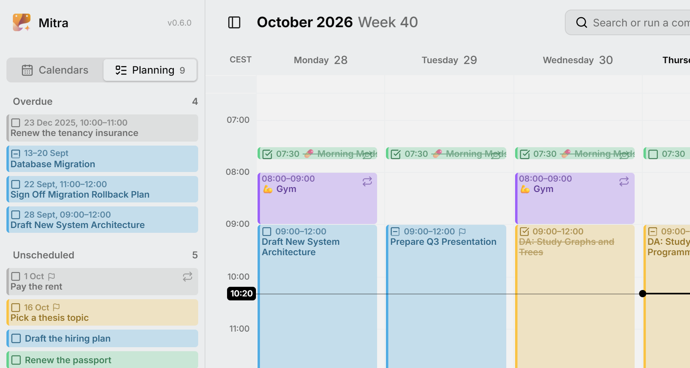

O planeamento trata das tarefas que ainda não têm um lugar na sua semana: ideias que você quer guardar, trabalho com data de vencimento mas sem plano, e coisas a que você simplesmente ainda não chegou. Elas esperam na aba **Planeamento** da barra lateral com uma data de vencimento e uma estimativa, até você arrastá-las para a sua semana.

Esta página trata da aba Planeamento, das datas de vencimento, das estimativas, de agendar e desagendar tarefas e das tarefas em atraso.

<picture>
  <source media="(prefers-color-scheme: dark)" srcset="../assets/screenshots/planning-detail-dark.webp">
  
</picture>

## Agendamento, restrições e planeamento

O Mitra separa dois tipos de informação sobre o tempo de uma tarefa.

- O **agendamento** é quando você vai trabalhar na tarefa: o seu início e o seu fim. É o que as vistas mostram. Uma tarefa com agendamento está **agendada**, e uma tarefa sem ele está **sem agendamento**.
- As **restrições** são o que o agendamento tem de respeitar. Uma tarefa tem duas: a sua **data de vencimento**, quando tem de estar pronta, e a sua **estimativa**, quanto tempo vai levar.

**Planear** é agendar as suas tarefas sem agendamento de modo que cada agendamento respeite as suas restrições: termina antes da data de vencimento e tem a duração da estimativa. O Mitra leva a estimativa em conta por você, de modo que uma tarefa que você agenda já tem a duração certa.

Nem o agendamento nem as restrições são obrigatórios. Uma tarefa pode ter data de vencimento e nenhum agendamento, um agendamento e nenhuma data de vencimento, ambos, ou nenhum.

Por exemplo, uma apresentação vence na sexta-feira ao meio-dia, e você agenda a terça-feira de manhã para prepará-la. As vistas mostram a tarefa na terça-feira, e uma pequena bandeira ao lado indica que ela tem uma data de vencimento.

<picture>
  <source media="(prefers-color-scheme: dark)" srcset="../assets/screenshots/due-detail-dark.webp">
  
</picture>

## A aba Planeamento

A aba **Planeamento** da barra lateral é onde você planeia: as suas tarefas sem agendamento esperam ali até você agendá-las. Abra a barra lateral e mude para **Planeamento**. Você também pode deslizar para o lado a partir de **Calendários**, com dois dedos em um trackpad ou um dedo em uma tela sensível ao toque.

A aba tem duas listas:

- **Sem agendamento** contém todas as tarefas sem agendamento. Até você [colocá-las em ordem](#put-tasks-in-order), as tarefas com data de vencimento vêm primeiro, a mais próxima no topo. As restantes vêm em ordem alfabética, e as tarefas concluídas vão para o fim.
- **Em atraso** contém as tarefas em que você ficou para trás. Veja as [tarefas em atraso](#overdue-tasks).

O número na aba conta as duas listas, de modo que você vê quanto está esperando também a partir da aba **Calendários**. Clique em uma tarefa para abri-la, como faria nas vistas.

Para anotar uma tarefa para mais tarde, pressione **Adicionar tarefa** na parte inferior da aba. Ela só pede um título. A tarefa vai para o seu [calendário padrão](calendars.md#where-new-entries-land), ou para o primeiro calendário que pode guardar tarefas se o seu padrão não puder.

## Colocar as tarefas em ordem

Arraste uma tarefa para cima ou para baixo na lista **Sem agendamento** para reordená-la. A ordem é salva, e uma tarefa mantém o seu lugar quando passa para outro calendário.

A sua ordem vem antes das datas de vencimento. As novas tarefas aparecem abaixo das que você colocou, e as tarefas concluídas ficam no fim.

O Mitra guarda a ordem por conta própria, por isso os outros aplicativos não a veem.

## Definir uma data de vencimento

Abra a tarefa, pressione **Data de vencimento** e escolha um dia. Para remover a data de vencimento, pressione o **✕** ao lado dela.

Uma tarefa com data de vencimento mostra uma pequena bandeira, nas vistas e na aba Planeamento. Agendar, desagendar ou mover a tarefa nunca altera a sua data de vencimento.

Uma tarefa de dia todo vence em um dia. Para dar-lhe um horário, desative **Dia todo** no fim da data de vencimento, que aparece enquanto você está nela. Isso dá horários à tarefa inteira, de modo que a sua data de vencimento passa a ser 17:00 do mesmo dia, o que você pode alterar.

## Definir uma estimativa

Uma tarefa sem agendamento tem um campo **Estimativa**, com uma ampulheta, onde uma tarefa agendada tem o seu fim. Clique nele e digite as horas e os minutos, ou escolha uma duração na lista.

Só as tarefas sem agendamento têm estimativa. Quando você agenda uma tarefa, a sua estimativa se torna a duração do seu agendamento. Quando você a desagenda, a duração do seu agendamento volta a ser a sua estimativa, de modo que nada se perde em nenhum dos sentidos.

## Agendar uma tarefa

Agendar dá a uma tarefa um início e um fim. Há duas formas de fazê-lo.

### Arrastá-la para uma vista

Arraste a tarefa para fora da aba Planeamento e solte-a em uma vista.

- **Em um horário do dia na vista semanal**, a tarefa começa onde você a soltar e dura o tempo da sua estimativa. Sem estimativa, dura a sua [duração padrão](settings.md#entries).
- **Na faixa de dia todo da vista semanal, ou em um dia da vista mensal ou anual**, a tarefa se torna de dia todo. Abrange tantos dias quanto a sua estimativa, e pelo menos um.

Depois, arraste a sua borda para torná-la mais longa ou mais curta, como qualquer outra entrada.

### Definir uma data de início

Abra a tarefa, pressione **Data de início** e escolha um dia.

- Se a sua estimativa for menor que um dia, a tarefa começa às 9:00 e dura o tempo da sua estimativa.
- Caso contrário, a tarefa se torna de dia todo, abrangendo tantos dias quanto a sua estimativa, e pelo menos um.

A vista vai para esse dia, e a tarefa continua aberta, de modo que você pode ajustar os seus horários logo em seguida. Isso funciona em todo lugar, inclusive em um celular, onde a barra lateral aberta cobre a vista e não há para onde arrastar.

## Desagendar uma tarefa

Desagendar remove o agendamento de uma tarefa e a devolve à aba Planeamento. Há duas formas de fazê-lo:

- **Arraste** a tarefa para fora da vista e solte-a na lista **Sem agendamento**.
- **Abra a tarefa e pressione o ✕** ao lado da sua data de início. A aba Planeamento se abre, com a tarefa ainda aberta.

A tarefa mantém a sua data de vencimento, e a duração do seu agendamento se torna a sua estimativa. Os seus lembretes permanecem se ela tiver uma data de vencimento para a qual contar, e são removidos caso contrário.

O **✕** ao lado da data de término faz outra coisa. Não desagenda a tarefa, transforma-a em um [momento](#moments).

> [!NOTE]
> Só as tarefas podem ser desagendadas. Um evento tem sempre uma data. Uma tarefa que se repete em um agendamento, como uma revisão semanal, também não pode ser desagendada.

## Tarefas em atraso

Uma tarefa está **em atraso** quando não está concluída e o seu dia já passou. O seu dia é a sua data de vencimento ou, sem data de vencimento, o último dia do seu agendamento. A lista **Em atraso** mostra essas tarefas, as mais atrasadas primeiro.

O Mitra conta dias inteiros, por isso uma tarefa que vence esta manhã só fica em atraso amanhã.

Uma tarefa sai da lista quando você a marca como concluída. Você também pode dar-lhe uma data de vencimento posterior ou, se ela não tem data de vencimento, agendá-la em um dia posterior.

## Datas de vencimento recorrentes

Algumas tarefas vencem uma e outra vez, como pagar o aluguel até o dia 1 de cada mês. Dê à tarefa uma data de vencimento e configure-a para se repetir.

A lista **Sem agendamento** mostra apenas a próxima, para não se encher com todos os meses de uma vez. Quando você a agenda, apenas a tarefa desse mês é agendada, e a do mês seguinte ocupa o seu lugar na lista.

As tarefas recorrentes nunca estão em atraso.

## Momentos

Um **momento** é uma tarefa agendada com um início e sem fim, para algo que você faz em um ponto no tempo e não ao longo de um intervalo, como tomar o seu medicamento da manhã às 7:30. Na vista semanal aparece como uma entrada fina, de uma linha, no seu horário de início.

Para transformar uma tarefa em um momento, abra-a e pressione o **✕** ao lado da sua data de término. Para dar-lhe de novo um fim, pressione **Data de término**.

## Que calendários suportam isto

Cada alteração é salva diretamente no calendário a que a tarefa pertence.

- Os **calendários guardados no Mitra** suportam tudo o que está nesta página.
- Os **[servidores de calendário](integrations/caldav.md)** também suportam tudo. Os outros aplicativos que usam o mesmo calendário veem o início e a data de vencimento da tarefa.
- O **[Notion](integrations/notion.md)** suporta agendamentos, mas não restrições, porque uma base de dados do Notion guarda uma única data para cada tarefa.
