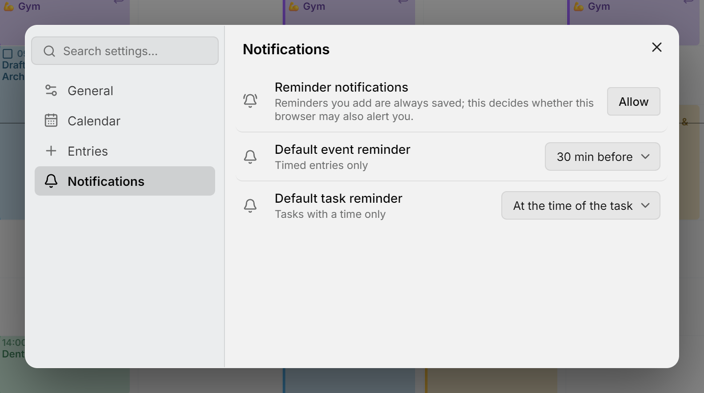

یک یادآور پیش از موعد، به‌صورت اعلان سیستم شما، دربارهٔ یک رویداد یا کار خبر می‌دهد، حتی وقتی میترا باز نیست. این اعلان از سرور میترای خودتان می‌آید، بنابراین سرویس دیگری برای ثبت‌نام وجود ندارد. در iPhone یا iPad، یادآورها به میترایی نیاز دارند که [به‌عنوان برنامه نصب شده](install-app.md) باشد؛ در بقیهٔ جاها مرورگر کافی است.

<picture>
  <source media="(prefers-color-scheme: dark)" srcset="../assets/screenshots/notifications-detail-dark.webp">
  
</picture>

## افزودن یک یادآور

یک مورد را باز کنید و روی **＋** در ردیف یادآورهایش، همان که زنگ دارد، بزنید. انتخاب کنید چه زمانی به صدا درآید: **در زمان شروع رویداد** (برای کار **در زمان کار**)، ۵ یا ۱۰ دقیقه، نیم ساعت، یک ساعت یا یک روز قبل، یا **سفارشی…** برای هر زمان دیگر. یک مورد می‌تواند چند یادآور داشته باشد و **✕** کنار هرکدام آن را حذف می‌کند.

یک یادآور از ابتدای مورد به عقب شمرده می‌شود، یا برای کاری که شروع ندارد، از تاریخ سررسیدش. اولین بار که یکی اضافه می‌کنید، مرورگرتان می‌پرسد میترا اجازهٔ نمایش اعلان دارد یا نه. اگر نه بگویید، یادآور همچنان همراه مورد ذخیره می‌شود.

یک مورد تکرارشونده برای هر تکرار به شما یادآوری می‌کند. کارهایی که انجام‌شده یا لغوشده علامت زده‌اید ساکت می‌مانند، اما تقویمی که پنهان می‌کنید ساکت نمی‌ماند: برای ساکت کردن آن، در **⋯ ← ویرایش** حساب آن را خاموش کنید. تقویم‌های [Notion](integrations/notion.md) و [Tempo](integrations/tempo.md) نمی‌توانند یادآور نگه دارند.

## یادآورهای پیش‌فرض

**تنظیمات ← اعلان‌ها** یادآورهایی را که موارد جدید با آن‌ها شروع می‌شوند تعیین می‌کند: ۳۰ دقیقه قبل برای یک رویداد، و در زمان کار برای یک کار، مگر اینکه آن‌ها را تغییر دهید یا **هیچ‌کدام** را انتخاب کنید. موارد تمام‌روز بدون یادآور شروع می‌شوند.

## وقتی یک یادآور به صدا درمی‌آید

اعلان عنوان مورد، زمان آن و مکانش را، به زبان و منطقهٔ زمانی دستگاه نشان می‌دهد. تا وقتی ببندیدش می‌ماند و لمس کردنش مورد را باز می‌کند. **۱۰ دقیقه بعد** آن را بعداً برمی‌گرداند، و روی یک کار، **انجام شد** بدون باز کردن میترا کار را انجام‌شده علامت می‌زند. Safari و Firefox این دکمه‌ها را نشان نمی‌دهند.

دستگاهی که هنگام ارسال یادآور آفلاین بوده است، آن را پنج دقیقه پس از شروع مورد رها می‌کند، به‌جای اینکه دیر نشانش دهد.

## دستگاه‌های شما

هر مرورگر یا برنامهٔ نصب‌شده‌ای که در آن اعلان را مجاز می‌کنید یک دستگاه است، و هر دستگاه همهٔ یادآورهای شما را دریافت می‌کند. **تنظیمات ← اعلان‌ها** آن‌ها را فهرست می‌کند، و دستگاهی که با آن هستید با **این دستگاه** مشخص شده است. با مداد نام یکی را تغییر دهید، با **✕** یکی را حذف کنید، و با **رویداد آزمایشی** یا **کار آزمایشی** نمونه‌ای برای خودتان بفرستید.

## عیب‌یابی

- اگر یادآوری نمی‌رسد، یک **رویداد آزمایشی** بفرستید. اگر آزمایش رسید، مورد احتمالاً در تقویمی است که خاموش شده است. مجوز برای هر مرورگر و هر نشانی جداگانه است، بنابراین اجازه دادن به میترا در یک نشانی نشانی دیگر را در بر نمی‌گیرد.
- اگر در **تنظیمات ← اعلان‌ها** ردیف **اعلان‌های یادآور** نیست، این مرورگر نمی‌تواند از میترا اعلان بگیرد: در iPhone یا iPad، به‌جای Safari [برنامهٔ نصب‌شده](install-app.md) را باز کنید، و در جاهای دیگر، میترا باید از طریق HTTPS ارائه شود.
- اگر ردیف **مسدودشده** را نشان می‌دهد، در تنظیمات سایت مرورگر اعلان‌ها را برای میترا مجاز کنید.
- اگر در Windows وقتی Chrome بسته است چیزی نمی‌رسد، گزینهٔ **Continue running background apps when Google Chrome is closed** را در تنظیمات Chrome روشن کنید، یا میترا را از Edge نصب کنید.

## روی سرور

یادآورها به هیچ راه‌اندازی نیاز ندارند، فقط [HTTPS](configuration.md#put-it-behind-https). میترا اعلان‌هایش را با کلیدی امضا می‌کند که در اولین راه‌اندازی می‌سازد و در پایگاه دادهٔ خودش نگه می‌دارد، بنابراین پوشهٔ داده را کامل از [پشتیبان‌ها](backups.md) بازیابی کنید: در یک پایگاه دادهٔ تازه، میترا کلید جدیدی می‌سازد و دستگاه‌های ثبت‌شده با کلید قدیمی دیگر یادآور دریافت نمی‌کنند. [گزارش‌ها](logging.md) هر یادآور را هنگام ارسال ثبت می‌کنند.
