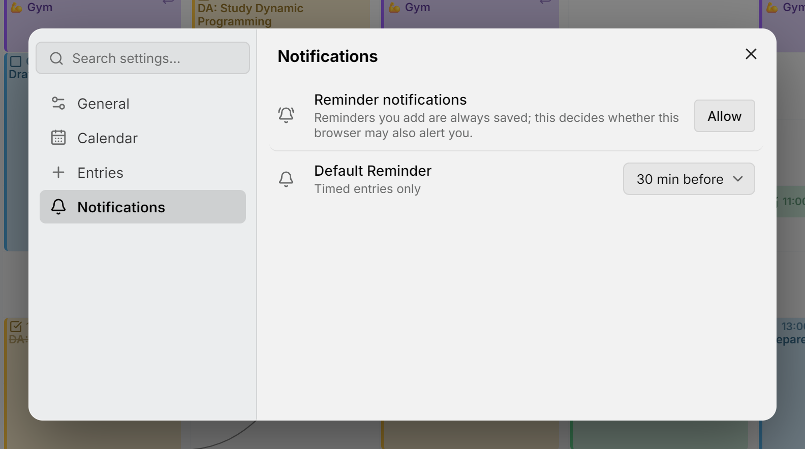

A reminder tells you about an event or a task ahead of time, as a notification from your system, even when Mitra isn't open. It comes from your own Mitra server, so there's no other service to sign up for. On an iPhone or iPad, reminders need Mitra [installed as an app](install-app.md); everywhere else, the browser is enough.

<picture>
  <source media="(prefers-color-scheme: dark)" srcset="../assets/screenshots/notifications-detail-dark.png">
  
</picture>

## Add a reminder

Open an entry and press **＋** on its reminders row, the one with the bell. Pick when it should go off: **At start of event** (**At the time of the task** for a task), 5 or 10 minutes, half an hour, an hour or a day before, or **Custom…** for any other time. An entry can have several, and the **✕** beside one removes it.

A reminder counts back from the entry's start, or, for a task without a start, from its due date. The first time you add one, your browser asks whether Mitra may show notifications. If you say no, the reminder is still saved with the entry.

A repeating entry reminds you for each occurrence. Tasks you've marked done or cancelled stay silent, but a calendar you hide doesn't: to silence one, turn it off under its account's **⋯ → Edit**. [Notion](integrations/notion.md) and [Tempo](integrations/tempo.md) calendars can't hold reminders.

## Default reminders

**Settings → Notifications** sets the reminders new entries start with: 30 minutes before for an event, and at the time of the task for a task, unless you change them or choose **None**. All-day entries start without reminders.

## When a reminder goes off

The notification shows the entry's title, when it is, and its location, in the language and time zone of the device. It stays until you dismiss it, and tapping it opens the entry. **Snooze 10 min** brings it back later, and on a task, **Done** marks the task done without opening Mitra. Safari and Firefox don't show these buttons.

A device that was offline when a reminder went out drops it five minutes after the entry's start, rather than showing it late.

## Your devices

Every browser or installed app where you allow notifications is a device, and every device gets all your reminders. **Settings → Notifications** lists them, with the one you're on marked **this device**. Rename one with the pencil, remove one with the **✕**, and send yourself a sample with **Test event** or **Test task**.

## Troubleshooting

- If a reminder doesn't arrive, send a **Test event**. If the test arrives, the entry is probably in a calendar that's turned off. Permission is per browser and per address, so allowing Mitra at one address doesn't cover another.
- If there's no **Reminder notifications** row in **Settings → Notifications**, this browser can't get notifications from Mitra: on an iPhone or iPad, open the [installed app](install-app.md) instead of Safari, and anywhere else, Mitra has to be served over HTTPS.
- If the row reads **Blocked**, allow notifications for Mitra in the browser's site settings.
- If nothing arrives on Windows while Chrome is closed, turn on **Continue running background apps when Google Chrome is closed** in Chrome's settings, or install Mitra from Edge.

## On the server

Reminders need no setup, only [HTTPS](configuration.md#put-it-behind-https). Mitra signs its notifications with a key it creates on first start and keeps in its database, so restore the data folder whole from your [backups](backups.md): on a fresh database, Mitra creates a new key, and devices registered with the old one stop getting reminders. The [logs](logging.md) record each reminder as it goes out.
