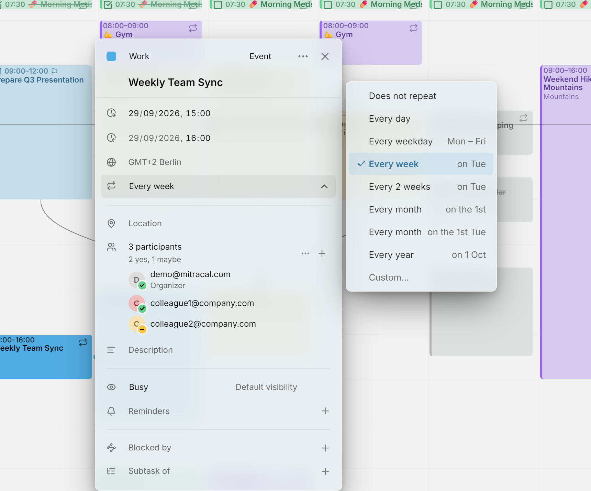
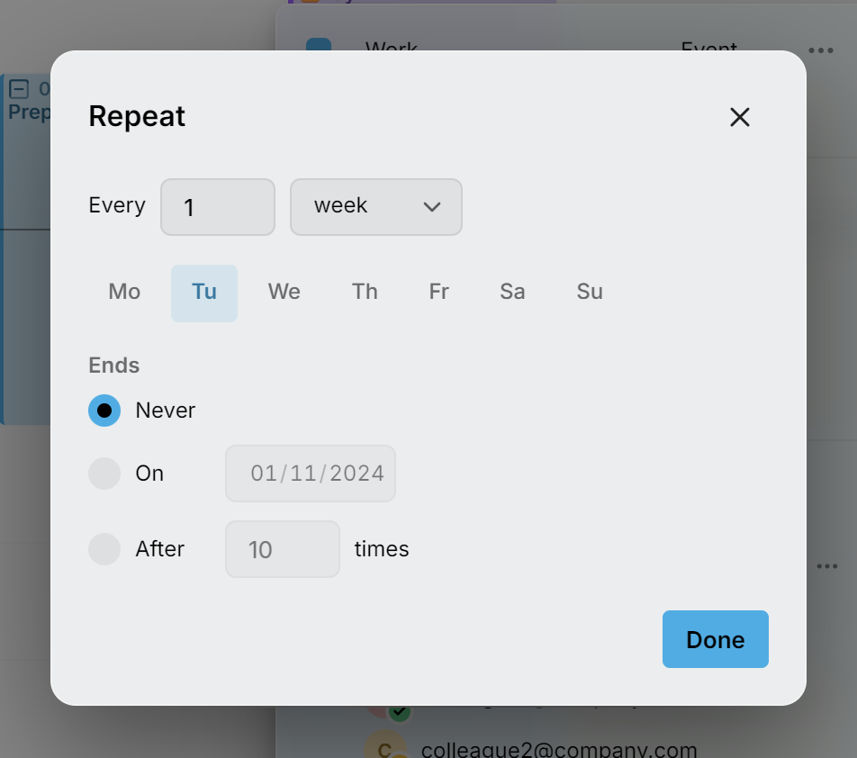

Ein wiederkehrender Eintrag ist ein Eintrag mit einer Wiederholungsregel, etwa ein Team-Meeting jeden Montag oder die Miete, die am 1. jedes Monats fällig ist. Diese Seite nennt das Ganze eine Serie und jedes ihrer Daten eine Wiederholung. Jede Wiederholung zeigt in den Ansichten ein kleines Wiederholungssymbol.

<picture>
  <source media="(prefers-color-scheme: dark)" srcset="../assets/screenshots/repeat-detail-dark.webp">
  
</picture>

## Einen Eintrag wiederholen lassen

Öffne den Eintrag und wähle in seiner Zeile **Wiederholung** eine Regel. Die Zeile erscheint, sobald der Eintrag ein Datum hat: einen Start oder, bei einer Aufgabe ohne Termin, ein Fälligkeitsdatum.

Die Liste bietet Regeln an, die sich aus dem Datum ergeben, an dem die Serie beginnt, auch wenn du eine spätere Wiederholung geöffnet hast. Für einen Eintrag am Dienstag, den 13., bietet sie **Jeden Tag**, **Jeden Werktag** (Montag bis Freitag), **Jede Woche** am Dienstag, **Alle 2 Wochen** am Dienstag, **Jeden Monat** am 13., **Jeden Monat** am 2. Dienstag und **Jedes Jahr** an diesem Datum. Fällt der Start in die letzten sieben Tage seines Monats, gibt es außerdem **Jeden Monat** am letzten Dienstag.

Damit ein Eintrag sich nicht mehr wiederholt, wähle **Wiederholt sich nicht**. Eine Änderung der Regel gilt immer für die ganze Serie, deshalb fragt Mitra nicht, welche Wiederholungen du meinst.

### Benutzerdefinierte Regeln

Für alles andere wähle **Benutzerdefiniert…**.

<picture>
  <source media="(prefers-color-scheme: dark)" srcset="../assets/screenshots/repeat-custom-detail-dark.webp">
  
</picture>

Gib nach **Alle** eine Zahl ein und wähle Tage, Wochen, Monate oder Jahre. Eine wöchentliche Regel zeigt dann die Wochentage: Schalte jeden Tag ein, an dem sich der Eintrag wiederholt, mindestens einer bleibt eingeschaltet. Eine monatliche Regel wiederholt sich am selben Tag des Monats wie der Start, etwa am 13., oder am selben Wochentag des Monats, etwa am 2. Dienstag. Liegt der Start in den letzten sieben Tagen seines Monats, kann sie sich auch am letzten Dienstag wiederholen.

Unter **Endet** wähle **Nie**, **Am** einem Datum oder **Nach** einer Anzahl von Malen. Drück **Fertig**, und die Zeile **Wiederholung** liest die Regel zurück, etwa „Alle 2 Wochen am Do. bis 18. Dez.“.

## Eine Wiederholung ändern oder löschen

Wenn du eine Wiederholung änderst, fragt Mitra, welche Einträge du meinst. Es fragt, wenn du die Wiederholung auf eine andere Zeit ziehst, an ihrem Rand ziehst, sie löschst oder in ihrem Editor ein Feld änderst, etwa ihren Titel.

- **Dieser Eintrag** ändert nur die Wiederholung, die du gewählt hast.
- **Dieser und folgende Einträge** ändert sie und jede spätere. Die Serie endet kurz davor, und dort beginnt eine neue Serie mit deiner Änderung, die früheren Wiederholungen bleiben also, wie sie waren. Die erste Wiederholung bietet das nicht an, da es dort die ganze Serie bedeuten würde.
- **Alle Einträge** ändert jede Wiederholung. Verschiebst du eine um einen Tag, verschieben sich alle, ein wöchentliches Meeting am Montag wird also zu einem wöchentlichen Meeting am Dienstag. Änderst du die Größe einer, bekommen alle die neue Länge.

Löschen funktioniert genauso: **Dieser Eintrag** entfernt ein Datum, **Dieser und folgende Einträge** beendet die Serie davor, und **Alle Einträge** löscht die Serie.

Um die Frage zu überspringen und nur diese Wiederholung zu ändern, halte beim Ablegen <kbd>Ctrl</kbd> (<kbd>⌘</kbd> auf einem Mac) gedrückt oder drück <kbd>Ctrl</kbd> + <kbd>Delete</kbd>, während sie offen ist.

Einige Änderungen fragen nie. Eine Wiederholung einer Aufgabe als fertig zu markieren, gilt nur für diese Wiederholung, und ebenso, eine einzelne Wiederholung einer Aufgabe zu planen, die sich nach ihrem Fälligkeitsdatum wiederholt.

## Geänderte und gelöschte Wiederholungen

Eine Wiederholung, die du mit **Dieser Eintrag** änderst, verlässt die Serie und wird zu einem eigenen Eintrag. Die Serie überspringt ihr Datum, sie erscheint also nie doppelt, und spätere Änderungen an der ganzen Serie erreichen sie nicht.

Eine gelöschte Wiederholung bleibt gelöscht. Sie kommt nicht zurück, wenn du später die ganze Serie verschiebst oder änderst, und andere Apps, die denselben Kalender nutzen, lassen sie ebenfalls aus.

## Eine Serie in einen anderen Kalender verschieben

Wähle im Editor einer Wiederholung einen anderen Kalender, und dieselbe Frage entscheidet, ob diese Wiederholung, der Rest der Serie oder die ganze Serie umzieht, wie unter [Einen einzelnen Eintrag verschieben](calendars.md#move-a-single-entry) beschrieben.

## Wiederkehrende Aufgaben

Jede Wiederholung einer wiederkehrenden Aufgabe ist eine eigene Aufgabe, die du als fertig markierst. Eine Aufgabe kann sich auch allein nach ihrem Fälligkeitsdatum wiederholen, etwa die Miete bis zum 1. jedes Monats: siehe [sich wiederholende Fälligkeitsdaten](planning.md#repeating-due-dates). Wiederkehrende Aufgaben sind nie überfällig, und sie lassen sich nicht ohne Termin stellen, da ihre Daten die Serie ausmachen.

## Wie Wiederholungen angezeigt werden

Was oft wiederkehrt, etwa ein tägliches Training, erscheint in der Monats- und Jahresansicht als [Routine](routines.md): eine Reihe kleiner Markierungen statt eines Balkens pro Tag. Die [Zeitleiste](views/timeline.md) zeigt von einer wiederkehrenden Aufgabe nur die fälligen Wiederholungen, damit eine tägliche Aufgabe sie nicht füllt.

## Welche Kalender sich wiederholen können

[In Mitra gespeicherte Kalender](integrations/mitra.md) und [Kalenderserver](integrations/caldav.md), Google und Apple eingeschlossen, nehmen wiederkehrende Einträge auf. [Notion](integrations/notion.md)- und [Tempo](integrations/tempo.md)-Kalender können das nicht, deshalb hat ihr Editor keine Zeile **Wiederholung**, und der Editor einer Serie bietet sie nicht als ihren Kalender an.

Wenn du [alle Einträge eines Kalenders](calendars.md#move-or-copy-every-entry-to-another-calendar) in einen verschiebst, der sich nicht wiederholen kann, fragt Mitra, was mit den wiederkehrenden geschehen soll. **Hier lassen** behält sie, wo sie sind. **In einzelne Einträge auflösen** schreibt jede Wiederholung im kommenden Jahr als eigenen Eintrag, der sich nicht mehr wiederholt.

[Verfügbarkeit](availability.md) ist ebenfalls ein wiederkehrender Eintrag und beginnt wöchentlich. Aus demselben Grund kann sie nicht in Notion- oder Tempo-Kalendern liegen.
