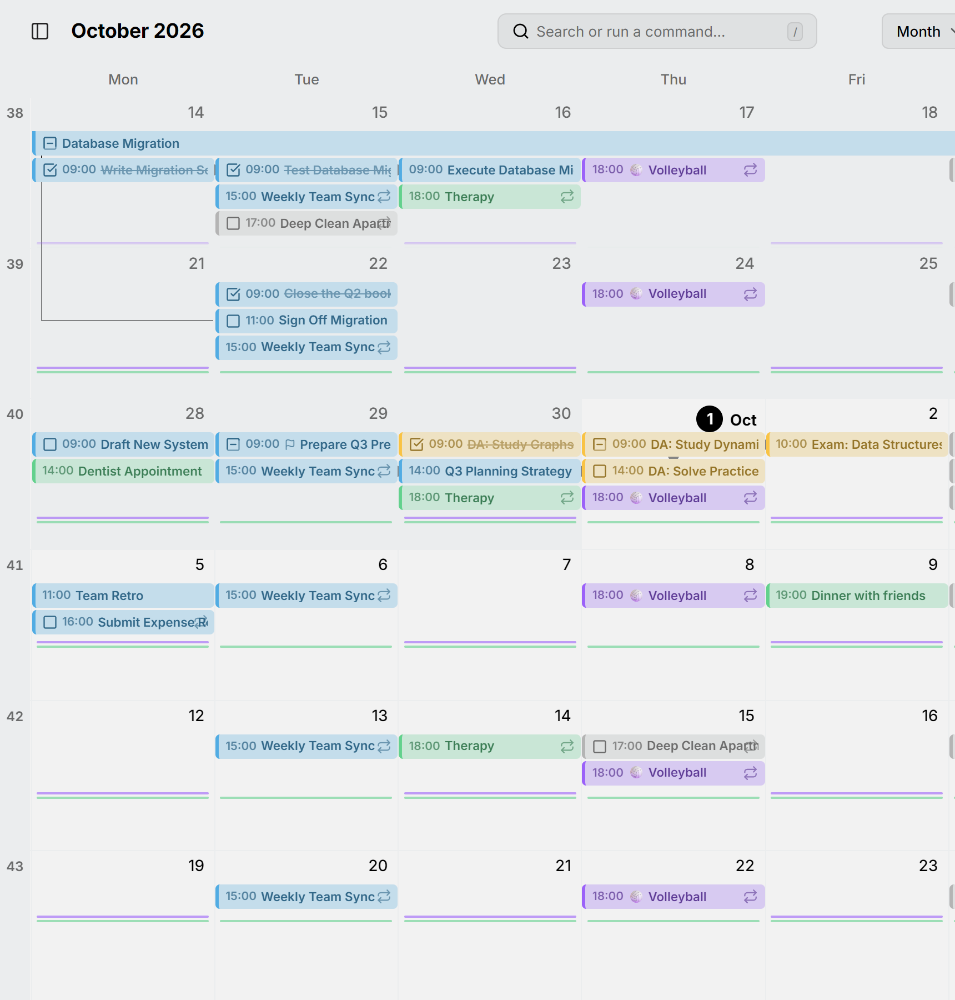

Certaines choses reviennent si souvent qu'une barre pour chacune remplirait un mois de copies : un entraînement quotidien, vos médicaments, un point d'équipe chaque jour ouvré. Dans les vues mois et année, Mitra les dessine plutôt comme une **routine** : un fin trait sous les jours, avec une marque sur chaque jour où la routine a lieu.

<picture>
  <source media="(prefers-color-scheme: dark)" srcset="../assets/screenshots/month-detail-dark.webp">
  
</picture>

Dans la vue année, où chaque jour est petit, les routines sont ce que vous voyez le plus : chaque trait coloré est une routine qui traverse les mois.

<picture>
  <source media="(prefers-color-scheme: dark)" srcset="../assets/screenshots/year-detail-dark.webp">
  
</picture>

## Ce qui devient une routine

Des entrées forment une routine quand elles sont dans le même calendrier, portent le même titre et reviennent assez souvent :

- Dans la vue mois, plus d'une fois par semaine. Ce qui est hebdomadaire reste une barre.
- Dans la vue année, environ toutes les cinq semaines ou plus souvent, si bien que les entrées hebdomadaires et mensuelles deviennent aussi des marques.

Il faut aussi au moins quatre entrées dans la période affichée.

Les entrées n'ont pas besoin d'être récurrentes pour former une routine. Des entrées distinctes intitulées « Course » dans le même calendrier forment une seule routine, comme le ferait une série quotidienne. Une occurrence que vous avez déplacée seule reste dans sa routine, sous forme de marque sur son nouveau jour. Les entrées sans titre ne se regroupent jamais avec d'autres, seulement avec le reste de leur propre série.

## Utiliser une routine

Pointez une routine pour voir son titre et, s'il s'agit d'une entrée récurrente, sa fréquence. Cliquez dessus pour ouvrir sa première entrée dans cette ligne : la semaine dans la vue mois, ou le mois dans la vue année.

La vue semaine montre toujours chaque entrée en entier, avec ses horaires.
