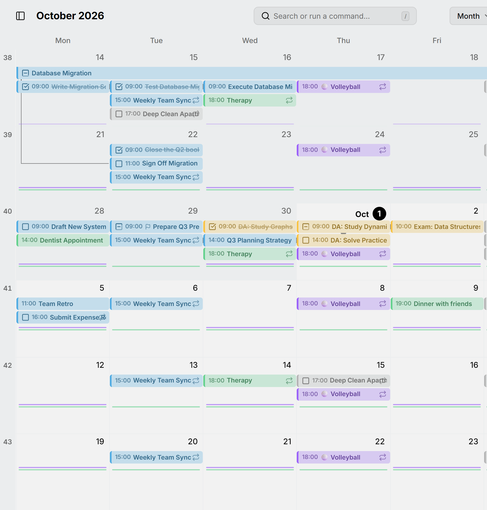
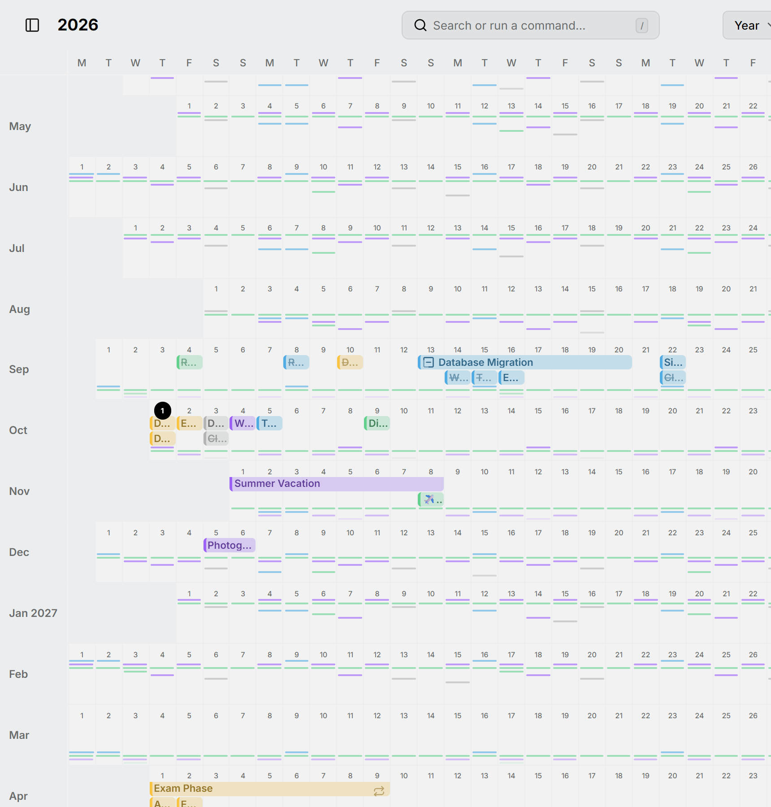

Some things happen so often that a bar for each would fill a month with copies: a daily workout, your medication, a weekday standup. In the month and year views, Mitra draws them as a **routine** instead: a thin line under the days, with a mark on each day the routine happens.

<picture>
  <source media="(prefers-color-scheme: dark)" srcset="../assets/screenshots/month-detail-dark.png">
  
</picture>

In the year view, where every day is small, routines are what you see most: each colored line is a routine running through the months.

<picture>
  <source media="(prefers-color-scheme: dark)" srcset="../assets/screenshots/year-detail-dark.png">
  
</picture>

## What becomes a routine

Entries form a routine when they're in the same calendar, have the same title, and come often enough:

- In the month view, more often than once a week. Something weekly stays a bar.
- In the year view, about every five weeks or more often, so weekly and monthly entries become marks too.

There also have to be at least four of them in view.

Entries don't have to repeat to form a routine. Separate entries called "Run" in the same calendar make one routine, the same as a daily series would. An occurrence you moved on its own stays part of its routine, as a mark on its new day. Entries without a title never group with others, only with the rest of their own series.

## Use a routine

Point at a routine to see its title and, if it's a repeating entry, how often it repeats. Click it to open its first entry in that row: the week in the month view, or the month in the year view.

The week view always shows each entry in full, with its times.
