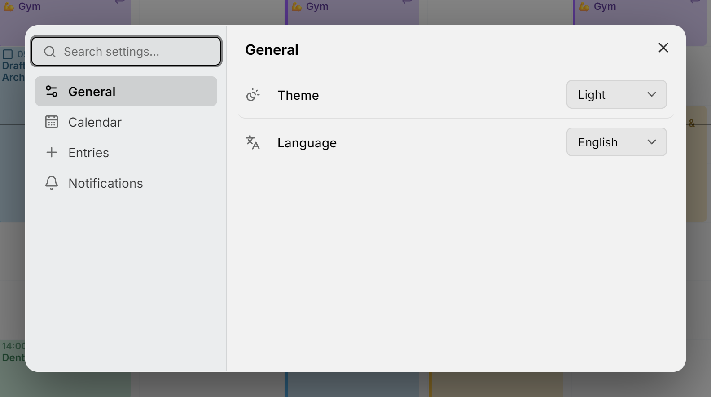

Mitra hat alle Einstellungen in einem Dialog. Öffne ihn mit **Einstellungen** unten in der Seitenleiste, mit <kbd>Ctrl</kbd>+<kbd>,</kbd> (auf dem Mac <kbd>⌘</kbd>+<kbd>,</kbd>) von überall aus oder über die [Befehlspalette](shortcuts.md). Wenn du dich mit einem Konto anmeldest, sind **Einstellungen** das Zahnrad auf deiner Kontokarte unten in der Seitenleiste, und das **⋯** daneben enthält **Abmelden**.

<picture>
  <source media="(prefers-color-scheme: dark)" srcset="../assets/screenshots/settings-detail-dark.webp">
  
</picture>

Du musst nie etwas ändern. Eine Einstellung, die du in Ruhe lässt, folgt Mitras Standard. Wenn eine spätere Version einen Standard verbessert, bekommst du also den neuen. Auch wenn du selbst den Standardwert wählst, gilt sie als unberührt.

## Eine Einstellung finden

Tipp in **Einstellungen durchsuchen…** oben im Dialog. Die Suche durchsucht Seiten und Einstellungen zugleich und gruppiert die Treffer nach Seite: „Kalender“ zeigt die ganze Seite **Kalender** zusammen mit der Einstellung **Standardkalender** aus **Einträge**. Du kannst eine Einstellung direkt in den Ergebnissen ändern.

Die Befehlspalette kennt dieselben Wörter und ändert die meisten Einstellungen, ohne den Dialog zu öffnen. Tipp „dunkel“ und wähl **Erscheinungsbild: Dunkel**, oder „einrasten“ und wähl **Einrasten auf: 30 Min.**. Sie bietet nur Werte an, die du noch nicht gewählt hast. Eine Einstellung, die sie nicht in einem Schritt ändern kann, etwa die Standardansicht, bietet stattdessen **Standardansicht ändern…** an, was den Dialog bei dieser Einstellung öffnet.

## Dein Konto oder dieses Gerät

Die meisten Einstellungen gehören zu deinem Konto und folgen dir auf jedes Gerät und in jeden Browser, in dem du dich anmeldest: die Standardansicht, **Erledigte Aufgaben ausblenden**, **Verfügbarkeit ausblenden**, der Standardkalender, die Standarddauer, **Einrasten auf** und beide Standarderinnerungen.

Die anderen gehören zum Gerät, auf dem du gerade bist, sodass sich dein Handy und dein Laptop unterscheiden können: das Erscheinungsbild, die Sprache, die Verbindungslinien und ob dieser Browser Benachrichtigungen anzeigt.

Mitra merkt sich außerdem einiges pro Gerät, während du es benutzt: wie weit du gezoomt hast, ob die Seitenleiste offen ist und auf welchem Tab, welche Zeitzonen du eingeklappt hast und den Zeitraum, den die Tabellenansicht zeigt.

## Allgemein

**Erscheinungsbild** ist **Wie das System**, **Hell** oder **Dunkel**. **Wie das System**, der Standard, folgt dem hellen oder dunklen Modus deines Geräts.

**Sprache** bietet Englisch, Deutsch, Französisch, Spanisch, Portugiesisch, Italienisch und Persisch an, jede in ihrer eigenen Sprache benannt. Die Änderung gilt sofort, ohne neu zu laden, und Persisch richtet Mitra von rechts nach links aus. Datum, Uhrzeit und der erste Wochentag folgen der Sprache so, wie die Region deines Browsers sie schreibt: Englisch in den USA beginnt die Woche am Sonntag, im Vereinigten Königreich am Montag, Persisch am Samstag.

## Kalender

**Standardansicht** ist die Ansicht, mit der Mitra sich öffnet: **Woche**, außer du wählst **Monat**, **Jahr**, **Zeitleiste** oder **Tabelle**.

**Erledigte Aufgaben ausblenden** nimmt erledigte und abgebrochene Aufgaben aus der Wochen-, Monats- und Jahresansicht und aus dem Tab Planung. Die Suche findet sie weiterhin, sie zählen weiter zum Fortschritt ihrer übergeordneten Aufgabe, und die Tabellenansicht listet sie weiterhin. Eine Aufgabe, die du geöffnet hast, bleibt sichtbar, bis du sie schließt.

**Verfügbarkeit ausblenden** nimmt die [Verfügbarkeit](availability.md) aus der Wochenansicht. Sie bleibt in ihren Kalendern, und belegte Verfügbarkeit erscheint für andere weiterhin als belegt.

**Verbindungslinien in der Wochenansicht**, **Verbindungslinien in der Monatsansicht** und **Verbindungslinien in der Zeitleiste** schalten die Linien zwischen [Teilaufgaben](subtasks.md) und [Abhängigkeiten](dependencies.md) in jeder Ansicht ein oder aus. Anfangs sind alle an.

## Einträge

**Standardkalender** ist der Ort, an dem neue Termine und Aufgaben landen. Es ist dieselbe Wahl wie das gefüllte Symbol in der Seitenleiste: siehe [wo neue Einträge landen](calendars.md#where-new-entries-land). Ohne Standardkalender landen neue Einträge im ersten Kalender, der angezeigt wird.

**Standarddauer** ist, wie lange ein neuer Eintrag dauert, wenn du keine Länge angibst, zum Beispiel wenn du ins Raster klickst, eine Aufgabe ohne Schätzung hineinziehst oder **Ganztägig** ausschaltest. Sie reicht von 15 Minuten bis 2 Stunden und beträgt eine Stunde, wenn du nichts änderst.

**Einrasten auf** ist der Schritt, auf dem Ziehen und Größenändern einrasten: 5, 10, 15 oder 30 Minuten, 15, wenn du nichts änderst.

## Benachrichtigungen

**Erinnerungsbenachrichtigungen** legt fest, ob dieser Browser dich benachrichtigen darf. Drück **Erlauben**, dann fragt dein Browser um Erlaubnis. Die Zeile zeigt danach **Erlaubt** oder **Blockiert**. Um eine Blockierung aufzuheben, erlaube Benachrichtigungen für Mitra in den Website-Einstellungen des Browsers. Die Erinnerungen, die du hinzufügst, werden in jedem Fall gespeichert. In einem Browser, der keine Benachrichtigungen von Mitra anzeigen kann, fehlt diese Zeile; siehe [Fehlerbehebung](reminders.md#troubleshooting).

**Standarderinnerung für Termine** und **Standarderinnerung für Aufgaben** legen fest, mit welchen Erinnerungen neue Einträge beginnen: 30 Minuten vorher bei einem Termin und zur Zeit der Aufgabe bei einer Aufgabe, oder **Keine**. Sie gelten nur für Einträge mit Uhrzeit.

Sobald dieser Browser Benachrichtigungen erlaubt, listet die Seite auch deine **Geräte** auf, die du umbenennen, denen du eine Testerinnerung schicken oder die du entfernen kannst. Siehe [Erinnerungen](reminders.md#your-devices).
