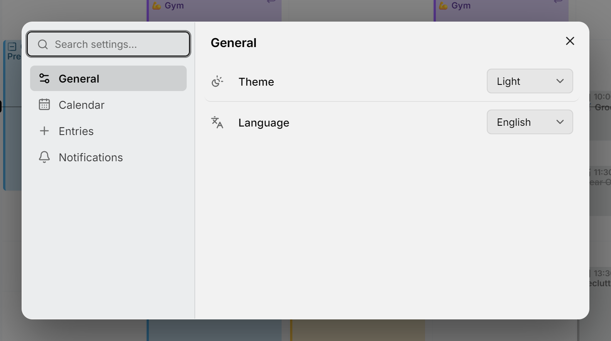

Mitra keeps its settings in one dialog. Open it with **Settings** at the bottom of the sidebar, with <kbd>Ctrl</kbd>+<kbd>,</kbd> (<kbd>⌘</kbd>+<kbd>,</kbd> on a Mac) from anywhere, or from the [command palette](shortcuts.md). When you sign in with an account, **Settings** is the gear on your account card at the bottom of the sidebar, and the **⋯** beside it holds **Sign out**.

<picture>
  <source media="(prefers-color-scheme: dark)" srcset="../assets/screenshots/settings-detail-dark.png">
  
</picture>

You never have to change anything. A setting you leave alone follows Mitra's default, so when a later version improves a default, you get the new one. Choosing the default value yourself counts as leaving it alone.

## Find a setting

Type into **Search settings…** at the top of the dialog. It searches the pages and the settings at once, and groups what it finds by page: "calendar" brings up the whole **Calendar** page along with the **Default Calendar** setting from **Entries**. You can change a setting right in the results.

The command palette knows the same words, and changes most settings without opening the dialog. Type "dark" and pick **Theme: Dark**, or "snap" and pick **Snap to: 30 min**. It only offers values you haven't chosen already. A setting it can't change in one step, such as the default view, offers **Change Default View…** instead, which opens the dialog on that setting.

## Your account or this device

Most settings belong to your account and follow you to every device and browser you sign in from: the default view, **Hide done tasks**, **Hide availability**, the default calendar, the default duration, **Snap to** and both default reminders.

The others belong to the device you're on, so your phone and your laptop can differ: the theme, the language, the connector lines, and whether this browser shows notifications.

Mitra also remembers some things on each device as you use them: how far you've zoomed, whether the sidebar is open and on which tab, which time zones you've folded away, and the period the table view shows.

## General

**Theme** is **Match the system**, **Light** or **Dark**. **Match the system**, the default, follows your device's light or dark mode.

**Language** offers English, German, French, Spanish, Portuguese, Italian and Persian, each named in its own language. The change applies at once, without reloading, and Persian lays Mitra out from right to left.

## Calendar

**Default View** is the view Mitra opens on: **Week**, unless you choose **Month**, **Year**, **Timeline** or **Table**.

**Hide done tasks** takes done and cancelled tasks off the week, month and year views and the Planning tab. Search still finds them, they still count towards their parent's progress, and the table view still lists them. A task you have open stays in sight until you close it.

**Hide availability** takes [availability](availability.md) off the week view. It stays in its calendars, and busy availability still shows as busy to others.

**Connector lines in the week view**, **Connector lines in the month view** and **Connector lines in the timeline** turn the lines between [subtasks](subtasks.md) and [dependencies](dependencies.md) on or off in each view. They're all on to begin with.

## Entries

**Default Calendar** is where new events and tasks go. It's the same choice as the filled icon in the sidebar: see [where new entries land](calendars.md#where-new-entries-land). Without one, new entries go to the first calendar that's showing.

**Default Duration** is how long a new entry lasts when you don't give it a length, for example when you click the grid, drag in an unscheduled task without an estimate, or turn off **All day**. It goes from 15 minutes to 2 hours, and is an hour unless you change it.

**Snap to** is the step dragging and resizing land on: 5, 10, 15 or 30 minutes, 15 unless you change it.

## Notifications

**Reminder notifications** decides whether this browser may alert you. Press **Allow**, and your browser asks for permission; the row then reads **Allowed** or **Blocked**. To undo a block, allow notifications for Mitra in the browser's site settings. The reminders you add are saved either way. In a browser that can't show notifications from Mitra, this row is missing; see [troubleshooting](reminders.md#troubleshooting).

**Default event reminder** and **Default task reminder** set the reminders new entries start with: 30 minutes before for an event, and at the time of the task for a task, or **None**. They only apply to entries with a time.

Once this browser allows notifications, the page also lists your **Devices**, where you can rename them, send a test reminder or remove one. See [Reminders](reminders.md#your-devices).
