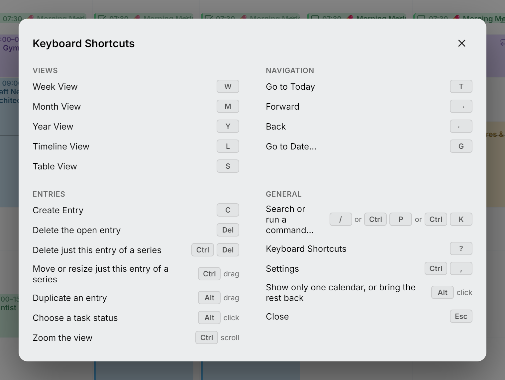
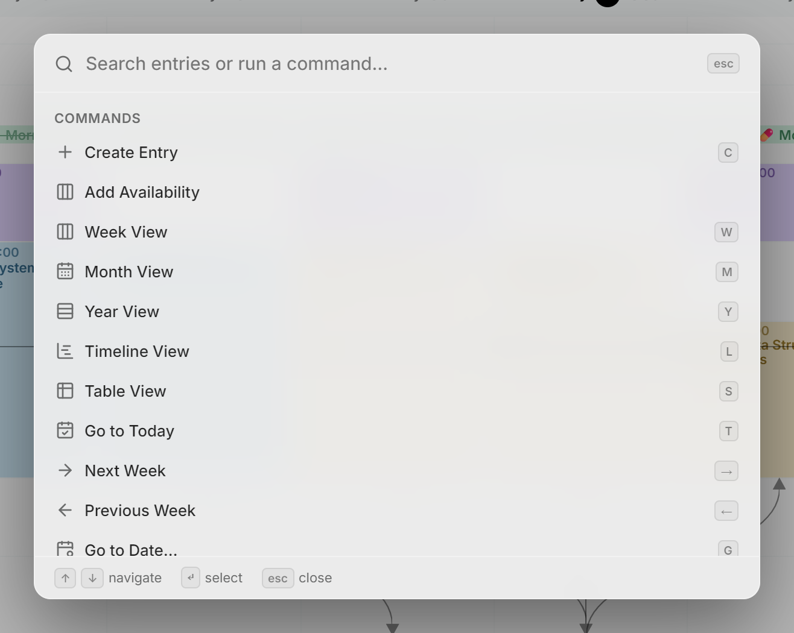

Pulsa <kbd>?</kbd> en cualquier lugar del calendario para abrir la lista de atajos. Siempre coincide con la versión que estás usando. Las teclas siguen las convenciones de calendarios web como Google Calendar, Notion Calendar y Proton Calendar, así que lo que ya sabes sigue valiendo.

<picture>
  <source media="(prefers-color-scheme: dark)" srcset="../assets/screenshots/shortcuts-detail-dark.webp">
  
</picture>

## Vistas

| Acción | Teclas |
| --- | --- |
| Vista de semana | <kbd>W</kbd> |
| Vista de mes | <kbd>M</kbd> |
| Vista de año | <kbd>Y</kbd> |
| Vista de cronograma | <kbd>L</kbd> |
| Vista de tabla | <kbd>S</kbd> |

## Navegación

| Acción | Teclas |
| --- | --- |
| Ir a hoy | <kbd>T</kbd> |
| Avanzar una semana / un mes / un año | <kbd>→</kbd> |
| Retroceder una semana / un mes / un año | <kbd>←</kbd> |
| Ir a una fecha concreta | <kbd>G</kbd> |

## Entradas

| Acción | Teclas |
| --- | --- |
| Crear una entrada | <kbd>C</kbd> |
| Eliminar la entrada abierta | <kbd>Delete</kbd> o <kbd>Backspace</kbd> |
| Eliminar solo esta entrada de una serie | <kbd>Ctrl</kbd> <kbd>Delete</kbd> |
| Mover o cambiar el tamaño de solo esta entrada de una serie | mantén <kbd>Ctrl</kbd> al soltar |
| Duplicar una entrada | mantén <kbd>Alt</kbd> al soltar |
| Elegir el estado de una tarea | <kbd>Alt</kbd> + clic en la casilla, o clic derecho en ella |
| Hacer zoom en la vista | <kbd>Ctrl</kbd> + desplazamiento |

## General

| Acción | Teclas |
| --- | --- |
| Buscar entradas o ejecutar un comando | <kbd>/</kbd> o <kbd>Ctrl</kbd> <kbd>P</kbd> o <kbd>Ctrl</kbd> <kbd>K</kbd> |
| Atajos de teclado | <kbd>?</kbd> |
| [Ajustes](settings.md) | <kbd>Ctrl</kbd> <kbd>,</kbd> |
| [Mostrar solo un calendario](calendars.md#show-only-one-calendar), o recuperar el resto | <kbd>Alt</kbd> + clic en su ojo en la barra lateral |
| Cerrar o volver atrás | <kbd>Esc</kbd> |

> [!NOTE]
> En un Mac, <kbd>Ctrl</kbd> se lee como <kbd>⌘</kbd> y <kbd>Alt</kbd> como <kbd>⌥</kbd> en todo el texto, y <kbd>⌫</kbd> sustituye a <kbd>Delete</kbd> (<kbd>Backspace</kbd> también elimina en todas partes).

Los atajos de una sola letra nunca se activan mientras escribes en un campo de texto.

## Paleta de comandos

Pulsa <kbd>/</kbd>, <kbd>Ctrl</kbd> + <kbd>K</kbd> o <kbd>Ctrl</kbd> + <kbd>P</kbd> para buscar tus entradas o ejecutar un comando; las tres hacen lo mismo. La búsqueda recorre los títulos, las descripciones y las ubicaciones de todos tus calendarios, no solo los días que se ven en pantalla, y lista una entrada que se repite una sola vez. Al elegir una entrada, va a su fecha y la abre. Los comandos abarcan las vistas, la navegación, las entradas nuevas, tus calendarios y tus ajustes, y cada uno muestra sus teclas al lado, para que las aprendas sobre la marcha.

<picture>
  <source media="(prefers-color-scheme: dark)" srcset="../assets/screenshots/palette-detail-dark.webp">
  
</picture>
