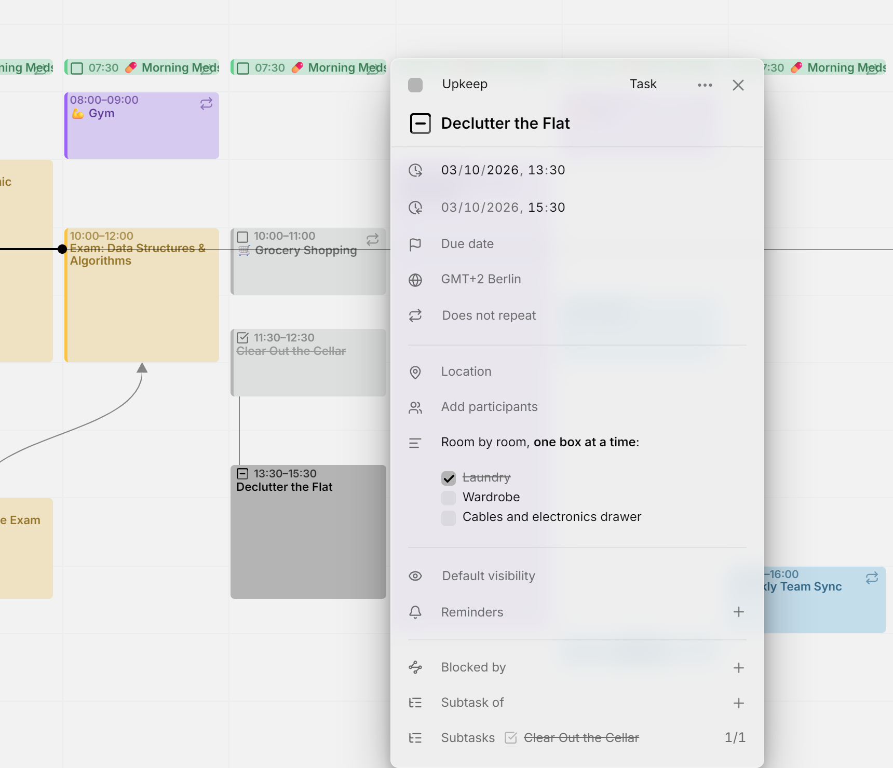

A task can have **subtasks**: smaller tasks that together make it up. A subtask can live in another calendar, even in another account, can have subtasks of its own, and can be [unscheduled](planning.md#the-planning-tab).

<picture>
  <source media="(prefers-color-scheme: dark)" srcset="../assets/screenshots/hierarchy-detail-dark.webp">
  
</picture>

## Add a subtask

Open the smaller task, press **＋** on **Subtask of** and type part of the bigger task's title. The search covers all your calendars. The bigger task then lists it under **Subtasks**, with a count of how many are done, such as 1/3. You always add the link from the subtask: the **Subtasks** row of the bigger task only lists them.

Each subtask in the list shows its checkbox in its [calendar's color](calendars.md#recolor), so you can tick it off without leaving the bigger task. Done and cancelled subtasks are struck through. Click a title to open that task, or press the **✕** beside it to remove the link, from either side. On the calendar, a line joins a task to its subtasks when both are in view.

Mitra refuses a link that would go in a circle, such as a task that ends up a subtask of itself.

## Checklists

A task's description can also hold a checklist, written in Markdown:

```markdown
- [ ] Book the venue
- [x] Send the invitations
```

Tick a box right in the description to check it off. Mitra changes `[ ]` to `[x]` in the text, so other apps using the calendar see it too. Ticking boxes never changes the task's status on its own. Only tasks count their checklists: an event's boxes can be ticked, but they count towards nothing.

## Progress

A task with subtasks or a checklist shows its progress. Each subtask and each box counts as one step, all with the same weight, so a task with three boxes and two subtasks has five steps.

A subtask that's partly done counts in part, whether it has a progress of its own or subtasks of its own. If a task has three subtasks, two of them done and the third at 80%, the task is at 93%. Cancelled subtasks don't count, so dropped work never holds the task back. Events linked as subtasks don't count either.

On the calendar, the outline of a task's checkbox fills up as it progresses. Point at the checkbox to see the count, such as "2 of 3 subtasks done", or "2 of 4 steps done" when boxes and subtasks count together. Right-click it, or <kbd>Alt</kbd>-click it, to open the status menu with the exact percentage.

## Set progress by hand

A task with no subtasks and no checklist can carry a progress you set yourself. Right-click its checkbox, or <kbd>Alt</kbd>-click it, and drag **Progress** in steps of 5%. At 100%, the task becomes **Done**. Below 100%, a done task goes back to **Doing**, or to **To Do** at 0%. The **✕** beside the value clears it.

The calendar has to be able to store progress: [calendar servers](integrations/caldav.md), [Apple Calendar](integrations/apple.md) and [Mitra calendars](integrations/mitra.md) can. Google Calendar, Notion and Tempo can't, so their tasks have no **Progress** slider.

## Finish a tree of tasks

When you tick off the last open subtask, Mitra asks whether to mark the bigger task done too. If that finishes more tasks further up, it offers to mark them all done. It only asks once the bigger task's checklist is fully ticked as well.

When you mark a task done or cancelled while some of its subtasks are still open, Mitra asks what to do with them: **Mark as done** or **Mark as cancelled**. Close the question to leave them open. You can come back to it later: in the task's status menu, the subtask count leads to the same question.

## Move or delete a task with subtasks

When you drag a task with subtasks to another time, Mitra asks **Move subtasks too?**. Choose **Only this entry**, or move the task with all its subtasks by the same amount of time. Deleting such a task asks **Delete subtasks too?** the same way.

> [!TIP]
> Hold <kbd>Ctrl</kbd> (<kbd>⌘</kbd> on a Mac) while you drop or delete to skip the question and change only that task. See [keyboard shortcuts](shortcuts.md).

## Which calendars support this

A link is saved with the subtask, in that entry's own calendar. [Calendar servers](integrations/caldav.md), [Apple Calendar](integrations/apple.md) and [Mitra calendars](integrations/mitra.md) hold any link, and on a calendar server it's written in the standard calendar format, so other apps using the same calendar can read it.

- In [Notion](integrations/notion.md), a link to a task in the same database goes into the matching relation property, such as "Parent task". Mitra keeps links to anything else itself.
- [Google Calendar](integrations/google.md) drops links, so an entry in a Google calendar can't be given a parent. Entries in other calendars can still link to it.
- [Calendar subscriptions](integrations/subscriptions.md) are read-only, and [Tempo](integrations/tempo.md) has no links.
