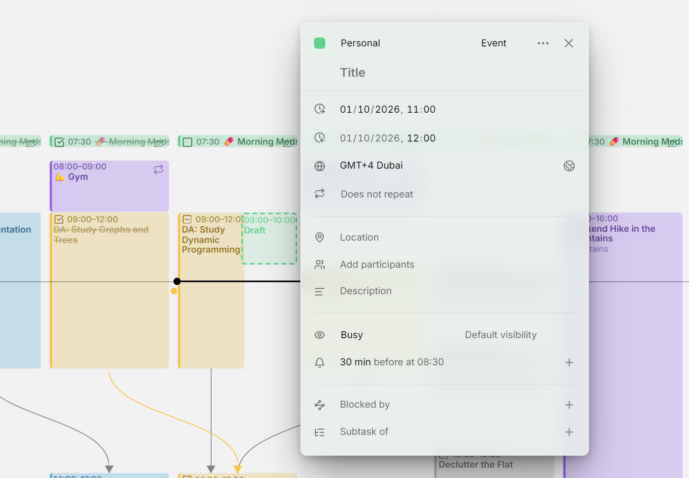
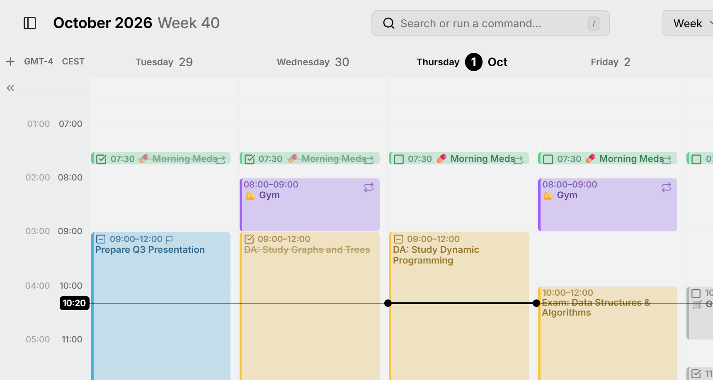

Mitra shows times in your time zone, the one your device is set to. When you travel and your device changes zone, Mitra follows. In the editor, this zone is called the **primary** time zone.

An entry can also have a time zone of its own, such as a flight that leaves at 9:00 in New York. And the week view can show the hours of other time zones beside yours.

<picture>
  <source media="(prefers-color-scheme: dark)" srcset="../assets/screenshots/time-zone-detail-dark.webp">
  
</picture>

## An entry's time zone

Every entry with times has a time zone. The entries you create take yours, and entries from other apps keep the zone they were made in.

Open an entry to see its zone in the row with the globe, below its dates, written as an offset and a city, such as "GMT-4 New York". All-day entries have no time zone and no such row, because they cover the same days for everyone.

### Change an entry's time zone

Click the zone and pick another one. Type a city, a zone's name or an offset to find it. Your own zone heads the list, marked **Primary**.

The entry keeps its clock times in the new zone: a meeting at 9:00 in Berlin becomes a meeting at 9:00 in New York. If only the zone was wrong and the meeting itself didn't move, change its times afterwards.

### Your time or the entry's

When an entry's zone differs from yours, the editor shows its times in your zone, so a meeting at 9:00 in New York reads 15:00 if you're in Berlin. A button beside the zone switches to the entry's own time and back. It shows a house while you see your time and a globe while you see the entry's, and pointing at it tells you which one you're looking at.

You can edit the times either way. To change the zone itself, switch to the entry's time first.

### Wall clock times

Some entries come from other apps without any time zone, and show **Wall clock (no time zone)**. Their times belong to no place: an alarm at 7:00 is meant at 7:00 wherever you are, and the editor shows it at 7:00 in every time zone. Its reminders go off at that clock time on each device.

Picking a zone for such an entry gives it that zone and keeps its clock times. It can't become a wall clock entry again.

### Which calendars support this

- **Calendars stored in Mitra**, [calendar servers](integrations/caldav.md) and [Google Calendar](integrations/google.md) keep each entry's time zone, and other apps see it.
- **[Notion](integrations/notion.md)** has no time zones. Its times show in yours, and the editor has no time zone row.
- **[Tempo](integrations/tempo.md)** reads worklogs in the time zone of your Jira profile, and the editor has no time zone row either.
- **[Subscriptions](integrations/subscriptions.md)** are read-only: you can see an entry's zone and switch between the two times, but not change it.

## Time zones in the week view

The [week view](views/week.md) can show the hours of other time zones in columns beside yours, so you see what time it is there at every hour of your day.

<picture>
  <source media="(prefers-color-scheme: dark)" srcset="../assets/screenshots/time-zones-detail-dark.webp">
  
</picture>

### Add a time zone to the week

Point at the top of the time column and press **＋** (**Add time zone**), then pick a zone. Its column appears beside yours, and your own zone stays the column next to the days.

Each column is headed by a short name, such as "PDT" or "GMT+2". Point at it to see the full name.

### Rename or remove a time zone

Click a zone's name and choose **Rename** to give it a label of your own, such as "NYC", or **Remove** to take its column away. To go back to the automatic name, rename it to nothing.

Your own zone can be renamed, but not removed.

### Fold the extra columns away

The extra columns take room from the days. To hide them, point at the top of the time column and press the arrow below the **＋**. Press it again to show them. You can also drag the time column toward the days to open them, and back to close them, which is the way to do it on a touch screen.

On a narrow screen, the columns start folded away until you open or close them yourself. Adding a zone always brings them out.

### Across your devices

The zones you add, and their names, belong to your account, so they show on every device you use. The name you give your own zone, and whether the columns are folded, stay on each device, since each device can be in a different zone.
