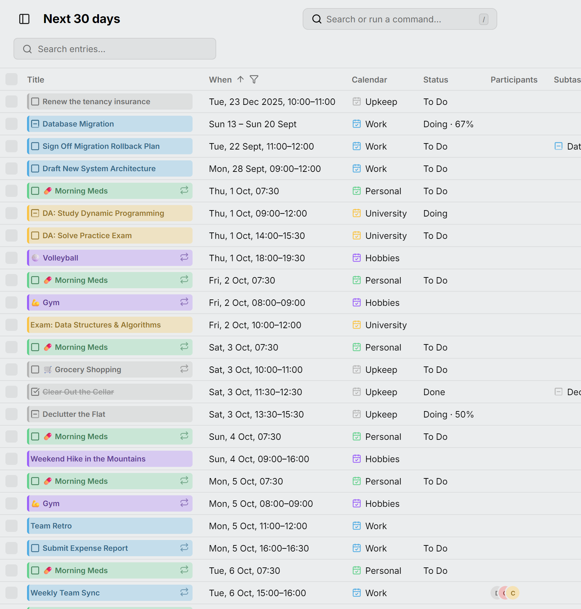

La vue **Tableau** liste vos entrées en lignes au lieu de les dessiner sur une grille. Ouvrez-la avec <kbd>S</kbd> ou depuis le sélecteur de vue.

Chaque ligne est une entrée, et chaque occurrence d'une entrée récurrente a sa propre ligne. Son titre est la même pastille que celle du calendrier : cliquez dessus pour ouvrir l'éditeur de l'entrée.

<picture>
  <source media="(prefers-color-scheme: dark)" srcset="../../assets/screenshots/table-detail-dark.webp">
  
</picture>

## Quelles entrées

Le tableau liste les entrées d'une période de jours comptée à partir d'aujourd'hui, nommée dans le titre de la page : **30 derniers jours**, **Aujourd'hui**, **7 prochains jours**, **30 prochains jours** (là où elle commence), **12 prochains mois**, **Toutes les entrées**, ou une **Période personnalisée** de deux dates. Choisissez-la dans le menu de la colonne **Quand**. Le nombre à côté du champ de recherche indique combien de lignes sont listées.

Les tâches sans date, et les tâches ouvertes en retard, sont listées quelle que soit la période choisie, donc la valeur par défaut montre ensemble l'arriéré et le mois à venir.

**Toutes les entrées** sert à faire le ménage. Une entrée récurrente y occupe une seule ligne, qui représente toute la série : son **Quand** indique où elle commence, et la déplacer ou la supprimer déplace ou supprime chaque occurrence. Son statut reste propre à chaque occurrence, donc les boutons de statut l'ignorent.

**Aujourd'hui** dans l'en-tête de la page, et <kbd>G</kbd> pour une autre date, font défiler jusqu'à la première ligne de ce jour sans changer la période.

## Rechercher, trier et filtrer

Le champ de **recherche** compare chaque mot saisi au titre, au lieu, à la description et à l'agenda.

Cliquez sur l'en-tête d'une colonne pour son menu :

- **Trier par ordre croissant** ou **Trier par ordre décroissant**. Choisissez à nouveau celui qui est actif pour le retirer. Maintenez <kbd>Shift</kbd> pour trier sur plusieurs colonnes.
- Le **filtre** de la colonne, quand elle en a un : décochez les valeurs à exclure. Maintenez <kbd>Alt</kbd> pour ne garder que celle sur laquelle vous cliquez. Dans le filtre **Statut**, **Sans statut** représente les événements, donc le décocher ne liste que les tâches.
- **Masquer la colonne**, qui lève aussi le filtre de la colonne.

Les colonnes **Statut**, **Agenda**, **Type** et **Se répète** peuvent filtrer, et **Quand** contient la période de jours. Un entonnoir à côté d'un en-tête indique que la colonne exclut des lignes. **Titre** et **Quand** ne peuvent pas être masquées.

## Colonnes

Le tableau commence avec **Titre**, **Quand**, **Agenda**, **Statut**, **Lieu**, **Participants**, **Sous-tâche de** et **Bloqué par**. Le bouton à la fin de la ligne d'en-tête affiche les autres (**Durée**, **Type**, **Se répète**, **Rappels** et **Description**), et **Réinitialiser les colonnes** rétablit celles par défaut.

Chaque colonne est aussi large que son contenu. Faites glisser un en-tête pour déplacer sa colonne, et son bord pour la redimensionner ; double-cliquez sur le bord pour ajuster à nouveau la colonne à son contenu.

## Modifier plusieurs entrées à la fois

Cliquez sur une ligne pour la sélectionner, maintenez <kbd>Ctrl</kbd> (<kbd>⌘</kbd>) pour ajouter des lignes, <kbd>Shift</kbd> pour sélectionner une plage, ou utilisez les cases à cocher. Une barre au-dessus des lignes propose alors :

- **À faire**, **Terminé** et **Annulé** pour les tâches sélectionnées ;
- **Déplacer vers…** un autre agenda ;
- **Supprimer**, après confirmation.

Pour une entrée récurrente, ces actions ne changent que l'occurrence sélectionnée, sauf sous **Toutes les entrées**, où la ligne est toute la série. Pour modifier une série depuis une autre période, ouvrez son éditeur.

Au clavier, <kbd>Space</kbd> sélectionne la ligne où vous êtes et <kbd>Enter</kbd> l'ouvre. <kbd>Escape</kbd> efface la sélection et <kbd>Delete</kbd> la supprime.

## Nouvelles entrées

**Créer** dans l'en-tête de la page, ou <kbd>C</kbd>, démarre une entrée pour aujourd'hui et l'ouvre comme une ligne du tableau.
