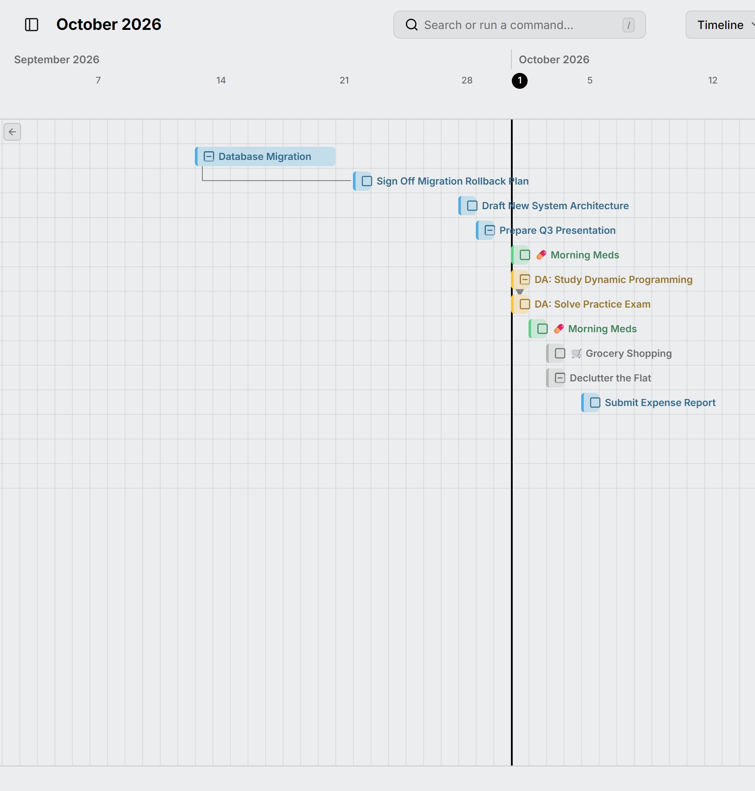

خط زمانی کارهای بازِ دارای تاریخ شما را نشان می‌دهد، هر کدام در یک ردیف و به ترتیب تاریخ. هر نوار بازه [زمان‌بندی](../planning.md) کار را پوشش می‌دهد، پس یکباره می‌بینید کدام کارها هم‌زمان پیش می‌روند و کدام‌ها پشت سر هم می‌آیند. آن را با <kbd>L</kbd> باز کنید.

<picture>
  <source media="(prefers-color-scheme: dark)" srcset="../../assets/screenshots/timeline-detail-dark.webp">
  
</picture>

عنوان هر کار کنار نوارش قرار دارد. وقتی نواری از دید خارج می‌شود، دکمه‌ای در لبه نما شما را به آن برمی‌گرداند.

یک کار تکرارشونده فقط نمونه‌هایی را که سررسیدشان رسیده نشان می‌دهد، پس یک کار روزانه خط زمانی را پر نمی‌کند. خط‌های میان [کارهای وابسته](../dependencies.md) هم اینجا دیده می‌شوند، مگر اینکه آن‌ها را در [تنظیمات](../settings.md) خاموش کنید.

نواری را بکشید تا کار جابه‌جا شود، یا دو سر آن را بکشید تا تاریخ‌هایش تغییر کند. برای افزودن کار، آن را روی ردیف خالی پایین بکشید.

رویدادهای تمام‌روز، مثل یک سفر یا یک تعطیلی، در بالا نمایش داده می‌شوند و روزهایشان به رنگ رویداد سایه می‌خورد، پس می‌بینید کدام کارها در آن‌ها می‌افتند.
