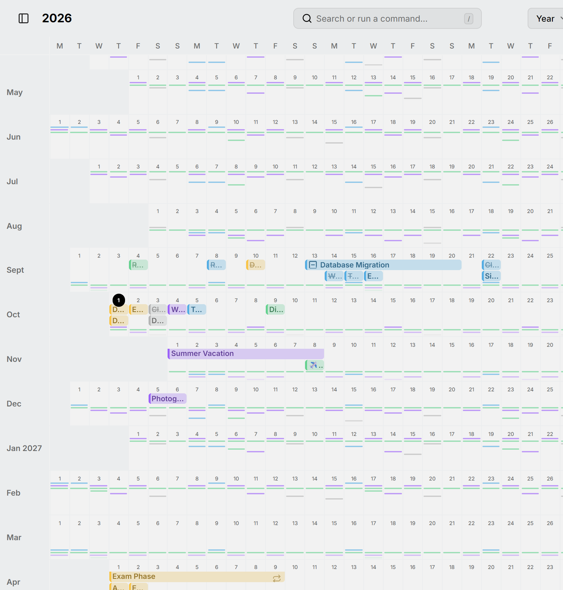

La vue par année affiche chaque mois sur une ligne de jours, de sorte que toute l'année tient sur un seul écran. C'est l'endroit pour trouver une semaine libre, ou pour voir comment un voyage s'articule avec tout ce qui l'entoure. Ouvrez-la avec <kbd>Y</kbd>.

<picture>
  <source media="(prefers-color-scheme: dark)" srcset="../../assets/screenshots/year-detail-dark.webp">
  
</picture>

Les entrées s'affichent en barres sur leurs jours. Ce qui revient souvent, même chaque mois, s'affiche plutôt en petites marques ; voir [Routines](../routines.md).

Faites glisser sur plusieurs jours pour créer une entrée de toute la journée, et faites glisser une entrée pour la déplacer, ou son extrémité pour changer ses jours. Cliquez sur le nom d'un mois pour l'ouvrir dans la [vue mois](month.md).

Zoomez avec <kbd>Ctrl</kbd> et le défilement pour donner plus de place aux lignes.
