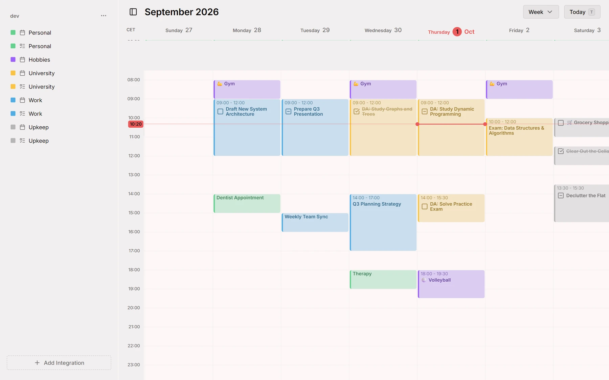
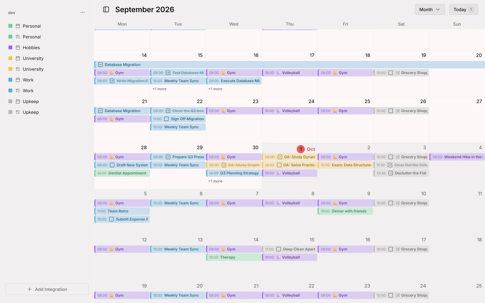
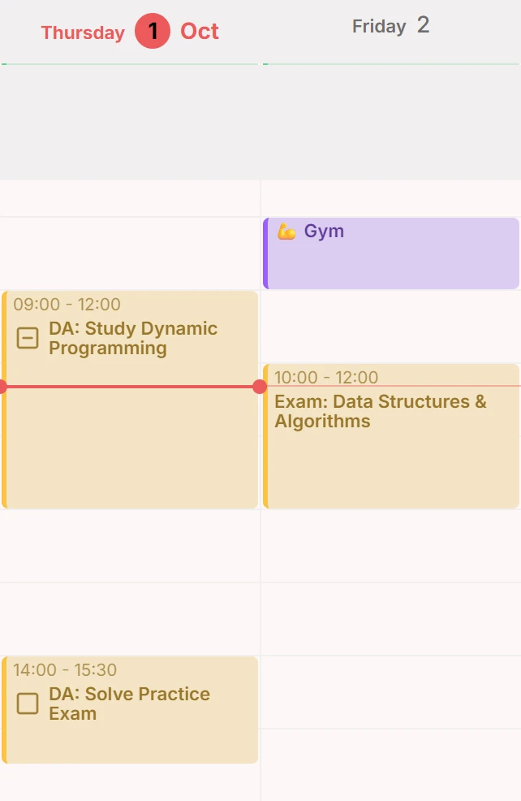
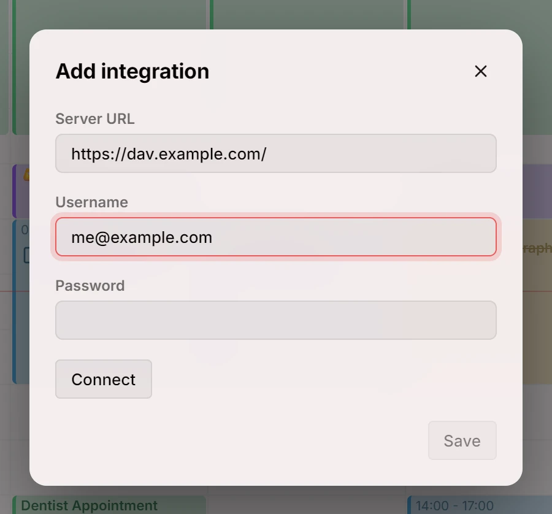
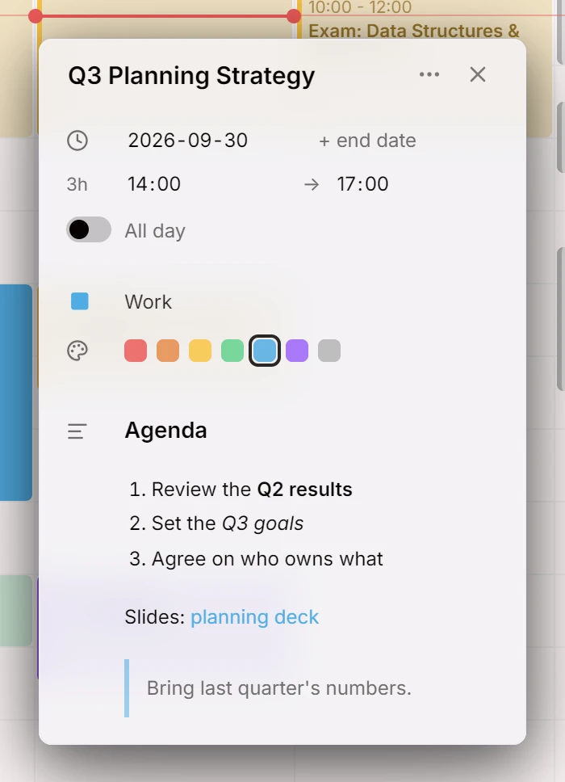

La primera versión de Mitra: un calendario que pone tus tareas en la misma línea de tiempo que tus eventos, sincronizado en ambos sentidos con los calendarios que ya usas.

## Por qué Mitra
Hay buenas aplicaciones de calendario y hay calendarios que puedes alojar tú mismo, y durante mucho tiempo no fueron los mismos.

Las aplicaciones pulidas viven en servidores ajenos y leen todo lo que pones en ellas. Las que puedes ejecutar en casa son sobre todo servidores: guardan tus calendarios con fidelidad y te dejan mirarlos con la aplicación que consigas encontrar. Mitra nació de querer las dos cosas a la vez: un calendario en el que da gusto pasar el día, que funciona en una máquina tuya y que no responde ante nadie más.

No te pide que te mudes. Mitra es una capa sobre los calendarios que ya tienes, no otro lugar donde guardarlos. Cada fuente de tu tiempo es una integración que se conecta junto a las demás, primero un servidor CalDAV y muchas más desde entonces, y todas se encuentran en una sola línea de tiempo mientras cada una conserva sus datos donde viven. Tus eventos y tus tareas también comparten esa línea de tiempo, así que el trabajo de encajar unos con otras ya no ocurre en tu cabeza.

También es una apuesta por la web tal como es ahora, no como era hace diez años. Mitra está escrito para los navegadores actuales y se apoya en lo que ellos hacen de forma nativa: diseños que se adaptan a su propio espacio, ventanas emergentes ancladas en su sitio, transiciones entre vistas, un modelo real de fechas y zonas horarias. No llevar capas de compatibilidad ni un framework pesado es lo que lo mantiene pequeño y rápido, le permite instalarse como una aplicación y hace que se sienta como en casa tanto en un teléfono como en un ordenador. El precio es que pide un navegador reciente, y seguirá pidiéndolo.

En el fondo hay una creencia sencilla: tu tiempo es el registro más personal que guardas. Dónde vive, quién puede leerlo y lo tranquilo que resulta mirarlo deberían ser decisiones tuyas. Mitra es un intento de hacer que eso sea fácil.

[@a11delavar](https://github.com/a11delavar)

## Vista Semana
Un día es una columna de 24 horas con una línea en la hora actual, y una semana son siete de ellas lado a lado. Vuelve a hoy con un solo botón.

<picture>
	<source media="(prefers-color-scheme: dark)" srcset="week-dark.webp">
	
</picture>

Docs: [Vista Semana](../../docs/views/week.md)

## Vista Mes
El mes se desplaza sin fin, con una fila por cada semana y una barra por cada entrada a lo largo de sus días. Cambia entre ella y la semana desde la cabecera.

<picture>
	<source media="(prefers-color-scheme: dark)" srcset="month-dark.webp">
	
</picture>

Docs: [Vista Mes](../../docs/views/month.md)

## Eventos y tareas
Una tarea ocupa el día como un evento, con una casilla para marcar cuando está hecha. Arrastra en la cuadrícula para crear una entrada, arrástrala para moverla y dale a cada calendario su color.

<picture>
	<source media="(prefers-color-scheme: dark)" srcset="entries-dark.webp">
	
</picture>

Docs: [Entradas](../../docs/entries.md)

## CalDAV
Conecta un servidor CalDAV, elige qué calendarios suyos mostrar y Mitra los mantiene al día en ambos sentidos, con los cambios hechos desde otros sitios apareciendo en el momento.

<picture>
	<source media="(prefers-color-scheme: dark)" srcset="caldav-dark.webp">
	
</picture>

Docs: [CalDAV](../../docs/integrations/caldav.md)

## Notas en Markdown
La descripción de una entrada es Markdown: los encabezados, las listas y los enlaces se leen como tales y siguen siendo texto sin formato para cualquier otra aplicación.

<picture>
	<source media="(prefers-color-scheme: dark)" srcset="markdown-dark.webp">
	
</picture>

## Colaboradores
- [@a11delavar](https://github.com/a11delavar)
