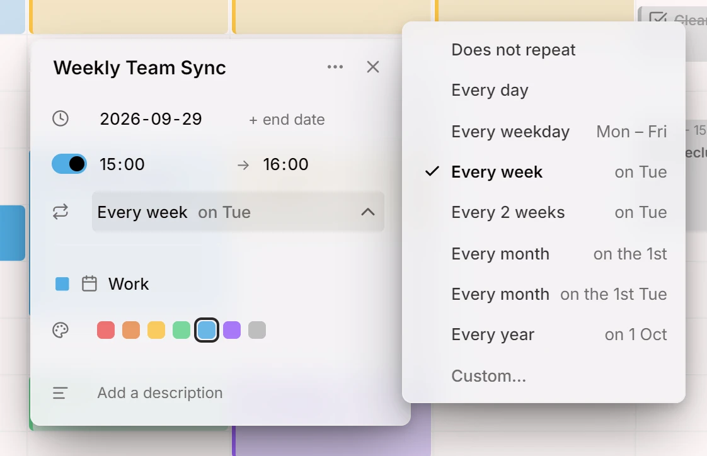
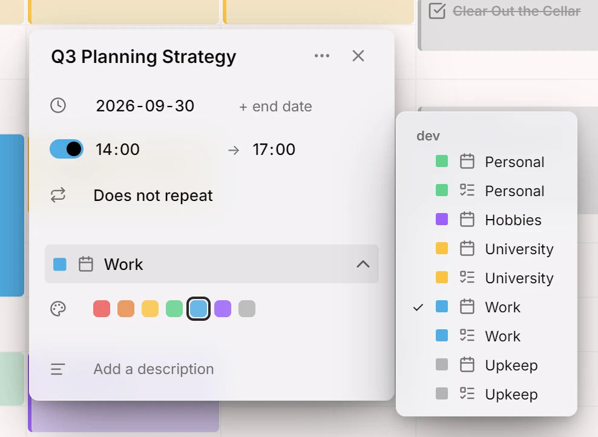

Questa versione porta le voci che si ripetono e permette di spostare una voce da un calendario a un altro.

## Voci ripetute
Una voce può ripetersi ogni giorno, settimana, mese o anno, oppure secondo una regola tua: ogni due settimane il lunedì e il giovedì, o l'ultimo venerdì di ogni mese. Può fermarsi dopo un certo numero di volte o a una data, e una singola occorrenza può essere saltata. Modifica un'occorrenza e Mitra ti chiede se intendi solo questa, questa e le successive, oppure tutte. Le regole viaggiano in entrambe le direzioni con il tuo calendario CalDAV, così i calendari che già usi si ripetono allo stesso modo.

<picture>
	<source media="(prefers-color-scheme: dark)" srcset="repeats-dark.webp">
	
</picture>

Documentazione: [Ripetizioni](../../docs/repeats.md)

## Sposta le voci tra calendari
Sposta una voce in un altro calendario dal suo editor, anche tra account diversi.

<picture>
	<source media="(prefers-color-scheme: dark)" srcset="move-dark.webp">
	
</picture>

Documentazione: [Calendari](../../docs/calendars.md)

## Collaboratori
- [@a11delavar](https://github.com/a11delavar)
