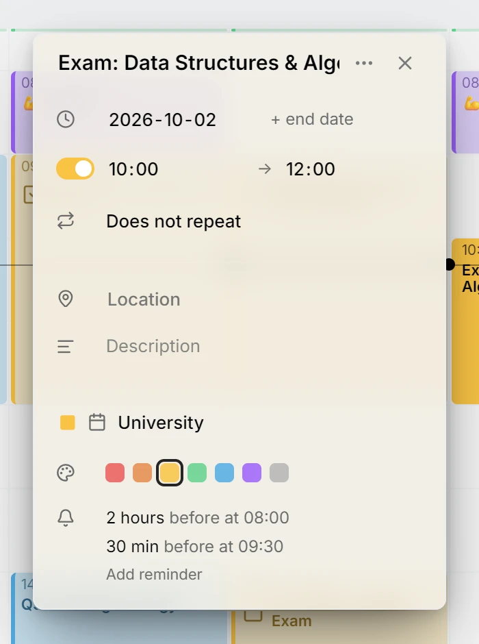
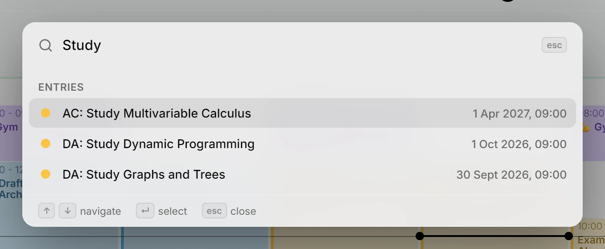
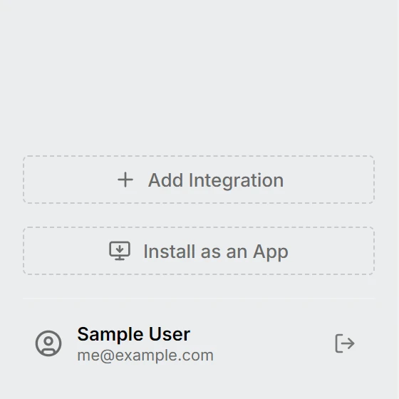
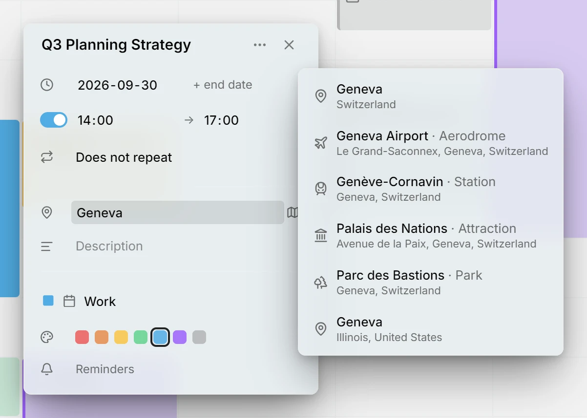
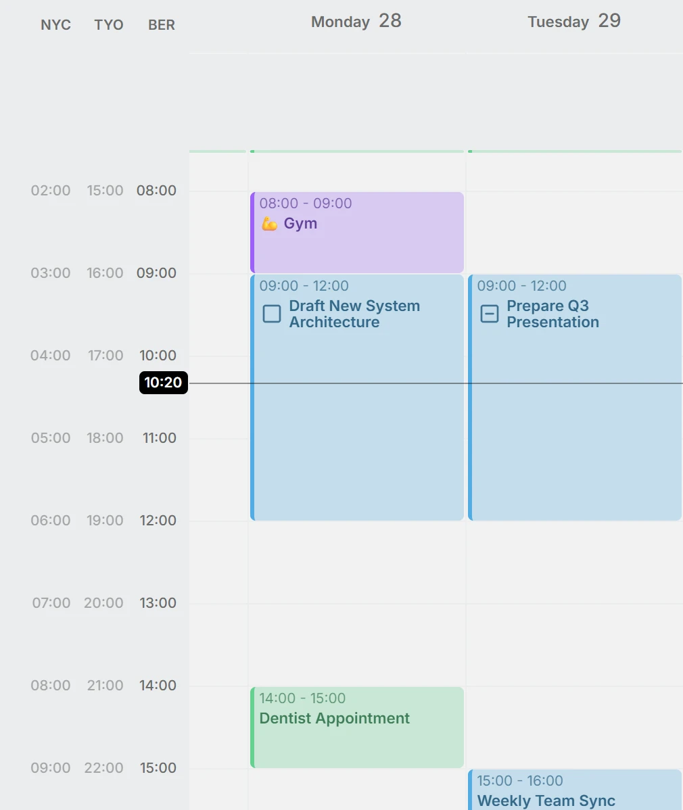
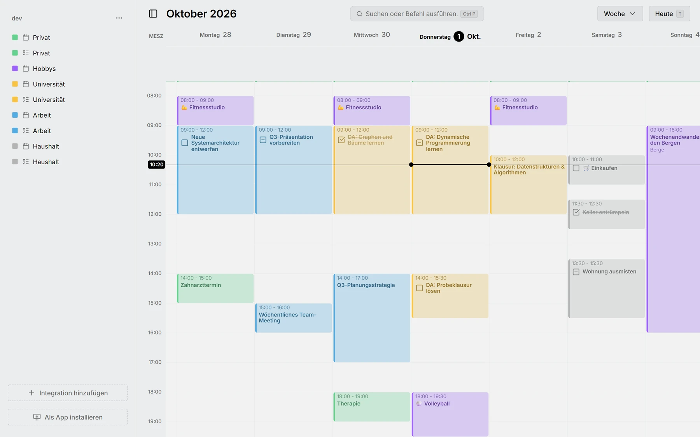
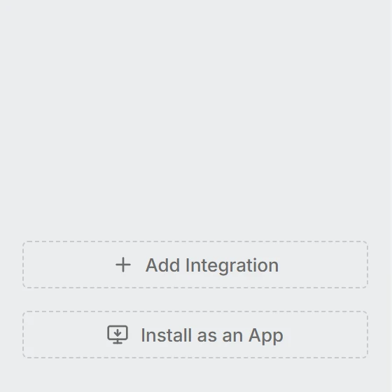

This release reminds you before things start, puts every action one keystroke away, and lets a household or a team share one Mitra, each person with their own calendars. It is also the first that can learn any language.

## Reminders
Mitra reminds you before an entry starts, on your phone or your desktop, with a push notification. New entries come with a reminder half an hour ahead, which you can change or remove.

<picture>
	<source media="(prefers-color-scheme: dark)" srcset="reminders-dark.webp">
	
</picture>

Docs: [Reminders](../../docs/reminders.md)

## Command palette
Press Ctrl+P, or ⌘P on a Mac, and type: a command, a date to go to, or the title of an entry to open.

<picture>
	<source media="(prefers-color-scheme: dark)" srcset="palette-dark.webp">
	
</picture>

Docs: [Shortcuts](../../docs/shortcuts.md)

## Multi-user & OIDC
Sign in through your own identity provider, and each person gets their own calendars on one Mitra.

<picture>
	<source media="(prefers-color-scheme: dark)" srcset="users-dark.webp">
	
</picture>

Docs: [Single sign-on](../../docs/sso.md)

## Locations
Type a place and pick it from the suggestions, your recent places first, or an approximate one when an address is more than you need.

<picture>
	<source media="(prefers-color-scheme: dark)" srcset="locations-dark.webp">
	
</picture>

Docs: [Location](../../docs/location.md)

## Grid time zones
Add the time zones of the people you work with, as extra columns beside the hours.

<picture>
	<source media="(prefers-color-scheme: dark)" srcset="time-zones-dark.webp">
	
</picture>

Docs: [Time zones](../../docs/time-zones.md)

## Internationalization
Every word in Mitra can now be translated, and a change of language applies at once, without a reload. German is the first language beyond English.

<picture>
	<source media="(prefers-color-scheme: dark)" srcset="german-dark.webp">
	
</picture>

Docs: [Settings](../../docs/settings.md)

## Install as an app
Install Mitra from the browser, and it opens in a window of its own, with its own icon.

<picture>
	<source media="(prefers-color-scheme: dark)" srcset="install-dark.webp">
	
</picture>

Docs: [Install as an app](../../docs/install-app.md)

## New logo
Mitra has a logo of its own, designed by [@corruptedlotus](https://github.com/corruptedlotus). It is the icon of the installed app and of its notifications.

<picture>
	<source media="(prefers-color-scheme: dark)" srcset="logo-dark.webp">
	
</picture>

## Contributors
- [@a11delavar](https://github.com/a11delavar)
- [@corruptedlotus](https://github.com/corruptedlotus)
