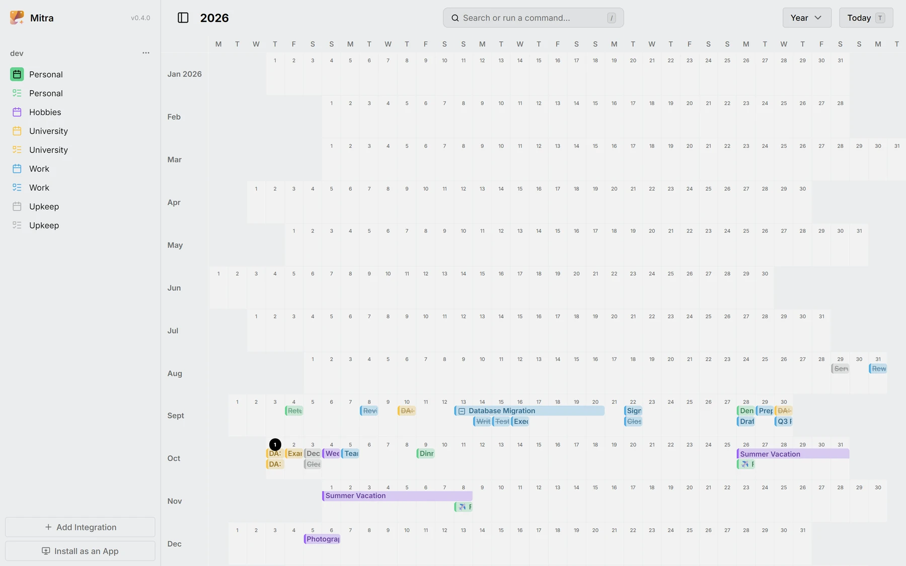
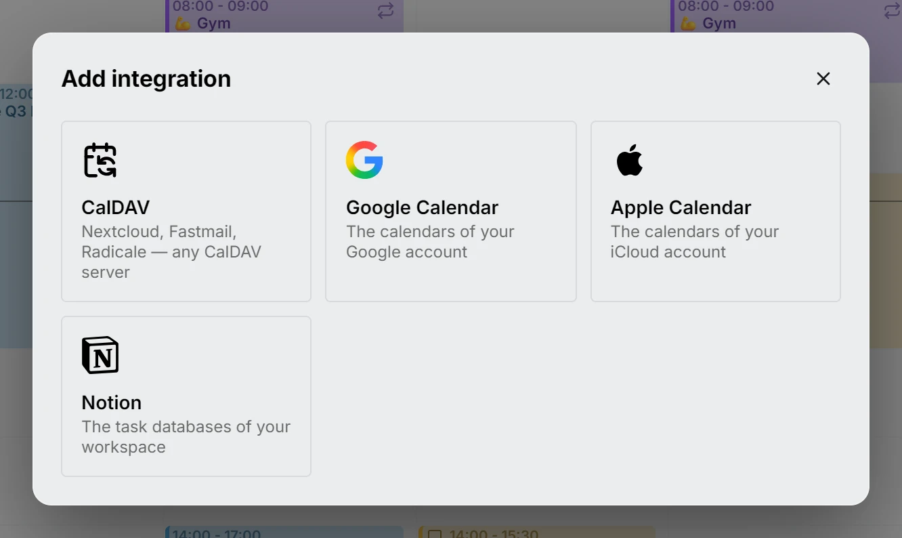
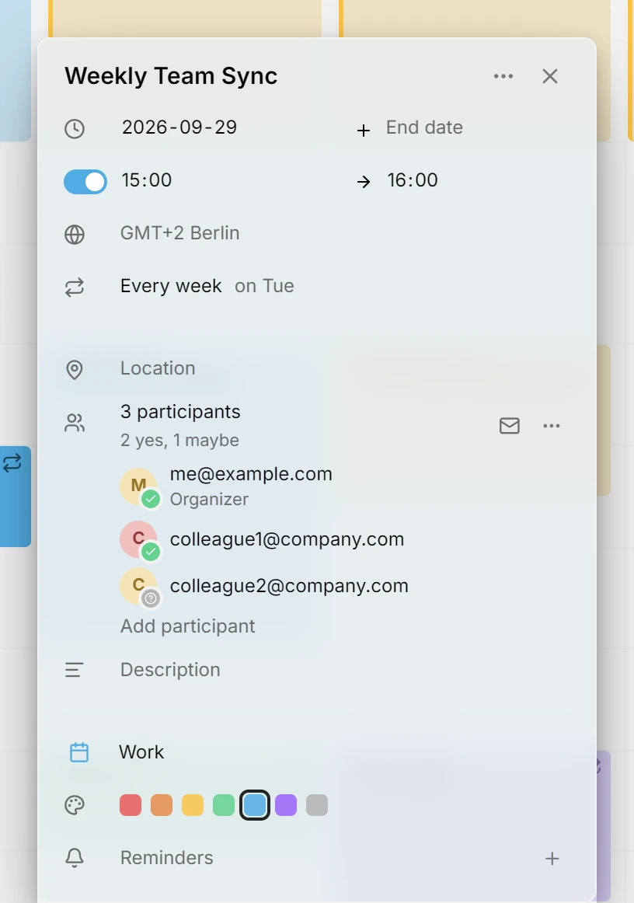
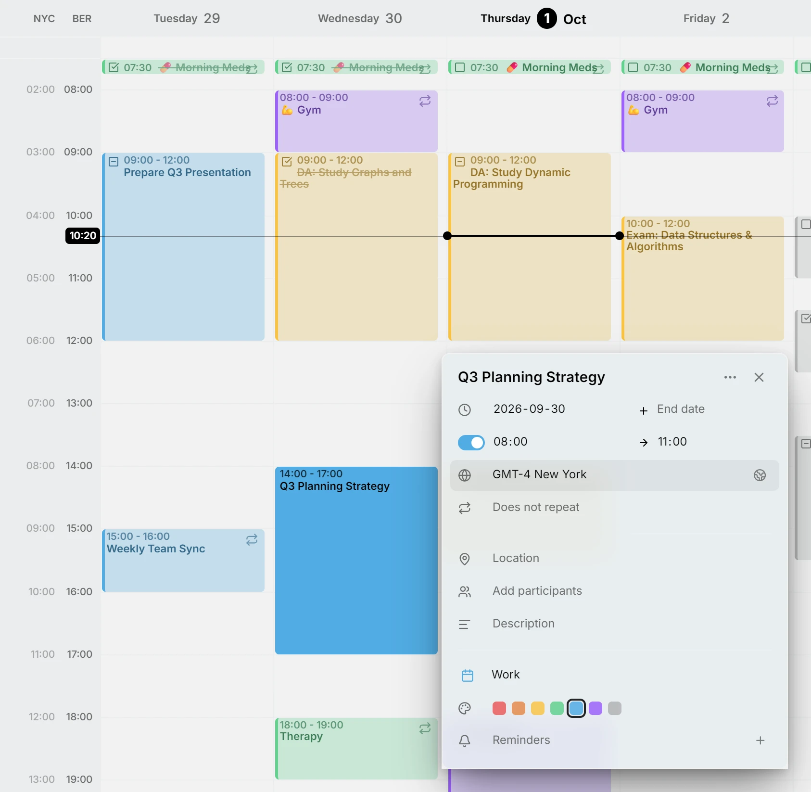
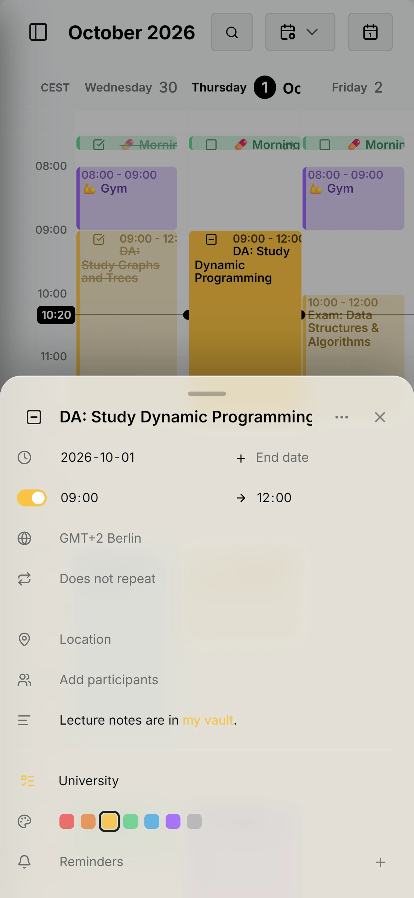
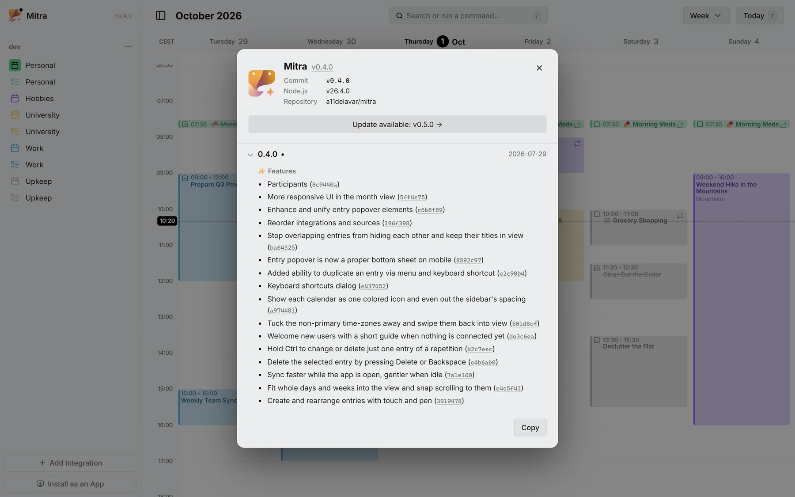

Esta versão traz uma vista anual, conecta o Mitra aos calendários que a maioria das pessoas já tem, Google, Apple e Notion, coloca gente nos seus eventos e faz o Mitra se sentir em casa no celular.

## Vista anual
O ano inteiro em uma tela, cada dia uma pequena célula, para achar a semana livre ou ver uma estação de uma vez.

<picture>
	<source media="(prefers-color-scheme: dark)" srcset="year-dark.webp">
	
</picture>

Documentação: [Vista anual](../../docs/views/year.md)

## Google Calendar, Apple Calendar e Notion
Entre com o Google, adicione uma senha de app para o iCloud ou cole um token do Notion, e seus calendários e bancos de dados ficam lado a lado em uma só semana. Uma vista do Notion vira um calendário, e o corpo de uma página vira a descrição da sua entrada.

<picture>
	<source media="(prefers-color-scheme: dark)" srcset="integrations-dark.webp">
	
</picture>

Documentação: [Integrações](../../docs/integrations/README.md)

## Participantes
Convide pessoas para um evento, veja quem já disse sim e responda aos convites que você recebe, pelos calendários que os entregam.

<picture>
	<source media="(prefers-color-scheme: dark)" srcset="participants-dark.webp">
	
</picture>

Documentação: [Participantes](../../docs/participants.md)

## Fuso horário por entrada
Uma entrada pode manter o seu próprio fuso horário, como um voo que parte em um e pousa em outro. Os fusos horários extras ao lado da semana se recolhem e voltam com um deslizar, quando você os quiser.

<picture>
	<source media="(prefers-color-scheme: dark)" srcset="time-zones-dark.webp">
	
</picture>

Documentação: [Fusos horários](../../docs/time-zones.md)

## Melhorias para celular
O editor abre como uma folha vinda de baixo, as entradas se movem e mudam de tamanho por toque e caneta, e o layout abre espaço para o teclado.

<picture>
	<source media="(prefers-color-scheme: dark)" srcset="phone-dark.webp">
	
</picture>

## Indicador de atualização e changelog
Um ponto avisa quando há uma nova versão, e a caixa Sobre lista o que mudou em cada versão, commit por commit.

<picture>
	<source media="(prefers-color-scheme: dark)" srcset="updates-dark.webp">
	
</picture>

Documentação: [Atualizações](../../docs/updates.md)

## Colaboradores
- [@a11delavar](https://github.com/a11delavar)
- [@d8monx](https://github.com/d8monx)
