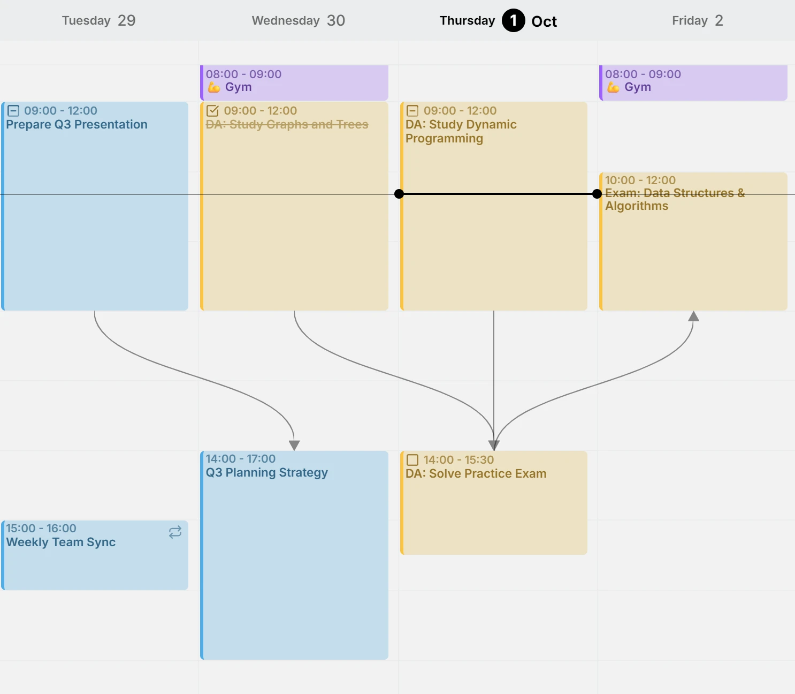
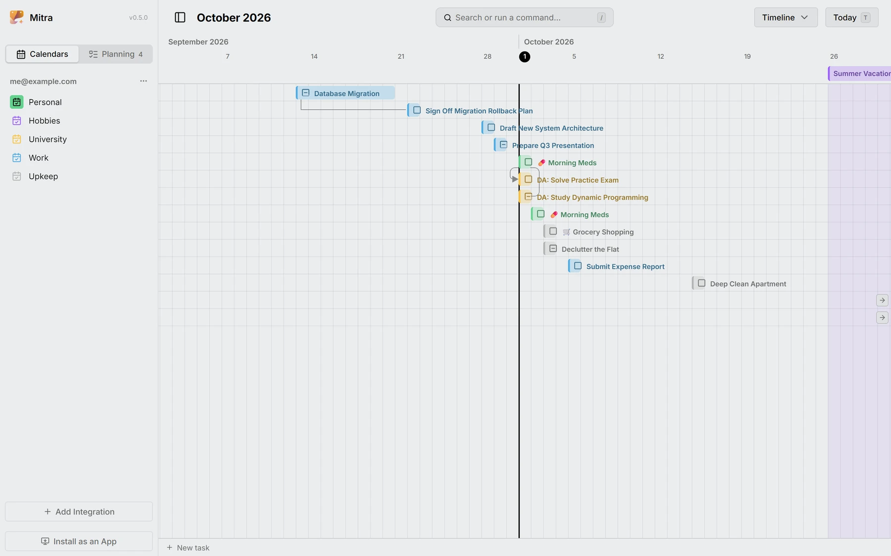
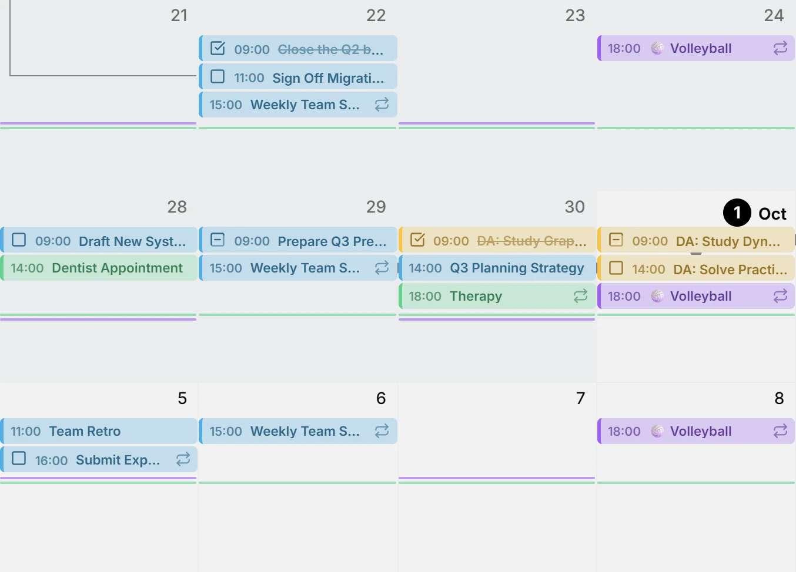
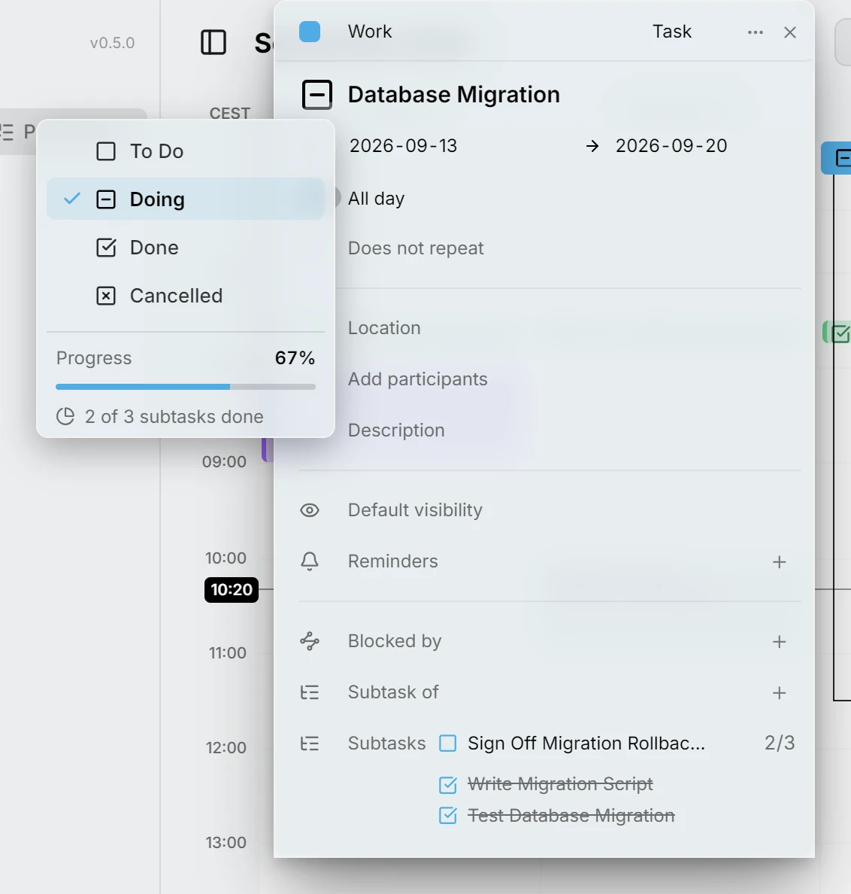
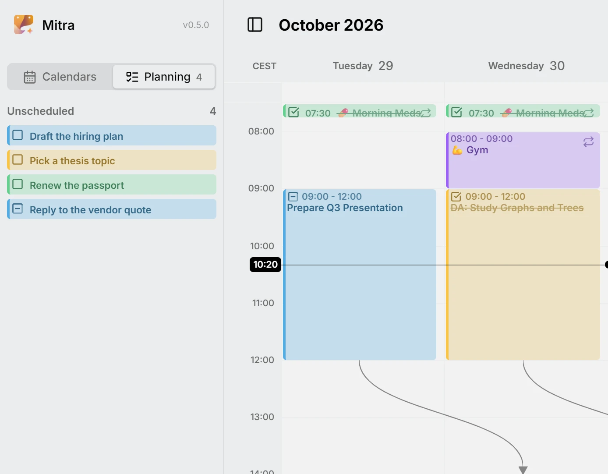
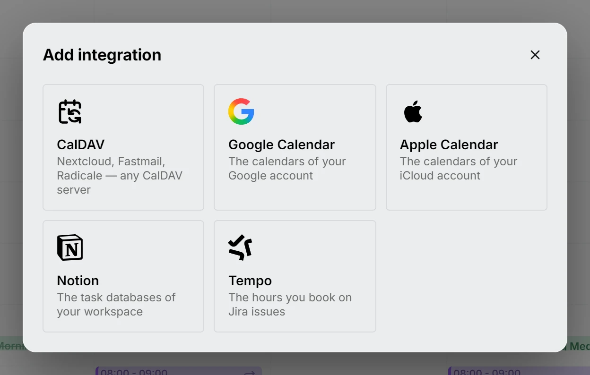
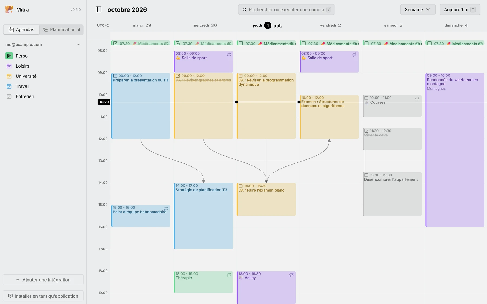

Esta versión permite que las entradas dependan unas de otras. Vincula una tarea con las que espera o con las partes de las que se compone, mira los vínculos dibujados a lo largo de la semana y observa cómo se mueve toda la cadena cuando una de ellas se mueve. El cronograma dispone las tareas abiertas según cuándo vencen, y las vistas Mes y Año pliegan los hábitos de cada día en marcas discretas.

## Relaciones
Haz que una entrada sea una subtarea de otra, o que espere a otra que tiene que terminar primero. Arrastra desde el tirador de una entrada hasta aquella a la que pertenece y Mitra dibuja el vínculo a lo largo de la semana, tanto entre entradas con hora como entre las de todo el día, y también lo conserva en Notion. Mueve una entrada y todo lo que depende de ella se mueve con ella. Cuando un vínculo ya no se puede mantener, porque algo empieza ahora antes de lo que espera, Mitra te lo dice.

<picture>
	<source media="(prefers-color-scheme: dark)" srcset="relationships-dark.webp">
	
</picture>

Docs: [Dependencias](../../docs/dependencies.md)

## Vista Cronograma
Tus tareas abiertas, una por fila, dispuestas como barras desde que empiezan hasta que vencen, de modo que un tramo de trabajo muestra su forma antes de que lo planifiques. Los solapamientos, los huecos y la tarea que se pasa de su fecha destacan de un vistazo. Una tarea que sale de la vista deja en el borde un marcador que la trae de vuelta, y las rutinas solo muestran la próxima vez que vencen.

<picture>
	<source media="(prefers-color-scheme: dark)" srcset="timeline-dark.webp">
	
</picture>

Docs: [Vista Cronograma](../../docs/views/timeline.md)

## Rutinas
Lo que haces cada día o cada semana, un entrenamiento o una pastilla, se recoge en pequeñas marcas en las vistas Mes y Año, así que un mes cargado se sigue leyendo de un vistazo.

<picture>
	<source media="(prefers-color-scheme: dark)" srcset="routines-dark.webp">
	
</picture>

Docs: [Rutinas](../../docs/routines.md)

## Progreso de las tareas
Una tarea con subtareas llena un anillo a medida que se completan y, cuando se completa la última, Mitra te pregunta si quieres terminar también la tarea. Una tarea sin subtareas puede llevar un porcentaje que tú mismo fijas.

<picture>
	<source media="(prefers-color-scheme: dark)" srcset="progress-dark.webp">
	
</picture>

Docs: [Subtareas](../../docs/subtasks.md)

## Tareas sin programar
Una tarea ya no necesita un día. Déjala sin programar hasta que sepas cuándo, y prográmala cuando lo sepas.

<picture>
	<source media="(prefers-color-scheme: dark)" srcset="unscheduled-dark.webp">
	
</picture>

Docs: [Planificación](../../docs/planning.md)

## Tempo
Tus registros de trabajo de Jira desde Tempo aparecen como un calendario, y una entrada que creas allí registra tiempo en el ticket que nombra su título.

<picture>
	<source media="(prefers-color-scheme: dark)" srcset="tempo-dark.webp">
	
</picture>

Docs: [Tempo](../../docs/integrations/tempo.md)

## Más idiomas
Mitra habla francés, español, portugués e italiano, además de inglés y alemán.

<picture>
	<source media="(prefers-color-scheme: dark)" srcset="languages-dark.webp">
	
</picture>

Docs: [Ajustes](../../docs/settings.md)

## Colaboradores
- [@a11delavar](https://github.com/a11delavar)
