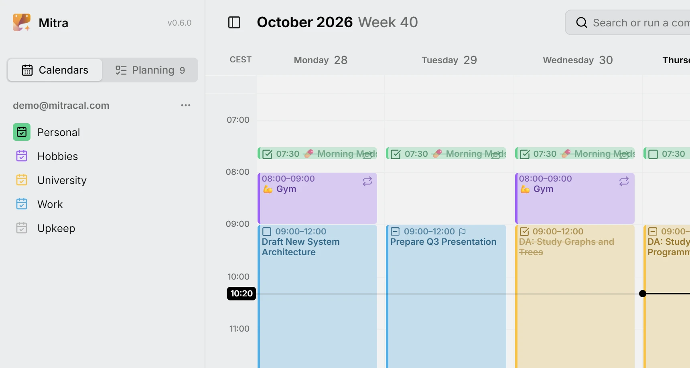
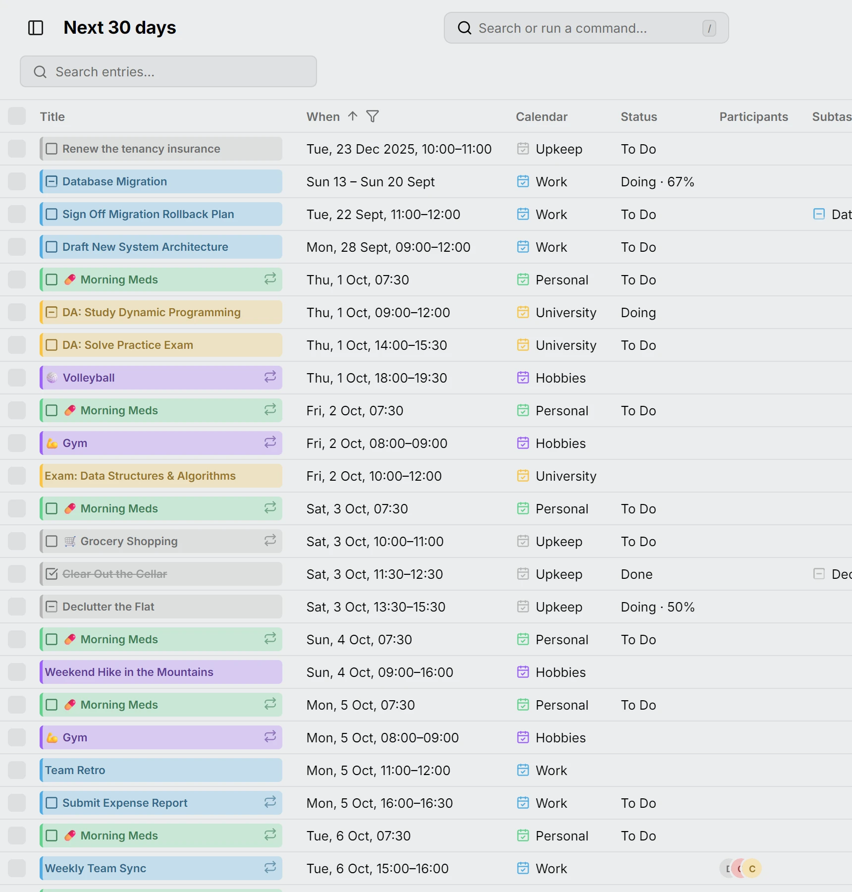
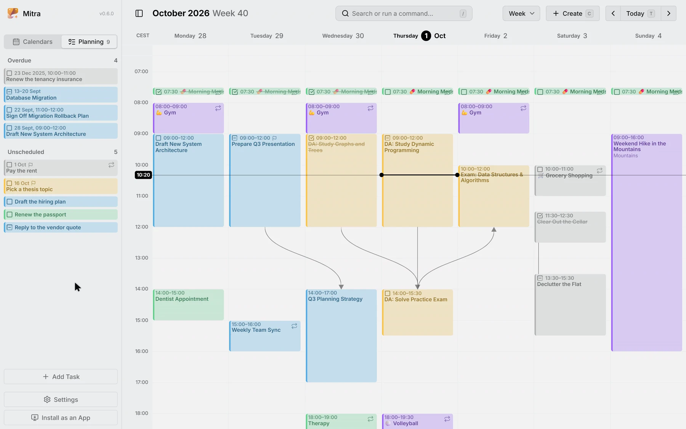
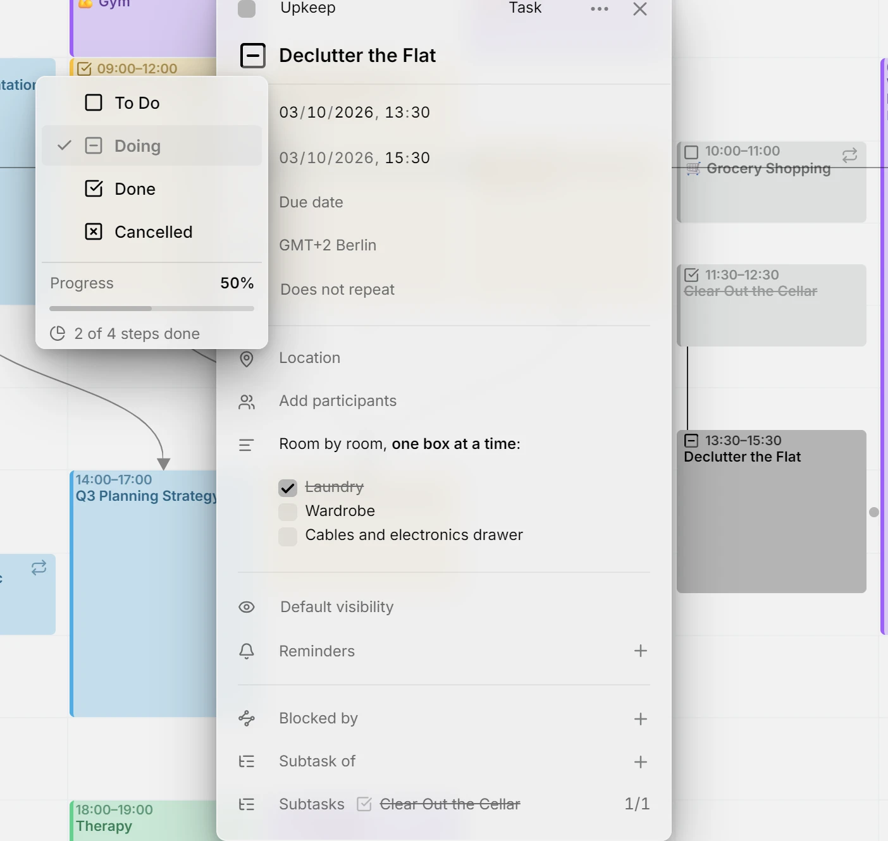
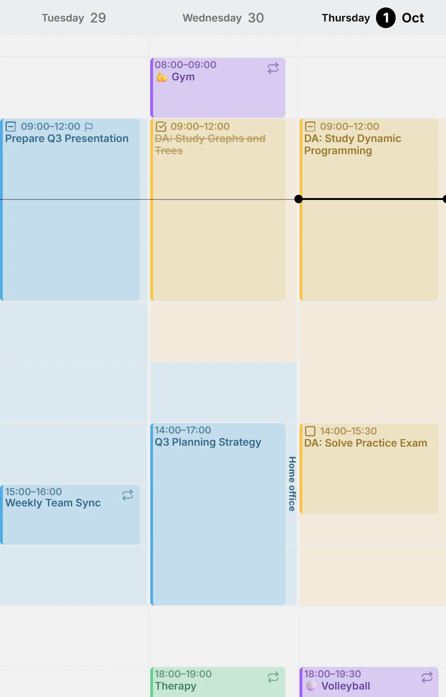
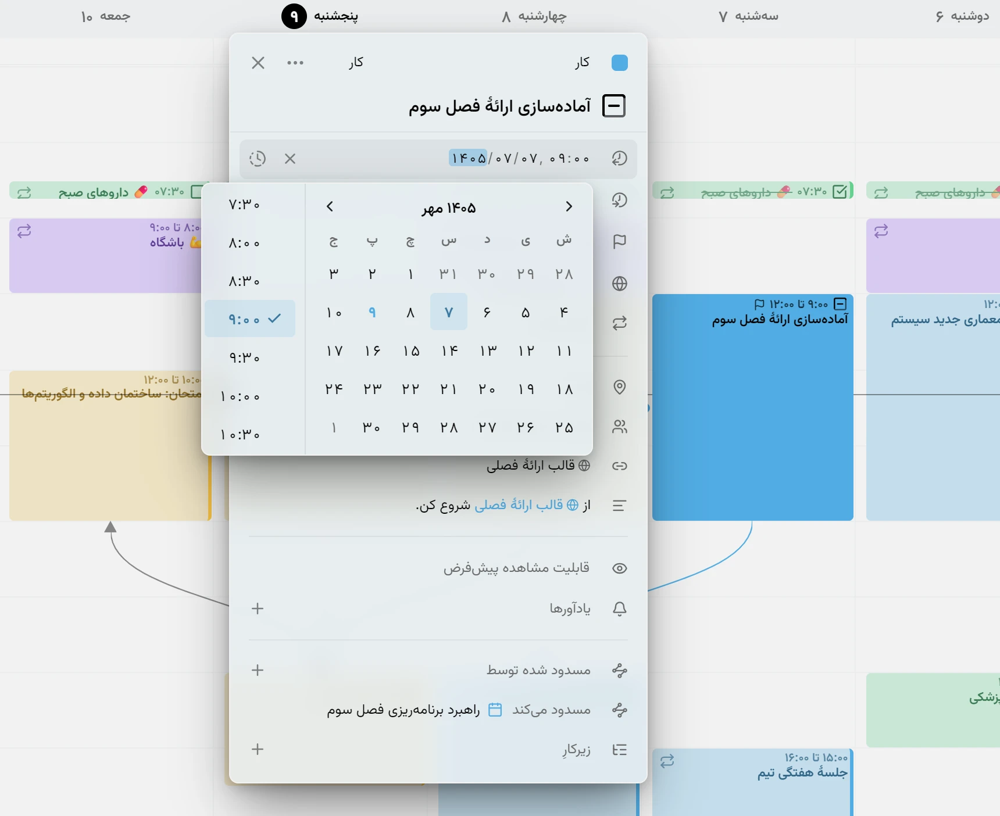
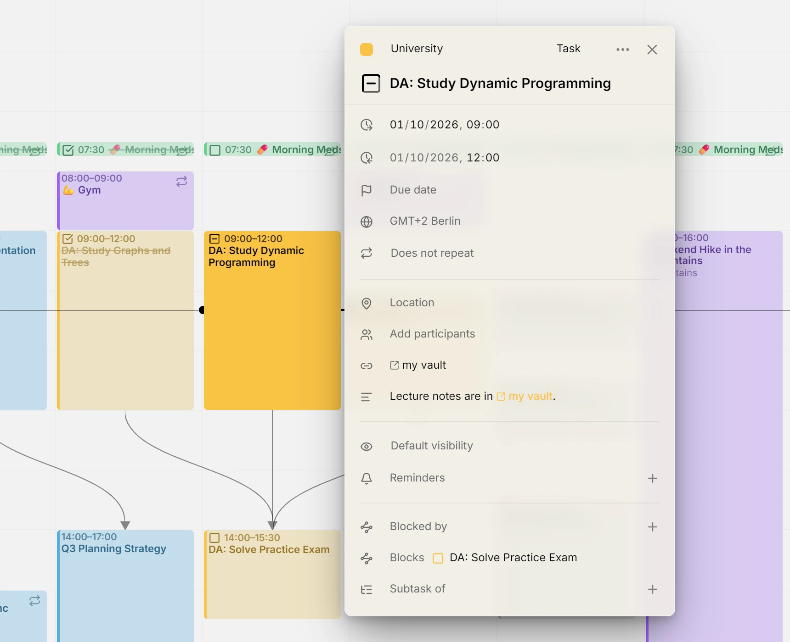

این انتشار به میترا تقویم‌هایی از خودش می‌دهد، موارد شما را به‌صورت جدول می‌چیند و به کارها قیدهایی می‌دهد که کم داشتند: تاریخ سررسید، تخمین و ساعت‌هایی که آزاد نگه می‌دارید. همچنین فارسی صحبت می‌کند، با تقویمش.

## تقویم‌های میترا
یک تقویم می‌تواند در خود میترا زندگی کند، بدون حسابی پشتش و بدون چیزی برای ورود. میترا را نصب کنید، یک تقویم اضافه کنید و برنامه‌ریزی را شروع کنید. روی هر دستگاهی که استفاده می‌کنید ظاهر می‌شود، و مواردش هر وقت حسابی وصل کنید می‌توانند به آن بروند.

<picture>
	<source media="(prefers-color-scheme: dark)" srcset="calendars-detail-dark.webp">
	
</picture>

مستندات: [تقویم‌های میترا](../../docs/integrations/mitra.md)

## نمای جدول
هر مورد یک ردیف. روزهایی را که فهرست شوند انتخاب کنید، از ماه گذشته تا هر چه دارید، میان عنوان‌ها، مکان‌ها و توضیحات جستجو کنید، با چند ستون هم‌زمان مرتب کنید و بر اساس وضعیت، تقویم، نوع یا تکرار فیلتر کنید. ردیف‌ها را انتخاب کنید تا چندتایی را یکجا تغییر دهید. عنوان همان تکه‌ای است که تقویم می‌کشد، پس یک مورد همان‌جا باز می‌شود.

<picture>
	<source media="(prefers-color-scheme: dark)" srcset="table-detail-dark.webp">
	
</picture>

مستندات: [نمای جدول](../../docs/views/table.md)

## تاریخ سررسید و تخمین
یک کار می‌تواند پیش از آنکه زمانی داشته باشد تاریخ سررسید و تخمین داشته باشد. کارهای زمان‌بندی‌نشده در برنامه‌ریزی بر اساس آنچه زودتر سررسید می‌شود صف می‌کشند، و وقتی یکی را روی هفته می‌کشید، تخمین طولش می‌شود. کارهایی که از روزشان گذشته‌اند در بخشی به‌تعویق‌افتاده بالای آن‌ها جمع می‌شوند.

<picture>
	<source media="(prefers-color-scheme: dark)" srcset="plan-task-dark.webp">
	
</picture>

مستندات: [برنامه‌ریزی](../../docs/planning.md)

## فهرست‌های بررسی در توضیحات
توضیحات یک کار می‌تواند یک فهرست بررسی داشته باشد، نوشته‌شده با Markdown، و خانه‌ها واقعی‌اند: یکی را در ویرایشگر تیک بزنید و میترا آن را در متن بازمی‌نویسد، پس هر اپ دیگر روی آن تقویم هم آن را می‌بیند. خانه‌ها و زیرکارها با هم شمرده می‌شوند، هر کدام یک گام: کاری با سه خانه و یک زیرکار چهار گام دارد، و با یک خانه تیک‌خورده و زیرکار انجام‌شده منوی وضعیتش ۲ از ۴ گام انجام‌شده را می‌خواند، در حالی که حلقه روی تکه‌اش تا نیمه پر می‌شود.

<picture>
	<source media="(prefers-color-scheme: dark)" srcset="checklist-dark.webp">
	
</picture>

مستندات: [زیرکارها](../../docs/subtasks.md)

## در دسترس بودن
ساعت‌هایی را که کار می‌کنید، ورزش می‌کنید یا آزاد نگه می‌دارید، در هر تقویمی بکشید. نمای هفته را سایه می‌زنند تا ساعت‌های باز برجسته شوند. ساعت‌های مشغول برای کسانی که تقویمی را با آن‌ها به اشتراک می‌گذارید مشغول نشان داده می‌شوند، و ساعت‌های آزاد برای خودتان می‌مانند.

<picture>
	<source media="(prefers-color-scheme: dark)" srcset="availability-detail-dark.webp">
	
</picture>

مستندات: [در دسترس بودن](../../docs/availability.md)

## تقویم فارسی
میترا فارسی صحبت می‌کند، و با زبان تقویمش هم می‌آید: ماه‌ها و هفته‌های فارسی در سربرگ‌ها و انتخاب‌گرها، و تاریخ‌هایی که همان‌طور که فارسی می‌نویسد تایپ می‌شوند. موارد شما همان‌جا که هستند می‌مانند. فقط شیوه خوانده شدنشان تغییر می‌کند.

<picture>
	<source media="(prefers-color-scheme: dark)" srcset="persian-calendar-detail-dark.webp">
	
</picture>

مستندات: [تنظیمات](../../docs/settings.md)

## پیوندها در یک ردیف
هر پیوند در توضیحات یا مکان یک مورد در ردیف پیوندهای ویرایشگر جمع می‌شود، با نامی از مقصدش: یک صفحه با سایتش، یک جلسه با سرویسش، یک یادداشت با اپش. مکانی که یک پیوند است به‌صورت همان پیوند نشان داده می‌شود.

<picture>
	<source media="(prefers-color-scheme: dark)" srcset="links-detail-dark.webp">
	
</picture>

مستندات: [پیوندها](../../docs/links.md)

## مشارکت‌کنندگان
- [@a11delavar](https://github.com/a11delavar)
