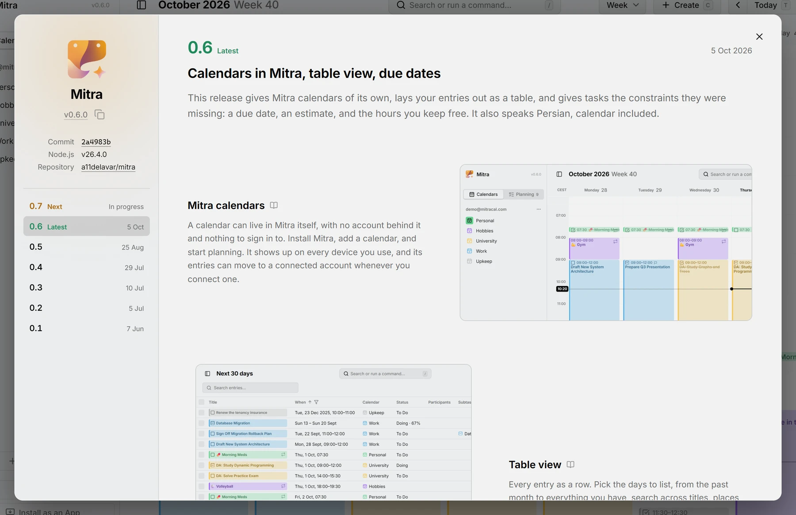

La 0.7 trata de que Mitra llegue más lejos: primeros pasos con la IA, tu región además de tu idioma, y los archivos y las notas de versión que lo hacen sentir terminado, con vistas Mes y Año más estables por el camino.

## IA
Estamos explorando cómo puede ayudarte la IA a planificar tu tiempo, en el propio Mitra y desde los asistentes que ya usas.

## Regiones e idiomas
Mitra aprende tu región junto con tu idioma, para que las fechas, las horas y el inicio de la semana se lean como donde estás, a partir de una elección corta en lugar de una lista larga.

Docs: [Ajustes](../../docs/settings.md)

## Chino
Mitra aprende chino, en caracteres simplificados: la aplicación, su calendario de ejemplo, la documentación y el sitio web, con una tipografía hecha para él.

## Archivos adjuntos
Adjunta archivos a una entrada. Los calendarios que pueden guardarlos, empezando por CalDAV, los llevan consigo.

## Notas de versión en la aplicación
El diálogo Acerca de muestra cada versión como lo hace el sitio web: sus notas, las imágenes de la versión que ejecutas, las correcciones que llegaron después y todo lo que trajo.

<picture>
	<source media="(prefers-color-scheme: dark)" srcset="about-dark.webp">
	
</picture>
